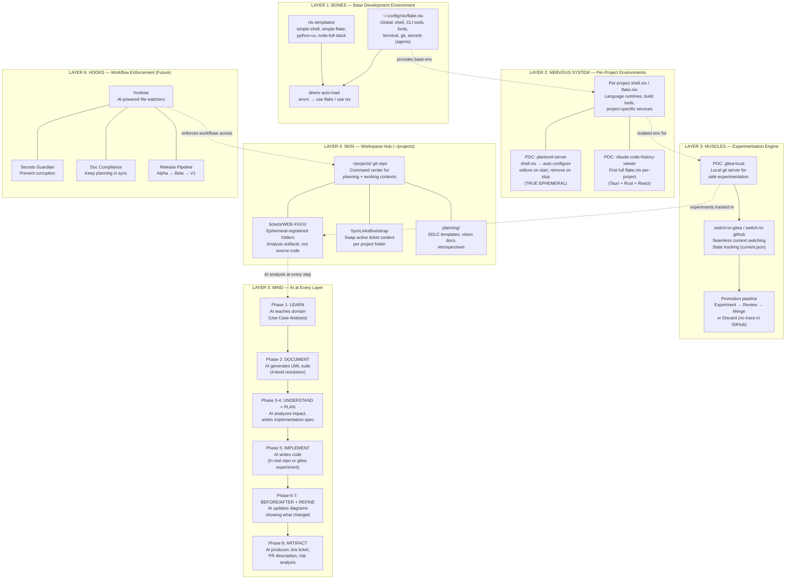
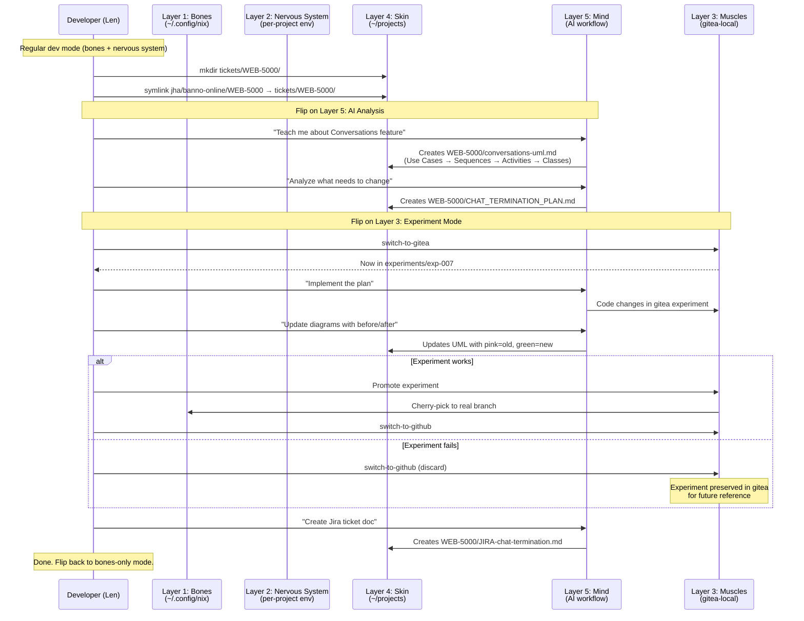

********==⚠  Switch to EXCALIDRAW VIEW in the MORE OPTIONS menu of this document. ⚠==

# Layers of Resolution — Anatomy Chart Architecture

> Like anatomy overlay charts where each transparent page adds a system
> (bones, nerves, muscles, skin) and you can flip between them.

## Layer Overview

## Scenario: "I get assigned WEB-5000"

## Layer Status Matrix

| Layer | Component | Status | Location |
|-------|-----------|--------|----------|
| **1: Bones** | flake.nix global config | Working | `~/.config/nix/flake.nix` |
| **1: Bones** | Per-project templates | Ready | `~/.config/nix/templates/` |
| **2: Nervous System** | plantuml-server (ephemeral) | Working POC | `~/projects/global/plantuml-server/` |
| **2: Nervous System** | CCHV per-project flake | Working POC | `~/projects/global/claude-code-history-viewer/` |
| **3: Muscles** | gitea-local (experimentation) | Working POC | `~/projects/global/gitea-local/` |
| **3: Muscles** | switch-to-gitea/github scripts | Working (Task 1) | `~/projects/global/gitea-local/bin/` |
| **4: Skin** | ~/projects workspace hub | Active | `~/projects/` |
| **4: Skin** | Ticket folders (ephemeral-registered) | Working | `~/projects/tickets/` |
| **4: Skin** | SymLinksBootstrap | Working | `~/projects/bin/symlinks-bootstrap` |
| **4: Skin** | Planning templates | Working | `~/projects/planning/templates/` |
| **5: Mind** | 8-phase AI workflow | Formalized | `~/projects/planning/templates/workflow-template.md` |
| **6: Hooks** | hooksai integration | Vision only | `~/projects/planning/vision/` |

## How Layers Compose

Each layer is independently useful but gains power through composition:

- **Bones only**: Standard dev — nix provides tools, direnv auto-loads
- **Bones + Nervous System**: Per-project isolation — each project gets its own environment
- **+ Muscles**: Safe experimentation — try risky changes in gitea, promote or discard
- **+ Skin**: Organized workspace — tickets, planning docs, symlinked contexts
- **+ Mind**: AI-augmented workflow — every phase documented, analyzed, and automated
- **+ Hooks**: Enforced quality — AI watches for secrets, compliance, release readiness
