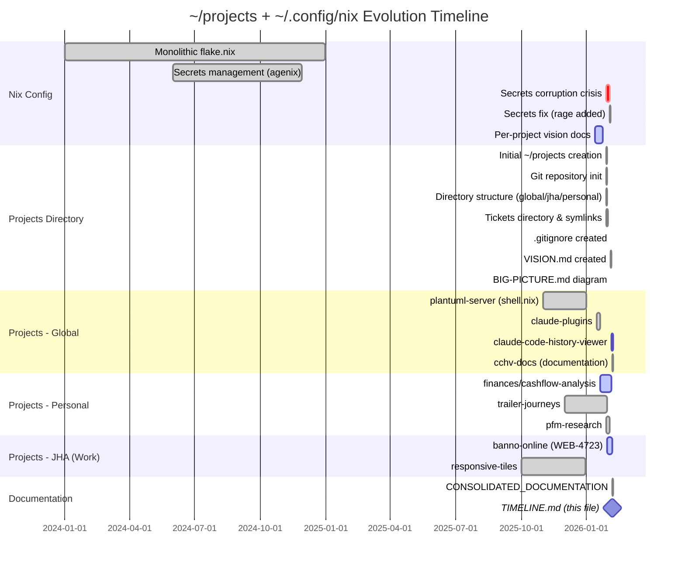
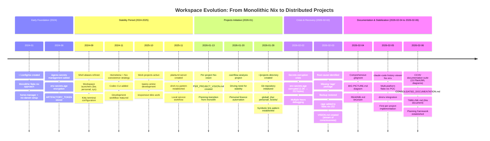
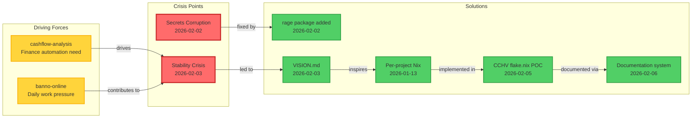
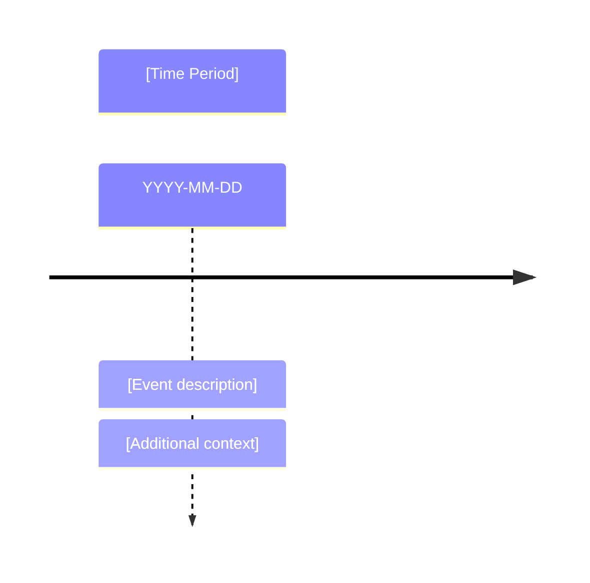

# ~/projects Evolution Timeline

**Created**: 2026-02-06
**Purpose**: Chronological visualization of project workspace development
**Format**: Mermaid diagrams + narrative

---

## How to Use This Timeline

This document contains **expandable Mermaid diagrams** that show:
1. **Chronological** creation of directories and projects
2. **Location** mapping (`~/` directories)
3. **Dependencies** between projects and configuration

To expand/update:
- Add new entries to the appropriate diagram section
- Update the narrative sections with context
- Use Mermaid live editor for validation: https://mermaid.live

---

## Master Timeline (Gantt View)



---

## Detailed Chronological Map



---

## Directory Creation Map

```mermaid
graph TB
    subgraph "Home Directory (~)"
        HOME["/Users/LenMiller"]
    end

    subgraph "Configuration (~/.config/nix)"
        NIXCONFIG["~/.config/nix<br/>(2024-01)"]
        FLAKE["flake.nix<br/>monolithic config<br/>(2024-01)"]
        SECRETS["secrets/env-secrets.age<br/>(2024-06)"]
        DOCS["docs/PER_PROJECT_VISION.md<br/>(2026-01-13)"]
        TEMPLATES["templates/<br/>(planned)"]

        NIXCONFIG --> FLAKE
        NIXCONFIG --> SECRETS
        NIXCONFIG --> DOCS
        NIXCONFIG -.future.-> TEMPLATES
    end

    subgraph "Projects Workspace (~/projects)"
        PROJECTS["~/projects<br/>(2026-01-28)"]

        GLOBAL["global/<br/>(2026-01-28)"]
        PERSONAL["personal/<br/>(2026-01-28)"]
        JHA["jha/<br/>(2026-01-28)"]
        TICKETS["tickets/<br/>(2026-01-28)"]
        LIBS["libs/<br/>(2026-01-28)"]

        VISION["VISION.md<br/>(2026-02-03)"]
        README["README.md<br/>(2026-02-04)"]
        BIGPIC["BIG-PICTURE.md<br/>(2026-02-04)"]
        GITIGNORE[".gitignore<br/>(2026-02-04)"]
        CONSOLIDATED["CONSOLIDATED_DOCUMENTATION.md<br/>(2026-02-06)"]
        TIMELINE["TIMELINE.md<br/>(2026-02-06)"]

        PROJECTS --> GLOBAL
        PROJECTS --> PERSONAL
        PROJECTS --> JHA
        PROJECTS --> TICKETS
        PROJECTS --> LIBS
        PROJECTS --> VISION
        PROJECTS --> README
        PROJECTS --> BIGPIC
        PROJECTS --> GITIGNORE
        PROJECTS --> CONSOLIDATED
        PROJECTS --> TIMELINE
    end

    subgraph "Global Projects"
        PLANTUML["plantuml-server<br/>shell.nix pattern<br/>(2025-11)"]
        PLUGINS["claude-plugins<br/>(2026-01-15)"]
        CCHV["claude-code-history-viewer<br/>flake.nix POC<br/>(2026-02-05)"]
        CCHVDOCS["cchv-docs<br/>documentation suite<br/>(2026-02-06)"]

        GLOBAL --> PLANTUML
        GLOBAL --> PLUGINS
        GLOBAL --> CCHV
        GLOBAL --> CCHVDOCS
    end

    subgraph "Personal Projects"
        FINANCES["finances/<br/>(2026-01-20)"]
        CASHFLOW["cashflow-analysis<br/>Google Apps Script<br/>(2026-01-20)"]
        TRAILER["trailer-journeys<br/>52 items<br/>(2025-12)"]
        PFM["pfm-research<br/>(2026-01-28)"]

        PERSONAL --> FINANCES
        FINANCES --> CASHFLOW
        PERSONAL --> TRAILER
        PERSONAL --> PFM
    end

    subgraph "Work Projects (JHA)"
        BANNO["banno-online<br/>WEB-4723 active<br/>(2026-01-30)"]
        PLATFORMUX["platform-ux<br/>(2025-10)"]
        TILES["responsive-tiles<br/>(2025-10)"]

        JHA --> BANNO
        JHA --> PLATFORMUX
        JHA --> TILES
    end

    subgraph "Ticket System"
        WEBTICKETS["WEB-1 through WEB-14+<br/>work tickets<br/>(2026-01-28)"]
        INATICKETS["INA-1 through INA-5<br/>personal tickets<br/>(2026-01-28)"]

        TICKETS --> WEBTICKETS
        TICKETS --> INATICKETS
    end

    HOME --> NIXCONFIG
    HOME --> PROJECTS

    NIXCONFIG -.influences.-> PROJECTS
    CCHV -.references.-> DOCS
    CASHFLOW -.drives.-> VISION

    classDef critical fill:#ff6b6b,stroke:#c92a2a,stroke-width:3px
    classDef active fill:#51cf66,stroke:#2f9e44,stroke-width:2px
    classDef complete fill:#339af0,stroke:#1971c2,stroke-width:2px
    classDef docs fill:#ffd43b,stroke:#fab005,stroke-width:2px

    class SECRETS,CASHFLOW critical
    class CCHV,BANNO,VISION active
    class PLANTUML,GITIGNORE,CCHVDOCS complete
    class CONSOLIDATED,TIMELINE,DOCS,README docs
```



---

## Location Timeline by Directory

### ~/.config/nix (Configuration Home)

| Date | Item | Type | Status | Notes |
|------|------|------|--------|-------|
| 2024-01 | Initial creation | Directory | ✅ Complete | Monolithic approach |
| 2024-01 | flake.nix | Config | ✅ Complete | ~600 lines, single source |
| 2024-06 | secrets/env-secrets.age | Secret | ⚠️ Recovered | Agenix encryption |
| 2024-09 | shell/ directory | Shell configs | ✅ Complete | banno-shortcuts.zsh, etc. |
| 2024-11 | Homebrew integration | Config section | ✅ Complete | Coexistence strategy |
| 2026-01-13 | docs/PER_PROJECT_VISION.md | Documentation | 🔄 Active | Transition planning |
| 2026-02-02 | rage package added | Package | ✅ Complete | Fixed secrets corruption |
| 2026-02-06 | nix-stack-3d/ | Visualization | 🔄 Active | 3D config explorer |

### ~/projects (Project Workspace)

| Date | Item | Type | Status | Notes |
|------|------|------|--------|-------|
| 2026-01-28 | Initial creation | Directory | ✅ Complete | Workspace initiative |
| 2026-01-28 | .git/ | Repository | ✅ Complete | Version control |
| 2026-01-28 | global/ | Directory | ✅ Complete | Cross-project tools |
| 2026-01-28 | personal/ | Directory | ✅ Complete | Personal projects |
| 2026-01-28 | jha/ | Directory | ✅ Complete | Work projects |
| 2026-01-28 | tickets/ | Directory | ✅ Complete | Centralized tickets |
| 2026-01-28 | libs/ | Directory | ✅ Complete | Shared libraries |
| 2026-02-03 | VISION.md | Documentation | ✅ Complete | Stream of consciousness |
| 2026-02-04 | README.md | Documentation | ✅ Complete | Structure & workflow |
| 2026-02-04 | BIG-PICTURE.md | Diagram | ✅ Complete | Excalidraw visual |
| 2026-02-04 | .gitignore | Config | ✅ Complete | Comprehensive ignores |
| 2026-02-06 | CONSOLIDATED_DOCUMENTATION.md | Documentation | ✅ Complete | This consolidation |
| 2026-02-06 | TIMELINE.md | Documentation | ✅ Complete | This timeline |

### ~/projects/global (Shared Tools)

| Date | Item | Type | Status | Notes |
|------|------|------|--------|-------|
| 2025-11 | plantuml-server/ | Project | ✅ Complete | shell.nix pattern |
| 2026-01-15 | claude-plugins/ | Project | 🔄 Active | Plugin development |
| 2026-02-05 | claude-code-history-viewer/ | Project | 🔄 Active | flake.nix POC, daily use |
| 2026-02-06 | cchv-docs/ | Documentation | ✅ Complete | 15 PlantUML diagrams |

### ~/projects/personal (Personal Projects)

| Date | Item | Type | Status | Notes |
|------|------|------|--------|-------|
| 2025-12 | trailer-journeys/ | Project | ✅ Complete | 52 items |
| 2026-01-20 | finances/cashflow-analysis/ | Project | ⚠️ CRITICAL | Drives stability need |
| 2026-01-28 | pfm-research/ | Project | 🔄 Active | Research & experiments |
| 2026-01-28 | pfm-platform/ | Project | 🔄 Active | Platform development |

### ~/projects/jha (Work Projects)

| Date | Item | Type | Status | Notes |
|------|------|------|--------|-------|
| 2025-10 | responsive-tiles/ | Project | ✅ Complete | Production work |
| 2025-10 | platform-ux/ | Project | 🔄 Active | Ongoing work |
| 2026-01-30 | banno-online/ (WEB-4723) | Project | 🔄 Active | Current ticket |

---

## Dependency & Influence Map



---

## Pattern Evolution

### Phase 1: Monolithic Configuration (2024-01 to 2026-01)
**Location**: `~/.config/nix/flake.nix`
**Pattern**: Single source of truth
**Pros**:
- Simple mental model
- Easy to understand whole system
- Centralized version control

**Cons**:
- ~600 lines, hard to navigate
- Unclear what's valuable vs. carried forward
- Breaking changes affect everything
- Hard to experiment safely

### Phase 2: Projects Workspace (2026-01-28 to present)
**Location**: `~/projects/`
**Pattern**: Organized project hierarchy
**Pros**:
- Clear separation of concerns (global/personal/work)
- Centralized ticket management
- Version controlled workspace

**Current Challenges**:
- Still relies on monolithic nix config
- Leap-frogging alpha/beta/production
- Documentation scattered

### Phase 3: Per-Project Environments (2026-02 onward)
**Location**: Individual project directories
**Pattern**: Declarative per-project Nix
**Pros**:
- Isolated dependencies
- Experimentation without risk
- Team-friendly (clone + direnv)

**POC**: `claude-code-history-viewer/flake.nix`
**Next**: Migrate more projects

---

## Timeline Extension Guide

To add new entries to this timeline:

### 1. Update Gantt Chart
```mermaid
gantt
    section [Category]
    [Description]  :[status], [id], [start-date], [duration]
```

**Status codes**: `done`, `active`, `crit`, `milestone`

### 2. Update Chronological Map


### 3. Update Directory Creation Map
Add nodes to appropriate subgraph:
```mermaid
[NODENAME]["description<br/>(date)"]
PARENT --> NODENAME
```

### 4. Update Location Tables
Add row to relevant table:
```
| YYYY-MM-DD | Item | Type | Status | Notes |
```

### 5. Update Dependency Map (if applicable)
Add nodes and edges showing influences:
```mermaid
[NEW_EVENT] -->|relationship| [EXISTING_EVENT]
```

---

## Narrative Summary

### The Journey

The workspace evolution represents a transition from **tool-focused configuration** to **project-centric organization**:

1. **2024**: Established solid Nix foundation
   - Monolithic but functional
   - Secrets management added
   - Development workflow matured

2. **2025**: Production work flourished
   - Work projects active (banno-online, responsive-tiles)
   - Personal projects started (trailer-journeys)
   - Tools refined (plantuml-server, workspace launchers)

3. **Early 2026**: Crisis and clarity
   - Secrets corruption crisis (critical blocker)
   - Recognition of stability issues
   - Vision crystallized: need for structure

4. **Mid-2026 (current)**: Systematic improvement
   - Projects workspace established
   - Per-project Nix POC successful
   - Documentation system emerging
   - Planning framework created

### Key Inflection Points

**2024-06**: Agenix adoption - First major complexity addition
**2026-01-20**: cashflow-analysis started - Drove need for stability
**2026-02-02**: Secrets crisis - Exposed systemic fragility
**2026-02-03**: VISION.md - Crystallized need for change
**2026-02-05**: CCHV POC - Proved per-project viability
**2026-02-06**: Documentation consolidation - Established planning framework

### Current Trajectory

We're moving from:
- **Ad-hoc** → **Systematic**
- **Monolithic** → **Modular**
- **Implicit** → **Documented**
- **Fragile** → **Resilient**

The next phase focuses on:
1. Stabilizing production environment
2. Formalizing alpha/beta/production versioning
3. Migrating projects to per-project Nix
4. Building documentation help system

---

## Questions for Timeline Maintenance

1. **What constitutes a timeline-worthy event?**
   - New directory created
   - Major configuration change
   - Crisis/blocker encountered
   - Solution implemented
   - Pattern established

2. **How often should we update?**
   - Real-time for critical events
   - Weekly for routine additions
   - Monthly for retrospective patterns

3. **What level of detail?**
   - High-level: Directory creation, project start
   - Medium: Major file additions, configuration changes
   - Low: Individual file edits (unless significant)

4. **How to track dependencies?**
   - Use dependency map for influences
   - Note in "Notes" column for direct dependencies
   - Update narrative summary for broader context

---

**Last Updated**: 2026-02-06
**Maintained By**: Len Miller + Claude Code
**Next Update**: After next significant event or weekly review
**Mermaid Version**: Compatible with Mermaid Live Editor and GitHub

---

## Future Expansions

Areas to track as timeline grows:

### Planned Additions
- [ ] SymLinksBootstrap implementation timeline
- [ ] Feature inventory classification dates
- [ ] Help system implementation milestones
- [ ] Nix template creation timeline
- [ ] Project migration schedule (monolithic → per-project)

### Metrics to Track
- [ ] Number of active projects over time
- [ ] Nix rebuild frequency and success rate
- [ ] Documentation coverage percentage
- [ ] Time spent debugging vs. building

### Integration Opportunities
- [ ] Link to git commit history
- [ ] Correlate with Claude Code session history
- [ ] Map to work ticket timelines (WEB-*, INA-*)
- [ ] Track tool adoption curves (nix packages added)

---

*This timeline is a living document. As the workspace evolves, so should this chronicle of its journey.*
