# CCHV Architecture Documentation

Comprehensive architecture documentation for **Claude Code History Viewer** using a layered resolution approach.

## Table of Contents

1. [Level 1: Use Cases](#level-1-use-cases)
   - [Use Case Diagram](#use-case-diagram)
   - [Actor Descriptions](#actor-descriptions)
   - [Use Case Descriptions](#use-case-descriptions)

2. [Level 2: Sequence Diagrams](#level-2-sequence-diagrams)
   - [App Startup Flow](#app-startup-flow)
   - [Project Scan & Load](#project-scan--load)
   - [Message Pagination](#message-pagination)
   - [Search Execution](#search-execution)
   - [Analytics Calculation](#analytics-calculation)

3. [Level 3: Activity Diagrams](#level-3-activity-diagrams)
   - [JSONL Parsing Process](#jsonl-parsing-process)
   - [Virtual Scroll Rendering](#virtual-scroll-rendering)
   - [Search Index Building](#search-index-building)
   - [Message Tree Flattening](#message-tree-flattening)
   - [Tauri IPC Communication](#tauri-ipc-communication)

4. [Level 4: Class Diagrams](#level-4-class-diagrams)
   - [Zustand Store Structure](#zustand-store-structure)
   - [Tauri Command Architecture](#tauri-command-architecture)
   - [React Component Hierarchy](#react-component-hierarchy)
   - [Message Type Hierarchy](#message-type-hierarchy)

5. [Reference](#reference)
   - [Tauri Commands Reference](#tauri-commands-reference)
   - [Store Slices Reference](#store-slices-reference)
   - [Key Files Map](#key-files-map)
   - [Message Type Reference](#message-type-reference)

---

## Level 1: Use Cases

### Use Case Diagram

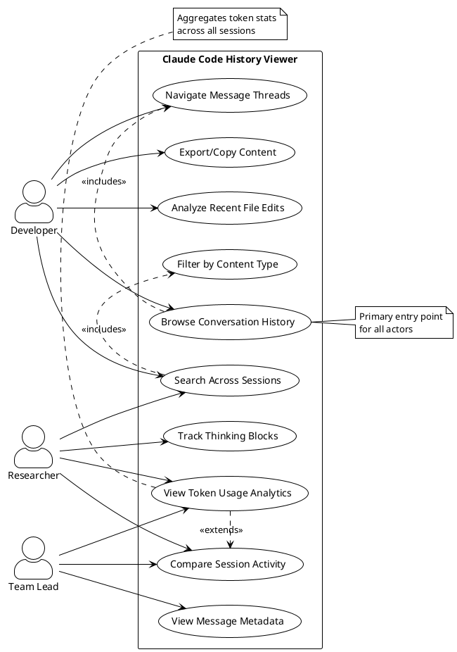

### Actor Descriptions

| Actor | Description | Goals |
|-------|-------------|-------|
| **Developer** | Software engineer using Claude Code for daily development | - Review past conversations for debugging<br>- Find code snippets from previous sessions<br>- Track file changes made by Claude<br>- Copy tool results for documentation |
| **Researcher** | Analyst studying Claude Code usage patterns | - Analyze token consumption trends<br>- Compare conversation structures<br>- Study thinking block patterns<br>- Extract statistical insights |
| **Team Lead** | Manager overseeing team's Claude usage | - Monitor team token usage<br>- Review session quality and outcomes<br>- Identify training opportunities<br>- Audit Claude interactions |

### Use Case Descriptions

#### UC1: Browse Conversation History

**Primary Actor:** Developer

**Description:** User navigates through a tree of projects and sessions stored in `~/.claude`, viewing message content in a virtual scrolling list.

**Preconditions:**
- Claude Code has been used at least once (creating `~/.claude` directory)
- User has launched CCHV desktop app

**Main Flow:**
1. App scans `~/.claude/projects/` directory
2. User sees project list in sidebar
3. User expands project to see sessions
4. User clicks session
5. App loads messages from JSONL file
6. User scrolls through message list
7. User can expand/collapse messages with tool use

**Postconditions:**
- User can read past conversation content
- Messages are displayed in chronological order
- Virtual scrolling ensures smooth performance

---

#### UC2: Search Across Sessions

**Primary Actor:** Developer, Researcher

**Description:** User enters search query to find specific content across all sessions, with highlighting and filtering options.

**Preconditions:**
- At least one session is loaded
- Search index has been built

**Main Flow:**
1. User types query in search box
2. App debounces input (300ms)
3. FlexSearch index is queried
4. Results appear in sidebar
5. User clicks result
6. App navigates to matching message
7. Search terms are highlighted

**Alternate Flows:**
- **3a:** User applies filter (tool results, thinking blocks)
  - Search is re-executed with filter
  - Only matching content types appear

**Postconditions:**
- User finds relevant messages
- Context is preserved (full conversation visible)

---

#### UC3: View Token Usage Analytics

**Primary Actor:** Researcher, Team Lead

**Description:** User views aggregated statistics about token usage, cost, and conversation patterns across sessions.

**Preconditions:**
- At least one session with assistant messages exists

**Main Flow:**
1. User clicks "Analytics" tab
2. App aggregates token counts from all sessions
3. Charts render:
   - Total input/output/cached tokens
   - Token usage over time
   - Cost estimation (if available)
   - Session comparison
4. User interacts with charts (zoom, filter)

**Postconditions:**
- User understands token consumption
- Cost trends are visible

---

#### UC4: Navigate Message Threads

**Primary Actor:** Developer

**Description:** User navigates parent-child message relationships, including sidechains and tool use/result pairs.

**Preconditions:**
- Session is loaded with message tree structure

**Main Flow:**
1. User sees message with reply indicator
2. User clicks "View Replies" button
3. Child messages are expanded inline
4. User can collapse thread

**Alternate Flows:**
- **3a:** User clicks "Go to Parent"
  - App scrolls to parent message
  - Parent is highlighted temporarily

**Postconditions:**
- User understands conversation structure
- Parent-child relationships are clear

---

#### UC5: Export/Copy Content

**Primary Actor:** Developer

**Description:** User copies message content or exports conversation data for external use.

**Preconditions:**
- At least one message is visible

**Main Flow:**
1. User right-clicks message or uses copy button
2. Context menu appears with options:
   - Copy message text
   - Copy tool result
   - Copy entire conversation
3. User selects option
4. Content is copied to clipboard
5. Toast notification confirms

**Postconditions:**
- Content is available in clipboard
- User can paste into other apps

---

#### UC6: Analyze Recent File Edits

**Primary Actor:** Developer

**Description:** User views a timeline of file edits made by Claude across sessions, grouped by file path.

**Preconditions:**
- At least one session contains Edit/Write tool results

**Main Flow:**
1. User opens "Recent Edits" panel
2. App scans all sessions for Edit/Write tool use
3. Edits are displayed in timeline:
   - Grouped by file path
   - Sorted by timestamp
   - Shows old_string → new_string diffs
4. User clicks edit to jump to session

**Postconditions:**
- User sees history of Claude's code changes
- Can correlate edits with conversation context

---

#### UC7: Compare Session Activity

**Primary Actor:** Researcher, Team Lead

**Description:** User compares metrics across multiple sessions (token usage, message count, tool use frequency).

**Preconditions:**
- Multiple sessions exist in different projects

**Main Flow:**
1. User selects multiple sessions (checkbox UI)
2. User clicks "Compare Sessions"
3. Comparison view appears:
   - Side-by-side metrics
   - Token usage chart (multi-line)
   - Tool use breakdown (stacked bar)
4. User exports comparison as CSV/JSON

**Postconditions:**
- User identifies outliers and patterns
- Data is exportable for further analysis

---

#### UC8: Filter by Content Type

**Primary Actor:** Developer, Researcher

**Description:** User filters messages to show only specific content types (tool results, thinking blocks, errors).

**Preconditions:**
- Session is loaded

**Main Flow:**
1. User opens filter dropdown
2. User selects content types:
   - ☑ Text messages
   - ☑ Tool use
   - ☑ Tool results
   - ☐ Thinking blocks
   - ☑ Errors
3. Message list refreshes
4. Only selected types are visible

**Postconditions:**
- User sees focused view of relevant content
- Virtual scroll adjusts to filtered list

---

#### UC9: View Message Metadata

**Primary Actor:** Team Lead

**Description:** User inspects detailed metadata for each message (timestamp, token counts, model used, stop reason).

**Preconditions:**
- Message with metadata exists

**Main Flow:**
1. User clicks "Details" icon on message
2. Metadata panel expands:
   - Message UUID
   - Timestamp (formatted)
   - Token usage breakdown
   - Model ID
   - Stop reason
   - Cost (if available)
3. User can copy metadata as JSON

**Postconditions:**
- User has full transparency into message details

---

#### UC10: Track Thinking Blocks

**Primary Actor:** Researcher

**Description:** User views and analyzes Claude's thinking blocks (extended thinking feature) across sessions.

**Preconditions:**
- At least one assistant message contains thinking blocks

**Main Flow:**
1. User enables "Show Thinking" toggle
2. Thinking blocks appear inline with assistant messages
3. User can:
   - Expand/collapse thinking
   - Search within thinking content
   - See thinking token count
4. Analytics tab shows thinking usage stats

**Postconditions:**
- User understands Claude's reasoning process
- Can study thinking patterns

---

## Level 2: Sequence Diagrams

### App Startup Flow

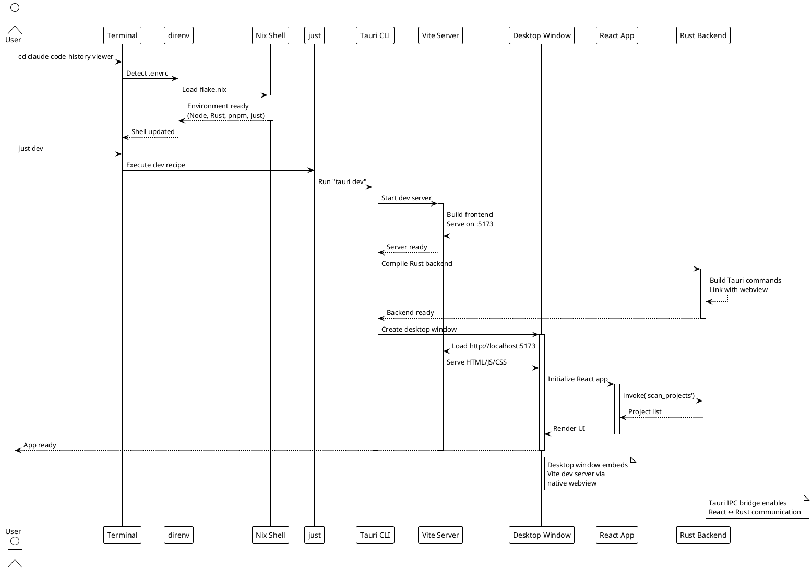

**Key Points:**
- User never directly opens browser - `just dev` launches desktop window
- Vite server runs in background, only accessible via Tauri webview
- Rust backend compiles once, then watches for changes
- React app initializes and immediately scans for projects

---

### Project Scan & Load

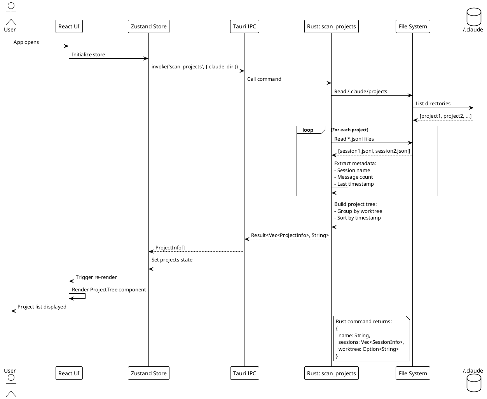

**Key Points:**
- Scan happens on app startup and can be manually refreshed
- Projects are grouped by Git worktree (if available)
- Metadata is extracted without loading full messages (efficient)

---

### Message Pagination

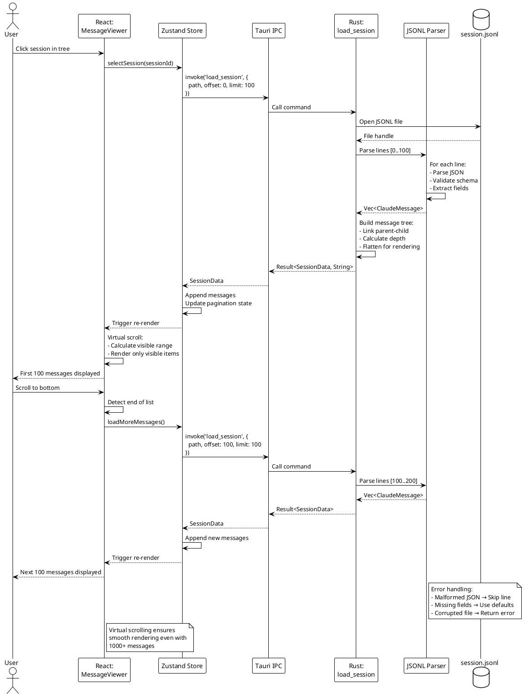

**Key Points:**
- Messages load in batches of 100 (configurable)
- Virtual scrolling renders only visible items
- Infinite scroll loads more messages automatically
- Message tree is flattened for linear display

---

### Search Execution

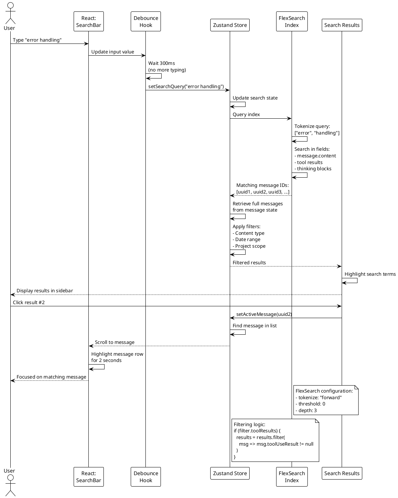

**Key Points:**
- Debouncing prevents search on every keystroke
- FlexSearch provides fast client-side full-text search
- Results maintain context (full conversation visible)
- Highlighting uses simple string replacement

---

### Analytics Calculation

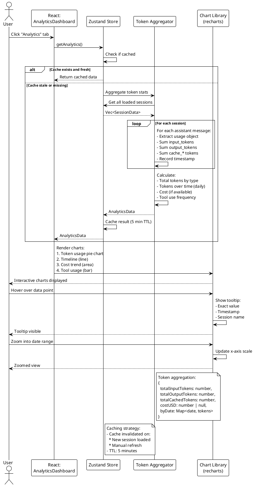

**Key Points:**
- Analytics are calculated on-demand (not on app startup)
- Results are cached to avoid redundant calculations
- All data is client-side (no backend aggregation)
- Charts are interactive (zoom, filter, tooltip)

---

## Level 3: Activity Diagrams

### JSONL Parsing Process

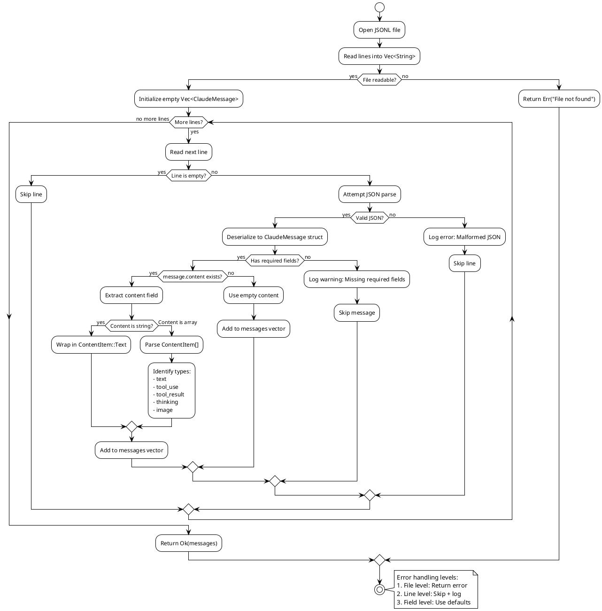

**Key Points:**
- Robust error handling at multiple levels
- Malformed lines are skipped, not fatal
- Content field can be string or array (both supported)
- Unknown content types are preserved as-is

---

### Virtual Scroll Rendering

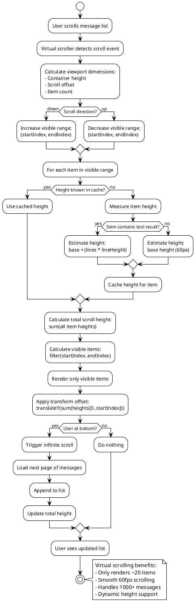

**Key Points:**
- Only visible items are rendered (performance)
- Heights are measured dynamically and cached
- Infinite scroll loads more messages automatically
- Transform offset maintains correct scroll position

---

### Search Index Building

```plantuml
@startuml Search Indexing
!theme plain
skinparam backgroundColor #FFFFFF

start

:User opens session;

:Messages loaded into store;

:Check if index exists for session;

if (Index exists?) then (yes)
  :Use existing index;
else (no)
  :Create new FlexSearch index;

  :Configure index:\n- tokenize: "forward"\n- threshold: 0\n- fields: [content, toolResult];

  :For each message in session;

  if (Message type?) then (user)
    :Extract text from content;
    :Add to index:\n{ id: uuid, content: text };
  else (assistant)
    :Extract text from content;

    if (Has tool_use?) then (yes)
      :Extract tool input/name;
      :Append to searchable text;
    endif

    if (Has thinking?) then (yes)
      if (User enabled "Search thinking"?) then (yes)
        :Extract thinking content;
        :Append to searchable text;
      endif
    endif

    :Add to index;
  else (system)
    :Extract text;
    :Add to index;
  endif

  if (Has toolUseResult?) then (yes)
    if (User enabled "Search tool results"?) then (yes)
      :Extract tool result content:\n- stdout/stderr\n- file content\n- error messages;
      :Add to index as separate document;
    endif
  endif

  :Next message;

  :Index complete;
  :Cache index in store;
endif

:Index ready for search;

stop

note right
  FlexSearch indexing:
  - ~10ms for 100 messages
  - ~100ms for 1000 messages
  - Index stored in memory
  - Rebuilt on session switch
end note

@enduml
```

**Key Points:**
- Index is built once per session
- Includes user preference filters (thinking, tool results)
- Separate documents for messages and tool results
- Fast indexing (~100ms for 1000 messages)

---

### Message Tree Flattening

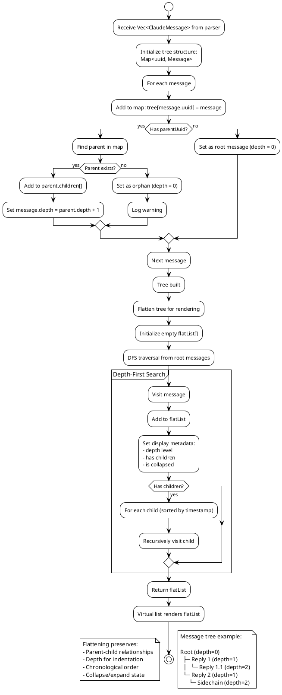

**Key Points:**
- Tree structure preserved but flattened for virtual list
- Depth stored for visual indentation
- DFS ensures correct ordering
- Orphan messages handled gracefully

---

### Tauri IPC Communication

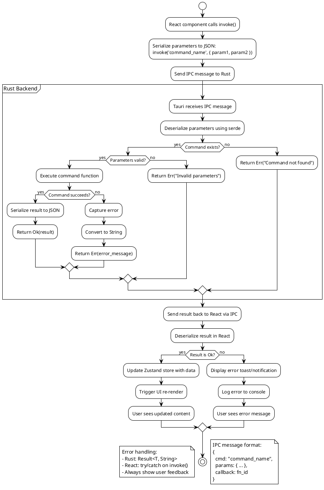

**Key Points:**
- All communication is async (Promise-based)
- Serialization/deserialization handled by Tauri
- Errors are always strings (Rust → React)
- No HTTP involved - direct function calls via IPC

---

## Level 4: Class Diagrams

### Zustand Store Structure

```plantuml
@startuml Zustand Store
!theme plain
skinparam backgroundColor #FFFFFF
skinparam classAttributeIconSize 0

package "Zustand Store (src/store/)" {

  class AppStore {
    + projects: ProjectInfo[]
    + messages: ClaudeMessage[]
    + searchQuery: string
    + analytics: AnalyticsData
    + settings: Settings
    --
    + setProjects(projects: ProjectInfo[])
    + selectProject(id: string)
    + loadMessages(sessionId: string)
    + setSearchQuery(query: string)
  }

  class ProjectSlice {
    + projects: ProjectInfo[]
    + selectedProject: string | null
    + loading: boolean
    --
    + setProjects(projects: ProjectInfo[])
    + selectProject(id: string)
    + refreshProjects()
  }

  class MessageSlice {
    + messages: ClaudeMessage[]
    + activeMessage: string | null
    + pagination: PaginationState
    + loading: boolean
    --
    + loadMessages(sessionId: string, offset: number, limit: number)
    + appendMessages(messages: ClaudeMessage[])
    + setActiveMessage(uuid: string)
    + clearMessages()
  }

  class SearchSlice {
    + query: string
    + results: SearchResult[]
    + filters: SearchFilters
    + index: FlexSearch.Index
    --
    + setQuery(query: string)
    + applyFilters(filters: SearchFilters)
    + buildIndex(messages: ClaudeMessage[])
    + search(query: string): SearchResult[]
  }

  class AnalyticsSlice {
    + data: AnalyticsData | null
    + cache: { timestamp: number, data: AnalyticsData } | null
    --
    + calculateAnalytics(): AnalyticsData
    + invalidateCache()
    + getTokenStats(): TokenStats
  }

  class SettingsSlice {
    + theme: 'light' | 'dark'
    + showThinking: boolean
    + searchInToolResults: boolean
    + language: string
    --
    + setTheme(theme: string)
    + toggleShowThinking()
    + setLanguage(lang: string)
  }

  class MetadataSlice {
    + hiddenProjects: Set<string>
    + customSessionNames: Map<string, string>
    --
    + hideProject(id: string)
    + unhideProject(id: string)
    + setSessionName(id: string, name: string)
  }

  class FilterSlice {
    + contentTypes: Set<ContentType>
    + dateRange: DateRange | null
    --
    + toggleContentType(type: ContentType)
    + setDateRange(range: DateRange)
    + clearFilters()
  }

  class NavigationSlice {
    + history: string[]
    + historyIndex: number
    --
    + pushHistory(sessionId: string)
    + goBack()
    + goForward()
    + canGoBack(): boolean
    + canGoForward(): boolean
  }

  AppStore *-- ProjectSlice
  AppStore *-- MessageSlice
  AppStore *-- SearchSlice
  AppStore *-- AnalyticsSlice
  AppStore *-- SettingsSlice
  AppStore *-- MetadataSlice
  AppStore *-- FilterSlice
  AppStore *-- NavigationSlice
}

note right of AppStore
  Store created with:
  create<AppStore>()(
    (...slices) => ({
      ...projectSlice(...slices),
      ...messageSlice(...slices),
      ...searchSlice(...slices),
      // etc.
    })
  )
end note

note bottom of SearchSlice
  FlexSearch index config:
  {
    tokenize: "forward",
    threshold: 0,
    depth: 3,
    async: false
  }
end note

@enduml
```

**Key Points:**
- All slices combined into single store (AppStore)
- Each slice manages a specific domain
- Slices can access other slices via parameters
- Store persists to localStorage for settings/metadata

---

### Tauri Command Architecture

```plantuml
@startuml Tauri Commands
!theme plain
skinparam backgroundColor #FFFFFF
skinparam classAttributeIconSize 0

package "Tauri Commands (src-tauri/src/commands/)" {

  class ProjectCommands {
    + scan_projects(claude_dir: String): Result<Vec<ProjectInfo>, String>
    + refresh_project(project_id: String): Result<ProjectInfo, String>
  }

  package "session/" {
    class SessionCommands {
      + load_session(path: String, offset: usize, limit: usize): Result<SessionData, String>
      + search_session(path: String, query: String): Result<Vec<SearchResult>, String>
      + rename_session(path: String, new_name: String): Result<(), String>
    }

    class EditTracker {
      + track_edits(messages: Vec<ClaudeMessage>): Vec<FileEdit>
      + get_recent_edits(sessions: Vec<String>): Result<Vec<FileEdit>, String>
    }
  }

  class StatsCommands {
    + calculate_stats(messages: Vec<ClaudeMessage>): TokenStats
    + get_session_stats(session_id: String): Result<SessionStats, String>
  }

  class MetadataCommands {
    + load_metadata(): Result<UserMetadata, String>
    + save_metadata(data: UserMetadata): Result<(), String>
    + hide_project(project_id: String): Result<(), String>
    + set_custom_name(session_id: String, name: String): Result<(), String>
  }

  class SettingsCommands {
    + load_settings(): Result<Settings, String>
    + save_settings(settings: Settings): Result<(), String>
    + reset_to_defaults(): Result<Settings, String>
  }

  class WatcherCommands {
    + start_watching(path: String): Result<(), String>
    + stop_watching(): Result<(), String>
  }

  class FeedbackCommands {
    + collect_system_info(): SystemInfo
    + generate_bug_report(description: String): Result<String, String>
  }

  class FsUtilsCommands {
    + read_file_safe(path: String): Result<String, String>
    + write_file_atomic(path: String, content: String): Result<(), String>
  }
}

ProjectCommands ..> FsUtilsCommands : uses
SessionCommands ..> FsUtilsCommands : uses
MetadataCommands ..> FsUtilsCommands : uses
SettingsCommands ..> FsUtilsCommands : uses
SessionCommands --> EditTracker : uses

note right of ProjectCommands
  Returns project list with:
  - Project name
  - Session count
  - Worktree info
  - Last activity timestamp
end note

note right of SessionCommands
  Pagination:
  - offset: starting index
  - limit: max messages (100)
  - Returns: messages + hasMore flag
end note

note bottom of FsUtilsCommands
  Atomic write pattern:
  1. Write to temp file
  2. Verify write success
  3. Rename temp → target
  (Prevents corruption)
end note

@enduml
```

**Key Points:**
- Commands organized by domain (project, session, stats, etc.)
- All commands return `Result<T, String>` for error handling
- FsUtils provides safe file operations used by other commands
- Commands are exposed via `#[tauri::command]` macro

---

### React Component Hierarchy

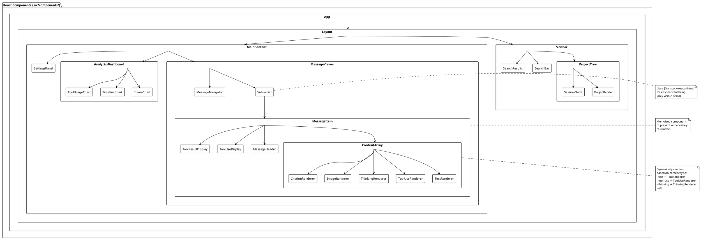

**Key Points:**
- Layout uses sidebar + main content pattern
- Virtual scrolling in MessageViewer for performance
- Content renderers are dynamically selected by type
- Components are memoized where appropriate
- Charts use recharts library

---

### Message Type Hierarchy

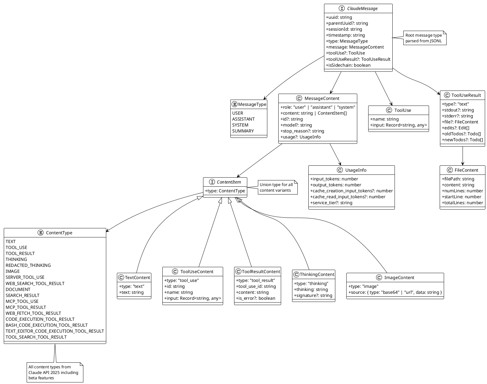

**Key Points:**
- `ClaudeMessage` is the root type for all messages
- `ContentItem` is a union type supporting 15+ content types
- Tool use and results are separate fields (not in content array)
- Usage info tracks token consumption and caching
- Type system matches Claude API 2025 specification

---

## Reference

### Tauri Commands Reference

| Command | Module | Parameters | Returns | Purpose |
|---------|--------|------------|---------|---------|
| `scan_projects` | `project.rs` | `claude_dir: String` | `Vec<ProjectInfo>` | Scan ~/.claude directory for projects |
| `load_session` | `session/` | `path: String, offset: usize, limit: usize` | `SessionData` | Load messages from JSONL file (paginated) |
| `search_session` | `session/` | `path: String, query: String` | `Vec<SearchResult>` | Search within a session (backend search) |
| `rename_session` | `session/` | `path: String, new_name: String` | `()` | Rename a session file |
| `calculate_stats` | `stats.rs` | `messages: Vec<ClaudeMessage>` | `TokenStats` | Calculate token statistics |
| `get_session_stats` | `stats.rs` | `session_id: String` | `SessionStats` | Get stats for a specific session |
| `load_metadata` | `metadata.rs` | - | `UserMetadata` | Load user metadata (hidden projects, custom names) |
| `save_metadata` | `metadata.rs` | `data: UserMetadata` | `()` | Save user metadata to disk |
| `hide_project` | `metadata.rs` | `project_id: String` | `()` | Hide a project from view |
| `set_custom_name` | `metadata.rs` | `session_id: String, name: String` | `()` | Set custom session name |
| `load_settings` | `settings.rs` | - | `Settings` | Load app settings |
| `save_settings` | `settings.rs` | `settings: Settings` | `()` | Save app settings |
| `reset_to_defaults` | `settings.rs` | - | `Settings` | Reset settings to defaults |
| `start_watching` | `watcher.rs` | `path: String` | `()` | Start file system watcher |
| `stop_watching` | `watcher.rs` | - | `()` | Stop file system watcher |
| `collect_system_info` | `feedback.rs` | - | `SystemInfo` | Collect system info for bug reports |
| `generate_bug_report` | `feedback.rs` | `description: String` | `String` | Generate formatted bug report |
| `get_recent_edits` | `session/` | `sessions: Vec<String>` | `Vec<FileEdit>` | Get recent file edits across sessions |
| `read_file_safe` | `fs_utils.rs` | `path: String` | `String` | Read file with error handling |
| `write_file_atomic` | `fs_utils.rs` | `path: String, content: String` | `()` | Write file atomically (temp + rename) |

**Error Handling Pattern:**
All commands return `Result<T, String>` where:
- `Ok(data)` → Success
- `Err(message)` → Error message as string

**Usage in React:**
```typescript
import { invoke } from '@tauri-apps/api/core';

try {
  const projects = await invoke<ProjectInfo[]>('scan_projects', {
    claudeDir: '~/.claude'
  });
  // Handle success
} catch (error) {
  console.error('Error scanning projects:', error);
  // Show user-friendly error
}
```

---

### Store Slices Reference

| Slice | State Keys | Actions | Purpose |
|-------|------------|---------|---------|
| **projectSlice** | `projects: ProjectInfo[]`<br>`selectedProject: string \| null`<br>`loading: boolean` | `setProjects(projects)`<br>`selectProject(id)`<br>`refreshProjects()`<br>`clearProjects()` | Manage project list and selection |
| **messageSlice** | `messages: ClaudeMessage[]`<br>`activeMessage: string \| null`<br>`pagination: PaginationState`<br>`loading: boolean` | `loadMessages(sessionId, offset, limit)`<br>`appendMessages(messages)`<br>`setActiveMessage(uuid)`<br>`clearMessages()`<br>`loadMoreMessages()` | Message data and pagination |
| **searchSlice** | `query: string`<br>`results: SearchResult[]`<br>`filters: SearchFilters`<br>`index: FlexSearch.Index` | `setQuery(query)`<br>`applyFilters(filters)`<br>`buildIndex(messages)`<br>`search(query)`<br>`clearSearch()` | Full-text search with FlexSearch |
| **analyticsSlice** | `data: AnalyticsData \| null`<br>`cache: CacheEntry \| null` | `calculateAnalytics()`<br>`invalidateCache()`<br>`getTokenStats()`<br>`getCostEstimate()` | Token usage and analytics |
| **settingsSlice** | `theme: 'light' \| 'dark'`<br>`showThinking: boolean`<br>`searchInToolResults: boolean`<br>`language: string` | `setTheme(theme)`<br>`toggleShowThinking()`<br>`toggleSearchToolResults()`<br>`setLanguage(lang)` | App settings and preferences |
| **metadataSlice** | `hiddenProjects: Set<string>`<br>`customSessionNames: Map<string, string>` | `hideProject(id)`<br>`unhideProject(id)`<br>`setSessionName(id, name)`<br>`clearMetadata()` | User metadata (hidden/renamed items) |
| **filterSlice** | `contentTypes: Set<ContentType>`<br>`dateRange: DateRange \| null` | `toggleContentType(type)`<br>`setDateRange(range)`<br>`clearFilters()`<br>`applyFilters()` | Message filtering |
| **navigationSlice** | `history: string[]`<br>`historyIndex: number` | `pushHistory(sessionId)`<br>`goBack()`<br>`goForward()`<br>`canGoBack()`<br>`canGoForward()` | Navigation history (back/forward) |
| **boardSlice** | `selectedSessions: Set<string>`<br>`layout: BoardLayout` | `toggleSession(id)`<br>`clearSelection()`<br>`setLayout(layout)` | Multi-session board view |

**Store Usage:**
```typescript
import { useAppStore } from '@/store/useAppStore';

function MyComponent() {
  const projects = useAppStore(state => state.projects);
  const setProjects = useAppStore(state => state.setProjects);

  // Use state and actions
}
```

---

### Key Files Map

#### Frontend (src/)

| Path | Purpose |
|------|---------|
| `src/components/ProjectTree.tsx` | Project/session tree in sidebar |
| `src/components/MessageViewer/` | Virtual scrolling message list |
| `src/components/AnalyticsDashboard/` | Token stats and charts |
| `src/components/SessionBoard/` | Multi-session comparison view |
| `src/components/MessageNavigator/` | TOC navigation for conversations |
| `src/components/renderers/` | Content type renderers (text, tool use, thinking, etc.) |
| `src/store/useAppStore.ts` | Zustand store (all slices combined) |
| `src/hooks/useGitHubUpdater.ts` | GitHub API integration for updates |
| `src/hooks/useSmartUpdater.ts` | Smart update logic (skip/postpone) |
| `src/i18n/` | Internationalization (5 languages) |
| `src/types/index.ts` | TypeScript type definitions |
| `src/utils/messageAdapter.ts` | Adapt raw messages to UI format |
| `src/utils/jsonUtils.ts` | JSON parsing utilities |

#### Backend (src-tauri/src/)

| Path | Purpose |
|------|---------|
| `src-tauri/src/main.rs` | Tauri app entry point |
| `src-tauri/src/commands/project.rs` | Project scanning and Git log |
| `src-tauri/src/commands/session/` | Session loading, pagination, search |
| `src-tauri/src/commands/stats.rs` | Token statistics calculation |
| `src-tauri/src/commands/metadata.rs` | User metadata (hidden projects, custom names) |
| `src-tauri/src/commands/settings.rs` | Settings preset management |
| `src-tauri/src/commands/watcher.rs` | File system watching |
| `src-tauri/src/commands/feedback.rs` | Bug reporting and system info |
| `src-tauri/src/commands/fs_utils.rs` | Safe file operations |
| `src-tauri/src/models/message.rs` | Message structs matching JSONL |
| `src-tauri/src/models/session.rs` | Session metadata |
| `src-tauri/src/models/stats.rs` | Statistics structures |
| `src-tauri/src/models/edit.rs` | File edit tracking |

#### Configuration

| Path | Purpose |
|------|---------|
| `flake.nix` | Nix development environment |
| `justfile` | Task runner commands |
| `package.json` | Node dependencies (source of truth for version) |
| `src-tauri/Cargo.toml` | Rust dependencies |
| `src-tauri/tauri.conf.json` | Tauri app configuration |
| `vite.config.ts` | Vite build configuration |
| `tsconfig.json` | TypeScript configuration |
| `tailwind.config.js` | Tailwind CSS configuration |

---

### Message Type Reference

#### Core Message Types

| Type | When Used | Structure Example |
|------|-----------|-------------------|
| **user** | User input messages | `{ type: "user", message: { role: "user", content: "..." } }` |
| **assistant** | Claude's responses | `{ type: "assistant", message: { role: "assistant", content: [...], usage: {...} } }` |
| **system** | System messages (init, errors) | `{ type: "system", message: { role: "system", content: "..." } }` |
| **summary** | Conversation summaries | `{ type: "summary", summary: "...", leafUuid: "..." }` |

#### Content Item Types

| Type | Purpose | Example |
|------|---------|---------|
| **text** | Plain text content | `{ type: "text", text: "Hello world" }` |
| **tool_use** | Tool invocation | `{ type: "tool_use", id: "toolu_...", name: "Read", input: {...} }` |
| **tool_result** | Tool execution result | `{ type: "tool_result", tool_use_id: "toolu_...", content: "..." }` |
| **thinking** | Claude's reasoning | `{ type: "thinking", thinking: "...", signature: "..." }` |
| **redacted_thinking** | Encrypted thinking (safety) | `{ type: "redacted_thinking", signature: "..." }` |
| **image** | Image content | `{ type: "image", source: { type: "base64", data: "..." } }` |
| **server_tool_use** | Server-side tool (web_search) | `{ type: "server_tool_use", name: "web_search", input: {...} }` |
| **web_search_tool_result** | Web search results | `{ type: "web_search_tool_result", content: "...", results: [...] }` |
| **document** | PDF/text documents | `{ type: "document", source: {...}, title: "..." }` |
| **search_result** | Search result items | `{ type: "search_result", url: "...", title: "...", content: "..." }` |
| **mcp_tool_use** | MCP tool invocation | `{ type: "mcp_tool_use", id: "...", server: "...", tool: "..." }` |
| **mcp_tool_result** | MCP tool result | `{ type: "mcp_tool_result", tool_use_id: "...", content: {...} }` |

#### Beta Content Types (2025)

| Type | Beta Feature | Purpose |
|------|--------------|---------|
| **web_fetch_tool_result** | web-fetch-2025-09-10 | Full page/PDF content retrieval |
| **code_execution_tool_result** | code-execution-2025-08-25 | Legacy Python code execution |
| **bash_code_execution_tool_result** | code-execution-2025-08-25 | Bash command execution |
| **text_editor_code_execution_tool_result** | code-execution-2025-08-25 | File operations (view/create/edit/delete) |
| **tool_search_tool_result** | mcp-client-2025-11-20 | MCP tool discovery results |

#### Tool Use Result Structures

| Tool | Result Structure |
|------|------------------|
| **Read** | `{ file: { filePath, content, numLines, startLine, totalLines } }` |
| **Write** | `{ filePath, content }` |
| **Edit** | `{ filePath, edits: [{ old_string, new_string, replace_all }], originalFileContents }` |
| **Bash** | `{ stdout, stderr, interrupted, isImage }` |
| **TodoWrite** | `{ oldTodos: [...], newTodos: [...] }` |
| **Error** | `{ content: "Error: ...", is_error: true }` |

---

**End of Architecture Documentation**

For quick lookup: [CCHV_API_REFERENCE.md](CCHV_API_REFERENCE.md)
For getting started: [CCHV_GETTING_STARTED.md](CCHV_GETTING_STARTED.md)
For high-level overview: [CCHV_TLDR.md](CCHV_TLDR.md)
