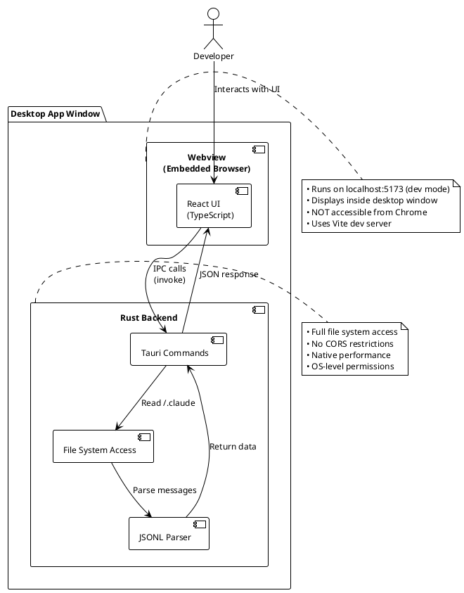

# CCHV TLDR - Quick Overview

**Claude Code History Viewer (CCHV)** is a Tauri-based desktop application for browsing and analyzing Claude Code conversation history stored in `~/.claude`.

## What is Tauri?

Tauri is a framework for building desktop applications using web technologies (HTML/CSS/JavaScript) with a native backend (Rust).



## Key Concepts

### 1. localhost:5173 - What is it?

**In development mode:**
- `just dev` starts **two** processes:
  1. **Vite dev server** (frontend) on `http://localhost:5173`
  2. **Tauri desktop app** (embeds the Vite server in a native window)

**Why you see localhost:5173:**
- The Tauri app window is showing the Vite dev server content
- It's NOT a regular browser - it's an embedded webview
- You cannot open `localhost:5173` in Chrome because Tauri uses native IPC, not HTTP APIs

### 2. Desktop App vs Browser

| Aspect | Desktop App (Tauri) | Browser (Chrome) |
|--------|---------------------|------------------|
| **Window** | Native OS window | Browser tab |
| **Backend Access** | Direct Rust function calls via IPC | HTTP/WebSocket only |
| **File System** | Full access (no security sandbox) | Restricted (user must grant permission) |
| **CORS** | Not applicable (no HTTP) | Enforced by browser |
| **Performance** | Native code (Rust) | JavaScript only |
| **Distribution** | .dmg/.exe/.AppImage | Not applicable |

### 3. Development Workflow

```bash
# 1. Enter project directory (direnv auto-loads Nix environment)
cd ~/projects/global/claude-code-history-viewer

# 2. Start development (launches desktop window)
just dev

# 3. What happens:
# - Terminal shows: "webview.window.create" with URL http://localhost:5173
# - Desktop window appears (this IS the app)
# - React DevTools available in desktop window
# - Hot reload works automatically
```

**Common mistake:** Opening `http://localhost:5173` in Chrome
- ❌ This won't work - Tauri commands fail (no IPC bridge)
- ✅ Use the desktop window that `just dev` opens

### 4. Tech Stack at a Glance

**Frontend:**
- React 18 + TypeScript
- Zustand (state management)
- Tailwind CSS v4 (styling)
- @tanstack/react-virtual (virtual scrolling)
- FlexSearch (client-side search)

**Backend:**
- Rust (stable)
- Tauri v2 (IPC framework)
- Serde (JSON serialization)
- Walkdir (file system traversal)

**Development Tools:**
- Nix + direnv (reproducible environment)
- just (task runner)
- Vite (frontend build tool)
- pnpm (package manager)

### 5. What CCHV Does

- **Scans** `~/.claude/projects/` for conversation JSONL files
- **Parses** messages (user, assistant, tool use, thinking blocks)
- **Renders** in a virtual scrolling list (efficient for 1000+ messages)
- **Searches** across all sessions using FlexSearch index
- **Analyzes** token usage, conversation patterns, file edits
- **Exports** content via copy/clipboard

## Quick Links

- **Getting Started:** [CCHV_GETTING_STARTED.md](CCHV_GETTING_STARTED.md)
- **Full Architecture:** [CCHV_ARCHITECTURE.md](CCHV_ARCHITECTURE.md)
- **API Reference:** [CCHV_API_REFERENCE.md](CCHV_API_REFERENCE.md)
- **Main Project:** [claude-code-history-viewer](https://github.com/jhlee0409/claude-code-history-viewer)

## One-Sentence Summary

CCHV is a Tauri desktop app (not a web app) that lets you browse Claude Code conversation history with a React UI powered by a Rust backend that reads `~/.claude` files.
