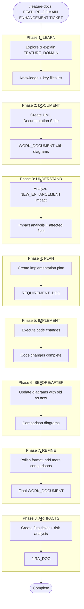

# /feature-docs - Feature Documentation Workflow

Interactive 8-phase workflow for documenting features and implementing enhancements with UML diagrams.

## Arguments

Parse the arguments provided:
- **FEATURE_DOMAIN** = First argument (e.g., "Conversations", "Magic Links")
- **NEW_ENHANCEMENT** = Second argument (e.g., "Chat Termination Handling", "API Migration")
- **TICKET_ID** = Third argument or derive from current folder (e.g., "WEB-5000")

## Workflow Overview



## Constants

Based on the arguments, set these constants:

| Constant | Value |
|----------|-------|
| `FEATURE_DOMAIN` | [First argument] |
| `NEW_ENHANCEMENT` | [Second argument] |
| `TICKET_ID` | [Third argument or folder name] |
| `WORK_DOCUMENT` | `{TICKET_ID}/{feature-domain-lowercase}-uml.md` |
| `REQUIREMENT_DOC` | `{TICKET_ID}/{enhancement-uppercase}_PLAN.md` |
| `JIRA_DOC` | `{TICKET_ID}/JIRA-{enhancement-kebab-case}.md` |

## Your Task

1. **Parse the arguments** and display the constants table with actual values
2. **Ask the user which phase to start with** (default: Phase 1)
3. **Execute each phase** using the prompts below, waiting for user confirmation between phases

---

## Phase 1: LEARN

**Goal:** Understand the feature domain and identify key files.

**Prompt:**
> Please teach me what **{FEATURE_DOMAIN}** is, how it is used by users of our product, and how I can begin to understand it.
>
> Identify:
> - The key concepts and terminology
> - The main user flows/use cases
> - The key source files and their purposes
> - Any existing documentation

**Output:** Knowledge summary + key files list

---

## Phase 2: DOCUMENT

**Goal:** Create a comprehensive UML documentation suite.

**Prompt:**
> Create a UML Documentation Suite for **{FEATURE_DOMAIN}** at `{WORK_DOCUMENT}` using PlantUML with:
>
> - **Level 1: Use Case Diagram** - Actors and use cases
> - **Level 2: Sequence Diagrams** - Main user flows (happy paths + error scenarios)
> - **Level 3: Activity Diagrams** - Detailed process steps
> - **Level 4: Class Diagrams** - Static structure (controllers, components, utilities)
> - **Reference Section** - API endpoints, key files, event types

**Output:** `{WORK_DOCUMENT}` file created

---

## Phase 3: UNDERSTAND

**Goal:** Analyze the enhancement's impact on the existing system.

**Prompt:**
> Study and review the changes being made for **{NEW_ENHANCEMENT}**.
>
> Analyze:
> - What components/files are affected?
> - Which use cases are impacted?
> - What are the API changes (if any)?
> - What are the potential risks?

**Output:** Impact analysis with affected files list

---

## Phase 4: PLAN

**Goal:** Create a detailed implementation plan.

**Prompt:**
> Create an implementation plan document at `{REQUIREMENT_DOC}` that includes:
>
> - **Overview** - Summary of the changes
> - **API Changes** - Before/after endpoint comparison
> - **Implementation Steps** - Phased approach with specific files and line numbers
> - **Testing Strategy** - Unit, integration, E2E tests
> - **Risks & Mitigation** - Risk matrix with likelihood/impact
> - **Rollback Plan** - How to revert if issues arise

**Output:** `{REQUIREMENT_DOC}` file created

---

## Phase 5: IMPLEMENT

**Goal:** Execute the code changes according to the plan.

**Prompt:**
> Implement the plan as specified in `{REQUIREMENT_DOC}`.
>
> - Create todo items for each implementation step
> - Mark todos as in_progress as you work
> - Don't stop until all todos are complete
> - Run linting and tests after changes

**Output:** Code changes complete, tests passing

---

## Phase 6: BEFORE/AFTER

**Goal:** Update diagrams to show the migration/changes.

**Prompt:**
> Update `{WORK_DOCUMENT}` to show before/after comparisons in the diagrams:
>
> - Use **color coding**: pink/red = deprecated/old, green = current/new
> - Add **migration notes** explaining what changed
> - Add **new error scenarios** introduced by the changes
> - Update **class diagrams** with new dependencies/utilities
> - Use PlantUML groups or partitions to show old vs new

**Output:** Diagrams updated with comparisons

---

## Phase 7: REFINE

**Goal:** Polish the documentation and add comprehensive comparisons.

**Prompt:**
> Analyze all diagrams in `{WORK_DOCUMENT}` to determine which could benefit from showing old vs new comparisons.
>
> For each diagram:
> - Is it affected by {NEW_ENHANCEMENT}?
> - Should it show before/after comparison?
> - Are there new error scenarios to add?
>
> Update all affected diagrams.

**Output:** Final polished `{WORK_DOCUMENT}`

---

## Phase 8: ARTIFACTS

**Goal:** Create Jira ticket documentation with risk analysis.

**Prompt:**
> Create a Jira ticket document at `{JIRA_DOC}` with:
>
> - **Title** - Clear, concise (under 70 chars)
> - **Description** - Summary, background, API changes table
> - **Scope** - Checklist of work items
> - **Acceptance Criteria** - What "done" looks like
> - **Risk Assessment**:
>   - Use case impact map (which use cases are affected)
>   - Risk matrix (risk, likelihood, impact, mitigation)
>   - Why risk is elevated (if applicable)
> - **Testing Requirements** - Unit, integration, manual testing checklists
> - **Rollback Plan** - Steps to revert if issues arise
> - **Files Changed** - Quick reference for code review

**Output:** `{JIRA_DOC}` file created

---

## Usage Examples

### Example 1: Conversations Feature
```bash
/feature-docs Conversations "Chat Termination Handling" WEB-5000
```

This will:
- Set FEATURE_DOMAIN = "Conversations"
- Set NEW_ENHANCEMENT = "Chat Termination Handling"
- Set TICKET_ID = "WEB-5000"
- Create files in `WEB-5000/` folder

### Example 2: Using Current Folder
```bash
/feature-docs "User Authentication" "OAuth Integration"
```

This will derive TICKET_ID from the current folder name.

---

## Interactive Flow

After parsing arguments, ask:

> I've set up the following constants:
>
> | Constant | Value |
> |----------|-------|
> | FEATURE_DOMAIN | {value} |
> | NEW_ENHANCEMENT | {value} |
> | TICKET_ID | {value} |
> | WORK_DOCUMENT | {path} |
> | REQUIREMENT_DOC | {path} |
> | JIRA_DOC | {path} |
>
> Which phase would you like to start with?
> 1. LEARN - Explore the feature domain
> 2. DOCUMENT - Create UML documentation
> 3. UNDERSTAND - Analyze the enhancement
> 4. PLAN - Create implementation plan
> 5. IMPLEMENT - Execute code changes
> 6. BEFORE/AFTER - Update diagrams with comparisons
> 7. REFINE - Polish documentation
> 8. ARTIFACTS - Create Jira ticket

Then execute that phase and ask if they want to continue to the next phase.
