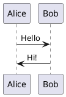
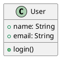
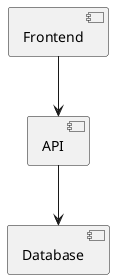

# PlantUML Server

Local PlantUML server for generating UML diagrams from plain text.

## Quick Start

```bash
# Enter the project directory (direnv will auto-load the environment)
cd ~/projects/global/plantuml-server

# Start the server
start

# Check status
status

# Open in browser
open http://localhost:8765/plantuml
```

## Usage

### Starting the Server

```bash
start
```

Server will be available at http://localhost:8765/plantuml

### Testing with Examples

```bash
# Generate PNG from example
curl http://localhost:8765/plantuml/png \
  --data '@examples/sequence.puml' > diagram.png

# Open the diagram
open diagram.png
```

### Web UI

1. Open http://localhost:8765/plantuml in your browser
2. Paste PlantUML code and click "Submit"
3. Download the generated diagram

### Stopping the Server

```bash
stop
```

### VS Code / Cursor / Obsidian Integration (Automatic & Ephemeral)

**Ephemeral Mode (Default):**

The server automatically manages IDE settings and Obsidian plugin:
- **On start:**
  - Configures VS Code/Cursor to use local server (silently)
  - **Installs Obsidian PlantUML plugin** (downloads from GitHub)
  - Configures Obsidian to use local server
- **On stop:**
  - Removes VS Code/Cursor PlantUML configuration (clean state)
  - **Completely uninstalls Obsidian PlantUML plugin** (removes all files)

**Truly ephemeral:** The Obsidian plugin only exists when the server is running. When you stop the server, the plugin completely disappears from Obsidian.

**Persistent Mode (Optional):**

To keep IDE configs when server stops:

```bash
# In .envrc
export PLANTUML_PERSISTENT_CONFIG=true

# Reload environment
direnv reload
```

On first start, you'll be prompted to configure IDEs. After that, configs persist even when the server is stopped.

**Configuration Modes:**

| Mode | Behavior | Use Case |
|------|----------|----------|
| **Ephemeral** (default) | Configs added on start, removed on stop | Clean state, one PlantUML server |
| **Persistent** | Configured once, kept forever | Multiple servers, prefer manual control |

**Using the Preview (VS Code/Cursor):**
- Open any `.puml` file in VS Code or Cursor
- Press `Alt+D` (or `Option+D` on Mac) to preview
- Or right-click → "Preview Current Diagram"
- Auto-preview updates as you type

**Using with Obsidian:**
1. **Just run `start` - plugin installs automatically!**
2. Create a `.puml` file in your vault (e.g., `~/projects/diagram.puml`)
3. Open the file in Obsidian - the diagram will render automatically
4. **When you stop the server, the plugin completely uninstalls** (true ephemeral mode)

**How it works:**
- `start` → Downloads plugin from GitHub → Installs to Obsidian → Configures for local server
- `stop` → Deletes plugin files → Removes from Obsidian → Clean state

The plugin only exists while the server is running!

**Test:**
- Open `examples/test-vscode.puml`
- Press `Option+D` to see the preview (VS Code/Cursor)
- Or open any `.puml` file in Obsidian to see it render

**Manual Configuration (if needed):**

If you prefer to configure manually or need to reconfigure:

```bash
# Reconfigure IDEs
bin/configure-ides --reconfigure

# Remove PlantUML configuration
bin/unconfigure-ides

# Or manually add to settings.json:
# (Cmd+Shift+P → "Open User Settings (JSON)")
```

```json
{
  "plantuml.server": "http://localhost:8765/plantuml",
  "plantuml.render": "PlantUMLServer",
  "files.associations": {
    "*.puml": "plantuml",
    "*.plantuml": "plantuml"
  },
  "plantuml.previewAutoUpdate": true
}
```

**Manually Install Extension (if auto-install failed):**
- Open Extensions (Cmd+Shift+X)
- Search for "PlantUML"
- Install "PlantUML" by jebbs

**Removing PlantUML Configuration:**

To completely remove PlantUML settings from your IDEs:

```bash
bin/unconfigure-ides
```

This will:
- Remove PlantUML server settings from VS Code/Cursor
- Remove file associations (*.puml, *.plantuml)
- Optionally uninstall the PlantUML extension
- Create backups before making changes
- Remove the `.configured` flag (so `start` will offer to reconfigure)

## Available Commands

**Server Management:**
- `start` - Start PlantUML server (auto-configures IDEs on first run)
- `stop` - Stop PlantUML server
- `status` - Check if server is running and responding
- `restart` - Restart server

**IDE Configuration:**
- `bin/configure-ides` - Configure VS Code/Cursor for PlantUML (auto-run by `start`)
- `bin/configure-ides --reconfigure` - Reconfigure IDEs (force re-run)
- `bin/unconfigure-ides` - Remove PlantUML configuration from IDEs
- `bin/install-obsidian-plugin` - Download and install Obsidian PlantUML plugin
- `bin/uninstall-obsidian-plugin` - Completely remove Obsidian PlantUML plugin
- `bin/configure-obsidian` - Configure Obsidian for PlantUML (auto-run by `start`, auto-installs plugin)
- `bin/unconfigure-obsidian` - Remove PlantUML configuration from Obsidian (legacy, not used in ephemeral mode)

**Direct Rendering:**
- `plantuml` - CLI tool for local rendering (no server needed)

## API Endpoints

- `GET /plantuml` - Web interface
- `POST /plantuml/png` - Generate PNG from PlantUML text
- `POST /plantuml/svg` - Generate SVG from PlantUML text
- `POST /plantuml/txt` - Generate ASCII art from PlantUML text

## Examples

See the `examples/` directory for sample PlantUML diagrams:
- `sequence.puml` - Sequence diagram
- `class.puml` - Class diagram
- `component.puml` - Component diagram

## Configuration

Environment variables (set in shell.nix or .envrc):
- `PLANTUML_PORT` - Server port (default: 8765)
  - Port 8765 chosen to avoid conflicts with common dev tools (webpack, spring boot, etc.)
  - Port 8080 is avoided as it's commonly used by many frameworks
- `PLANTUML_PERSISTENT_CONFIG` - IDE configuration mode (default: false)
  - `false` - Ephemeral mode: configs added on start, removed on stop
  - `true` - Persistent mode: configs kept when server stops
- `OBSIDIAN_VAULT_PATH` - Path to Obsidian vault (default: ~/projects)
  - Used to locate the PlantUML plugin configuration
- `OBSIDIAN_AUTO_INSTALL` - Auto-install Obsidian plugin if missing (default: true)
  - Set to `false` to skip auto-installation
- `PLANTUML_SERVER_WAR` - Path to PlantUML WAR file (auto-set by Nix)

## Troubleshooting

### Server won't start

```bash
# Check if port 8765 is already in use
lsof -i :8765

# View server logs
tail -f data/logs/plantuml.log

# If port conflict, change to different port in .envrc
# See "Port conflict" section below
```

### Obsidian PlantUML not rendering or using wrong server

```bash
# Check if plugin is installed
ls -la ~/projects/.obsidian/plugins/obsidian-plantuml/

# Check current server configuration
cat ~/projects/.obsidian/plugins/obsidian-plantuml/data.json | jq .server_url

# If plugin not installed:
# 1. Open Obsidian
# 2. Settings → Community Plugins → Browse
# 3. Search "PlantUML" and install "PlantUML" by joethei
# 4. Enable the plugin

# Manual reconfiguration (if needed)
cd ~/projects/global/plantuml-server
./bin/configure-obsidian

# Check if Obsidian needs restart to pick up config changes
# (may vary by plugin version)
```

### Obsidian pointing to wrong vault

If you have multiple Obsidian vaults, set the vault path:

```bash
# In .envrc
export OBSIDIAN_VAULT_PATH="$HOME/path/to/your/vault"

# Reload environment
direnv reload

# Restart server to apply
stop && start
```

### direnv not loading

```bash
# Allow direnv for this directory
direnv allow

# Reload environment
direnv reload
```

### Port conflict

Change the port in `.envrc`:
```bash
export PLANTUML_PORT=9090
```

Then reload: `direnv reload`

## Architecture

This project uses:
- **Nix** - Declarative environment management
- **direnv** - Automatic environment loading
- **Jetty** - Java web server
- **PlantUML** - Diagram rendering engine

## Development Pattern

This project follows the per-project Nix environment pattern:
- `shell.nix` - Defines dependencies (Java, Jetty, PlantUML, GraphViz)
- `.envrc` - Auto-loads environment via direnv
- `bin/` - Helper scripts (added to PATH automatically)
- `data/` - Runtime files (gitignored, not committed)
- `examples/` - Sample diagrams for testing

**This pattern can be copied for other utility projects.**

## Reference Implementation

This project serves as a reference for the new per-project Nix pattern:
- See `~/.config/nix/docs/PER_PROJECT_VISION.md` for the full strategy
- See `~/.config/nix/templates/` for project templates
- See `~/.config/nix/docs/DEVELOPER_WORKFLOW.md` for usage guides

## PlantUML Syntax Quick Reference

### Sequence Diagram


### Class Diagram


### Component Diagram


For full syntax reference, see: https://plantuml.com/

## Use Cases

- **Documentation** - Generate architecture diagrams for READMEs
- **Design** - Sketch out system designs quickly
- **Collaboration** - Share diagrams as code (version control friendly)
- **Education** - Learn UML with instant visual feedback

## Why PlantUML?

- ✅ Text-based (version control friendly)
- ✅ Fast to write (no mouse dragging)
- ✅ Reproducible (same code = same diagram)
- ✅ Easy to share (just text files)
- ✅ Supports many diagram types (sequence, class, component, state, etc.)
