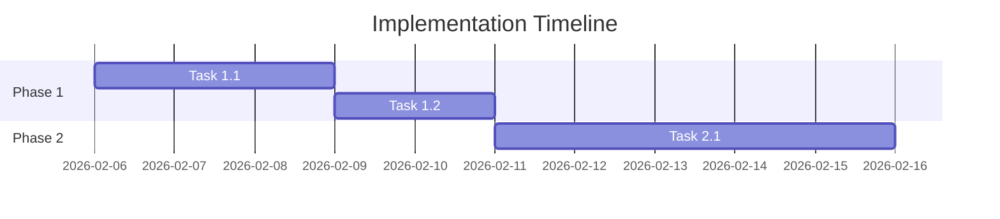

# Implementation Plan: [Feature/Project Name]

**Date**: YYYY-MM-DD
**Author**: [Your Name]
**Status**: Planning | In Progress | Completed
**Related Spec**: [Link to specification document]
**Target Completion**: YYYY-MM-DD

---

## Overview

### What We're Building
[Brief description of what will be implemented]

### Why We're Building It
[The business/technical value]

### Success Criteria
- [ ] Criterion 1
- [ ] Criterion 2
- [ ] Criterion 3

---

## Prerequisites

### Required Before Starting
- [ ] Prerequisite 1: [What's needed]
- [ ] Prerequisite 2: [What's needed]
- [ ] Prerequisite 3: [What's needed]

### Dependencies
- Dependency 1: [What it depends on]
- Dependency 2: [What it depends on]

### Resources Needed
- Resource 1: [e.g., "Access to production database"]
- Resource 2: [e.g., "API keys for service X"]

---

## Implementation Breakdown

### Phase 1: [Phase Name] (Estimated: X days/weeks)

**Goal**: [What this phase accomplishes]

#### Tasks

**Task 1.1**: [Task Name]
- **Description**: [What needs to be done]
- **Estimated Time**: [Hours/Days]
- **Assigned To**: [Name or TBD]
- **Dependencies**: [Other tasks this depends on]
- **Acceptance Criteria**:
  - [ ] Criterion 1
  - [ ] Criterion 2
- **Status**: Not Started | In Progress | Blocked | Completed

**Task 1.2**: [Task Name]
[Same structure as Task 1.1]

**Task 1.3**: [Task Name]
[Same structure as Task 1.1]

#### Phase 1 Deliverables
- [ ] Deliverable 1
- [ ] Deliverable 2

---

### Phase 2: [Phase Name] (Estimated: X days/weeks)

**Goal**: [What this phase accomplishes]

#### Tasks
[Same structure as Phase 1]

#### Phase 2 Deliverables
- [ ] Deliverable 1
- [ ] Deliverable 2

---

### Phase 3: [Phase Name] (Estimated: X days/weeks)

**Goal**: [What this phase accomplishes]

#### Tasks
[Same structure as Phase 1]

#### Phase 3 Deliverables
- [ ] Deliverable 1
- [ ] Deliverable 2

---

## Timeline

### Gantt Chart

### Milestones

| Milestone | Date | Description | Dependencies |
|-----------|------|-------------|--------------|
| Milestone 1 | YYYY-MM-DD | Description | Tasks 1.1-1.3 |
| Milestone 2 | YYYY-MM-DD | Description | Tasks 2.1-2.3 |

---

## Risk Management

### Identified Risks

**Risk 1**: [Risk Description]
- **Likelihood**: High | Medium | Low
- **Impact**: High | Medium | Low
- **Mitigation**: [How to prevent or reduce]
- **Contingency**: [What to do if it happens]

**Risk 2**: [Risk Description]
[Same structure as Risk 1]

### Blockers

| Blocker | Impact | Resolution Plan | Owner |
|---------|--------|----------------|-------|
| Blocker 1 | Description | How to resolve | Name |

---

## Testing Plan

### Testing Strategy
[Overview of how testing will be done]

### Test Phases

#### Unit Testing
- **When**: [During development, after each task]
- **Coverage Goal**: [e.g., "80% code coverage"]
- **Tools**: [Testing framework]
- **Checklist**:
  - [ ] Component 1 tests
  - [ ] Component 2 tests

#### Integration Testing
- **When**: [After phase completion]
- **What to Test**: [Integration points]
- **Tools**: [Testing framework]
- **Checklist**:
  - [ ] Integration scenario 1
  - [ ] Integration scenario 2

#### End-to-End Testing
- **When**: [Before deployment]
- **Scenarios**: [Critical user flows]
- **Tools**: [Testing framework]
- **Checklist**:
  - [ ] E2E scenario 1
  - [ ] E2E scenario 2

#### User Acceptance Testing (UAT)
- **When**: [After E2E testing]
- **Who**: [Who will test]
- **Success Criteria**: [What constitutes passing]

---

## Deployment Plan

### Deployment Strategy
- **Type**: [Big Bang | Phased | Blue-Green | Canary]
- **Reason**: [Why this strategy]

### Deployment Checklist

**Pre-Deployment**:
- [ ] All tests passing
- [ ] Code review completed
- [ ] Documentation updated
- [ ] Deployment plan reviewed
- [ ] Rollback plan ready
- [ ] Stakeholders notified

**Deployment Steps**:
1. Step 1: [Description]
2. Step 2: [Description]
3. Step 3: [Description]

**Post-Deployment**:
- [ ] Smoke tests run
- [ ] Monitoring verified
- [ ] Stakeholders notified
- [ ] Documentation published

### Rollback Plan

**Rollback Triggers**:
- Trigger 1: [When to rollback]
- Trigger 2: [When to rollback]

**Rollback Steps**:
1. Step 1
2. Step 2
3. Step 3

**Recovery Time Objective**: [How quickly we can rollback]

---

## Communication Plan

### Stakeholder Updates

| Stakeholder | Update Frequency | Channel | Content |
|-------------|------------------|---------|---------|
| Team | Daily | Standup | Progress, blockers |
| Manager | Weekly | Email | Status, risks |
| Users | Milestone | Announcement | Features, changes |

### Status Reporting

**Daily**:
- What was completed yesterday
- What's planned for today
- Any blockers

**Weekly**:
- Progress against timeline
- Risks and mitigations
- Next week's plan

---

## Quality Assurance

### Code Quality Checklist
- [ ] Follows coding standards
- [ ] No linter errors
- [ ] Commented where necessary
- [ ] Efficient algorithms used
- [ ] No code duplication

### Review Process
- **Code Review**: [How reviews will be done]
- **Design Review**: [Who reviews architecture]
- **Security Review**: [Security considerations]

---

## Documentation Plan

### Code Documentation
- [ ] Inline comments for complex logic
- [ ] API documentation
- [ ] README updated

### User Documentation
- [ ] User guide updated
- [ ] API reference published
- [ ] Changelog updated

### Technical Documentation
- [ ] Architecture diagrams
- [ ] Deployment guide
- [ ] Troubleshooting guide

---

## Monitoring & Observability

### Metrics to Track
- Metric 1: [What to measure]
- Metric 2: [What to measure]

### Alerts to Set Up
- Alert 1: [When to trigger]
- Alert 2: [When to trigger]

### Dashboards
- Dashboard 1: [What it shows]
- Dashboard 2: [What it shows]

---

## Success Metrics

### Technical Metrics
- Metric 1: [Target value]
- Metric 2: [Target value]

### Business Metrics
- Metric 1: [Target value]
- Metric 2: [Target value]

### How We'll Measure Success
[How and when these metrics will be evaluated]

---

## Post-Implementation

### Retrospective Plan
- **When**: [After completion]
- **Who**: [Participants]
- **Topics**:
  - What went well
  - What could be improved
  - Action items

### Knowledge Transfer
- [ ] Documentation complete
- [ ] Team training done
- [ ] Handoff completed

### Maintenance Plan
- **Ongoing Support**: [Who maintains this]
- **Update Frequency**: [How often to update]
- **Deprecation Strategy**: [When/how to sunset]

---

## Resources

### Team
| Name | Role | Responsibility | Availability |
|------|------|----------------|--------------|
| Person 1 | Role | What they do | Hours/week |

### Budget
| Item | Cost | Notes |
|------|------|-------|
| Infrastructure | $X | Cloud costs |
| Tools | $X | Licenses, services |

---

## Open Items

### Decisions Needed
- [ ] Decision 1: [What needs to be decided]
- [ ] Decision 2: [What needs to be decided]

### Open Questions
- [ ] Question 1: [Unanswered question]
- [ ] Question 2: [Unanswered question]

---

## Approval

| Role | Name | Date | Signature |
|------|------|------|-----------|
| Implementation Lead | | | |
| Tech Lead | | | |
| Product Owner | | | |

---

## Status Log

| Date | Status | Notes |
|------|--------|-------|
| YYYY-MM-DD | Planning | Initial plan created |
| YYYY-MM-DD | In Progress | Phase 1 started |
| YYYY-MM-DD | Blocked | [Blocker description] |
| YYYY-MM-DD | Completed | Successfully deployed |
