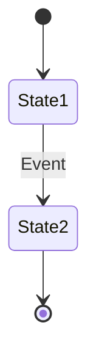
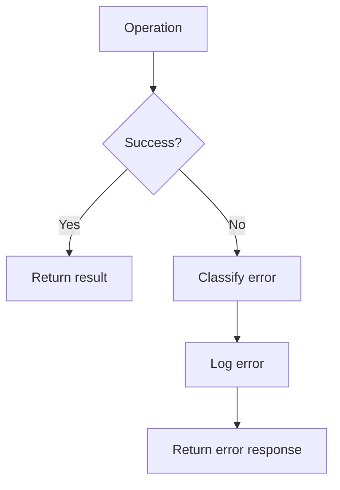

# Technical Specification: [Component/Feature Name]

**Date**: YYYY-MM-DD
**Author**: [Your Name]
**Status**: Draft | Review | Approved | Implemented
**Related Requirements**: [Link to requirements document]
**Related Architecture**: [Link to architecture document]

---

## Overview

### Purpose
[What does this component/feature do?]

### Scope
[What's included in this specification?]

### Goals
1. Goal 1
2. Goal 2
3. Goal 3

---

## System Context

### Where This Fits
[Diagram or description of how this fits into the larger system]

```
[System Context Diagram - could be Mermaid, PlantUML, or ASCII art]
```

### Dependencies
- Dependency 1: [What it depends on]
- Dependency 2: [What it depends on]

### Dependents
- Dependent 1: [What depends on this]
- Dependent 2: [What depends on this]

---

## Technical Approach

### High-Level Design

[Describe the overall approach]

```
[High-level architecture diagram]
```

### Technology Choices

| Decision | Choice | Rationale |
|----------|--------|-----------|
| Language | [e.g., Python] | [Why this choice] |
| Framework | [e.g., FastAPI] | [Why this choice] |
| Database | [e.g., PostgreSQL] | [Why this choice] |
| Hosting | [e.g., AWS] | [Why this choice] |

### Alternatives Considered

**Alternative 1: [Name]**
- Pros: ...
- Cons: ...
- Decision: Not chosen because...

**Alternative 2: [Name]**
- Pros: ...
- Cons: ...
- Decision: Not chosen because...

---

## Detailed Design

### Component Breakdown

#### Component 1: [Name]

**Purpose**: [What this component does]

**Responsibilities**:
- Responsibility 1
- Responsibility 2

**Interfaces**:
- Input: [What it receives]
- Output: [What it produces]

**Implementation Notes**:
- Note 1
- Note 2

---

#### Component 2: [Name]
[Same structure as Component 1]

---

### Data Model

#### Entity 1: [Entity Name]

```typescript
// Example: TypeScript interface
interface Entity1 {
  id: string;
  name: string;
  createdAt: Date;
  // ... other fields
}
```

**Fields**:
| Field | Type | Required | Description |
|-------|------|----------|-------------|
| id | string | Yes | Unique identifier |
| name | string | Yes | Display name |

**Constraints**:
- Constraint 1
- Constraint 2

---

### API Specification

#### Endpoint 1: [Name]

**Method**: GET | POST | PUT | DELETE
**Path**: `/api/v1/resource`

**Request**:
```json
{
  "field1": "value",
  "field2": 123
}
```

**Response** (Success - 200):
```json
{
  "status": "success",
  "data": {
    "field1": "value"
  }
}
```

**Response** (Error - 400):
```json
{
  "status": "error",
  "message": "Error description"
}
```

**Errors**:
| Code | Reason |
|------|--------|
| 400 | Bad request |
| 401 | Unauthorized |
| 404 | Not found |

---

#### Endpoint 2: [Name]
[Same structure as Endpoint 1]

---

### Algorithms

#### Algorithm 1: [Name]

**Purpose**: [What this algorithm does]

**Pseudocode**:
```
function algorithmName(input):
    step 1
    step 2
    return result
```

**Time Complexity**: O(?)
**Space Complexity**: O(?)

**Example**:
```
Input: [example input]
Output: [example output]
```

---

### State Management

#### State Diagram



#### State Transitions

| From State | Event | To State | Action |
|------------|-------|----------|--------|
| State1 | Event1 | State2 | Action1 |

---

### Error Handling

#### Error Categories

**Category 1: [Name]**
- When: [When this error occurs]
- Handling: [How to handle it]
- User message: [What the user sees]
- Logging: [What gets logged]

**Category 2: [Name]**
[Same structure]

#### Error Flow



---

## Implementation Details

### File Structure

```
project/
├── src/
│   ├── component1/
│   │   ├── index.ts
│   │   └── types.ts
│   ├── component2/
│   └── utils/
├── tests/
└── docs/
```

### Key Classes/Functions

#### Class 1: [Name]

```typescript
class ClassName {
  constructor() { }

  method1(): ReturnType {
    // Implementation
  }

  method2(param: Type): ReturnType {
    // Implementation
  }
}
```

**Properties**:
- Property 1: [Description]
- Property 2: [Description]

**Methods**:
- `method1()`: [What it does]
- `method2(param)`: [What it does]

---

### Configuration

#### Config Options

| Option | Type | Default | Description |
|--------|------|---------|-------------|
| option1 | string | "default" | What this configures |
| option2 | number | 100 | What this configures |

#### Environment Variables

| Variable | Required | Description |
|----------|----------|-------------|
| VAR_1 | Yes | Purpose of this variable |
| VAR_2 | No | Purpose of this variable |

---

## Security Considerations

### Authentication
[How authentication is handled]

### Authorization
[How authorization/permissions are handled]

### Data Protection
[How sensitive data is protected]

### Threat Model
| Threat | Mitigation |
|--------|------------|
| Threat 1 | How it's mitigated |
| Threat 2 | How it's mitigated |

---

## Performance Considerations

### Expected Load
- Metric 1: [e.g., "1000 requests/second"]
- Metric 2: [e.g., "10MB/s throughput"]

### Performance Targets
- Target 1: [e.g., "Response time < 100ms"]
- Target 2: [e.g., "CPU usage < 50%"]

### Optimization Strategies
- Strategy 1: [How performance will be optimized]
- Strategy 2: [How performance will be optimized]

### Bottlenecks
- Potential bottleneck 1: [Mitigation]
- Potential bottleneck 2: [Mitigation]

---

## Testing Strategy

### Unit Tests
- What to test: [Coverage goals]
- Tools: [Testing frameworks]
- Coverage target: [e.g., "80%"]

### Integration Tests
- What to test: [Integration points]
- Tools: [Testing frameworks]

### End-to-End Tests
- Scenarios: [Critical user flows]
- Tools: [Testing frameworks]

### Test Data
- How test data is generated/managed

---

## Deployment

### Build Process
```bash
# Commands to build
npm run build
```

### Deployment Steps
1. Step 1
2. Step 2
3. Step 3

### Environment Configuration
- Dev: [Configuration]
- Staging: [Configuration]
- Production: [Configuration]

### Rollback Plan
[How to rollback if deployment fails]

---

## Monitoring & Observability

### Metrics to Track
- Metric 1: [What and why]
- Metric 2: [What and why]

### Logging
- Log level: [INFO, DEBUG, ERROR]
- What to log: [Key events]
- Where logs go: [Logging service]

### Alerts
| Alert | Condition | Action |
|-------|-----------|--------|
| Alert 1 | When X happens | Do Y |

---

## Migration Strategy

### From Current State
[How to migrate from existing system/approach]

### Data Migration
- Migration plan: [Steps]
- Rollback plan: [If migration fails]

### Backward Compatibility
[How to maintain compatibility during transition]

---

## Documentation

### Code Documentation
- Inline comments: [When to use]
- API docs: [How generated]
- README: [What to include]

### User Documentation
- User guide: [Link or plan]
- API reference: [Link or plan]
- Tutorials: [Link or plan]

---

## Future Enhancements

### Planned Improvements
- Enhancement 1: [Description]
- Enhancement 2: [Description]

### Extensibility Points
- Extension point 1: [How to extend]
- Extension point 2: [How to extend]

---

## Risks & Mitigations

| Risk | Likelihood | Impact | Mitigation |
|------|------------|--------|------------|
| Risk 1 | H/M/L | H/M/L | How to mitigate |
| Risk 2 | H/M/L | H/M/L | How to mitigate |

---

## Open Questions

- [ ] Question 1: [Unanswered technical question]
- [ ] Question 2: [Unanswered technical question]

---

## References

- [Related documentation]
- [External resources]
- [Similar implementations]

---

## Approval

| Role | Name | Date | Signature |
|------|------|------|-----------|
| Spec Author | | | |
| Tech Lead | | | |
| Architect | | | |

---

## Revision History

| Date | Author | Changes |
|------|--------|---------|
| YYYY-MM-DD | [Name] | Initial draft |
