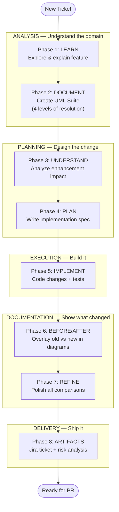

# 8-Phase Feature Documentation Workflow

> Extracted from the Magic Links (WEB-4718) experience. This is the AI-augmented workflow
> for analyzing, documenting, implementing, and shipping feature enhancements.

---

## Quick Start

```
/feature-docs <FEATURE_DOMAIN> "<NEW_ENHANCEMENT>" [TICKET_ID]
```

This creates `tickets/{TICKET_ID}/` and runs all 8 phases sequentially.

---

## Workflow Overview



---

## Constants

Fill these in per ticket. All prompts and file paths are derived from these values.

| Constant | Description | Convention |
|----------|-------------|------------|
| `FEATURE_DOMAIN` | The feature area (e.g., "Conversations", "Magic Links") | PascalCase or natural language |
| `NEW_ENHANCEMENT` | What's changing (e.g., "Chat Termination Handling") | Natural language |
| `TICKET_ID` | Jira ticket (e.g., "WEB-5000") | Uppercase with hyphen |
| `WORK_DOCUMENT` | UML doc path | `tickets/{TICKET_ID}/{domain}-uml.md` |
| `REQUIREMENT_DOC` | Plan path | `tickets/{TICKET_ID}/{ENHANCEMENT}_PLAN.md` |
| `JIRA_DOC` | Jira draft path | `tickets/{TICKET_ID}/JIRA-{enhancement}.md` |

---

## Phase Details

### Phase 1: LEARN

**Goal:** Build domain knowledge before touching code.

**Prompt:**
```
Please teach me what {FEATURE_DOMAIN} is, how it is used by users of our product,
and how I can begin to understand it. Identify the key files and concepts.
```

**Expected output:**
- Feature explanation (what it is, how users interact with it)
- Key use cases identified
- Key files, controllers, components, and API endpoints listed
- Existing documentation referenced

---

### Phase 2: DOCUMENT

**Goal:** Create a multi-resolution UML documentation suite.

**Prompt:**
```
Create a UML Documentation Suite for {FEATURE_DOMAIN} at {WORK_DOCUMENT} using PlantUML with:
- Level 1: Use Case Diagram (actors + capabilities)
- Level 2: Sequence Diagrams (main flows)
- Level 3: Activity Diagrams (process details)
- Level 4: Class Diagrams (static structure)
- Reference section (API endpoints, key files, events)
```

**Expected output:**
- `{WORK_DOCUMENT}` with PlantUML diagrams at all 4 levels
- Each level provides increasing detail (zoom in)

---

### Phase 3: UNDERSTAND

**Goal:** Analyze what the enhancement changes and what it affects.

**Prompt:**
```
Study and review the changes being made for {NEW_ENHANCEMENT}.
Analyze what components/files are affected and create a plan.
```

**Expected output:**
- Analysis of current behavior
- What's changing and why
- Affected use cases mapped to diagrams from Phase 2
- Affected files and line numbers

---

### Phase 4: PLAN

**Goal:** Write a detailed implementation specification.

**Prompt:**
```
Create an implementation plan document at {REQUIREMENT_DOC} that includes:
- Overview of changes
- API changes (before/after, if any)
- Implementation steps by phase
- Testing strategy (unit, integration, E2E)
- Risks and mitigation
```

**Expected output:**
- `{REQUIREMENT_DOC}` with actionable implementation plan
- Cross-references to UML diagrams from Phase 2

---

### Phase 5: IMPLEMENT

**Goal:** Execute the plan. Optionally use gitea-local for safe experimentation.

**Prompt:**
```
Implement the plan as specified in {REQUIREMENT_DOC}.
Mark todos as in_progress as you work. Don't stop until complete.
```

**Expected output:**
- Code changes to controllers, components, tests
- All tests passing
- Linting clean

**Optional — Experiment mode:**
```bash
# Switch to gitea for safe experimentation
switch-to-gitea
# ... make changes, commit, test ...
# If it works: promote and switch back
switch-to-github
# If it fails: switch back (experiment preserved in gitea)
switch-to-github
```

---

### Phase 6: BEFORE/AFTER

**Goal:** Update UML diagrams to show what changed.

**Prompt:**
```
Update {WORK_DOCUMENT} to show before/after comparisons in the diagrams:
- Use color coding (pink=deprecated/old, green=current/new)
- Add migration notes explaining what changed
- Show new error scenarios
- Update class diagrams with new dependencies
```

**Expected output:**
- Diagrams with visual old-vs-new overlays
- Migration summary tables

---

### Phase 7: REFINE

**Goal:** Ensure comprehensive before/after coverage across all affected diagrams.

**Prompt:**
```
Analyze all diagrams in {WORK_DOCUMENT} to determine which could benefit
from showing old vs new comparisons for {NEW_ENHANCEMENT}.
Update those that are affected.
```

**Expected output:**
- All relevant diagrams updated with comparison views
- No diagram left behind that should show changes

---

### Phase 8: ARTIFACTS

**Goal:** Produce delivery-ready documentation.

**Prompt:**
```
Create a Jira ticket document at {JIRA_DOC} with:
- Title and Description
- Scope (checklist of work items)
- Acceptance Criteria
- Risk Assessment (use case impact map + risk matrix)
- Testing Requirements (unit, integration, manual)
- Rollback Plan
```

**Expected output:**
- `{JIRA_DOC}` ready to paste into Jira
- Can also generate PR description from the same analysis

---

## Output Files

After completing all 8 phases:

```
tickets/{TICKET_ID}/
├── {domain}-uml.md              # UML Documentation Suite (Phases 2, 6, 7)
├── {ENHANCEMENT}_PLAN.md        # Implementation Plan (Phase 4)
└── JIRA-{enhancement}.md        # Jira Ticket Draft (Phase 8)
```

Plus the actual code changes, test updates, and (optionally) experiment history in gitea.

---

## Integration with Layers of Resolution

| Phase | Primary Layer | Optional Layer |
|-------|--------------|----------------|
| 1-2: LEARN + DOCUMENT | Layer 5: Mind | Layer 4: Skin (tickets/) |
| 3-4: UNDERSTAND + PLAN | Layer 5: Mind | Layer 4: Skin (tickets/) |
| 5: IMPLEMENT | Layer 5: Mind | Layer 3: Muscles (gitea experiment) |
| 6-7: BEFORE/AFTER + REFINE | Layer 5: Mind | Layer 4: Skin (tickets/) |
| 8: ARTIFACTS | Layer 5: Mind | Layer 4: Skin (tickets/) |

See `Excalidraw/layers-of-resolution.excalidraw.md` for the full architecture diagram.
