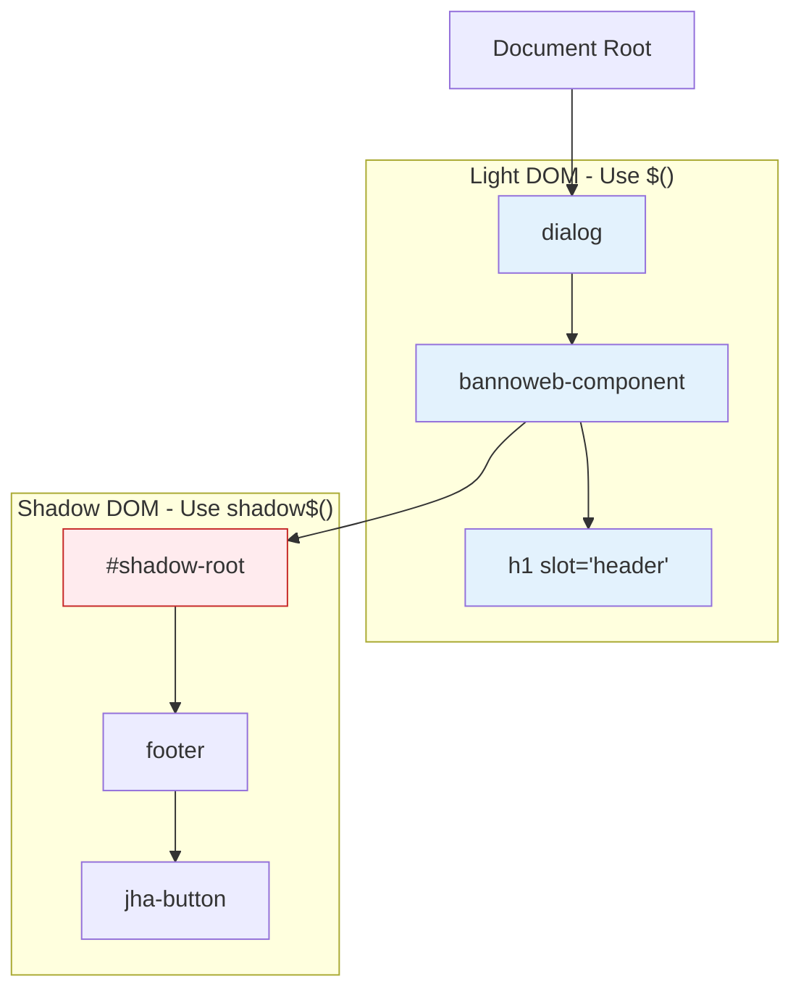
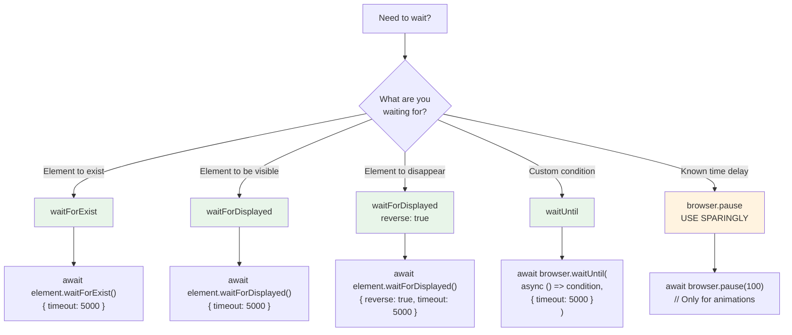
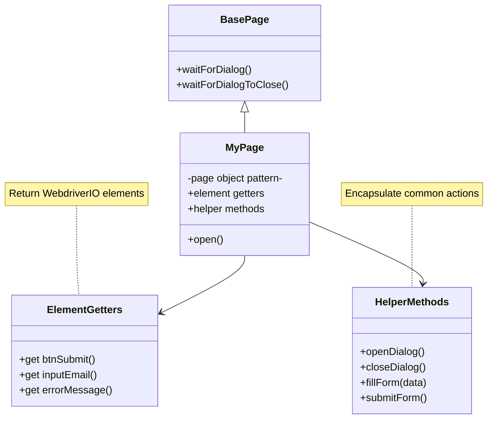
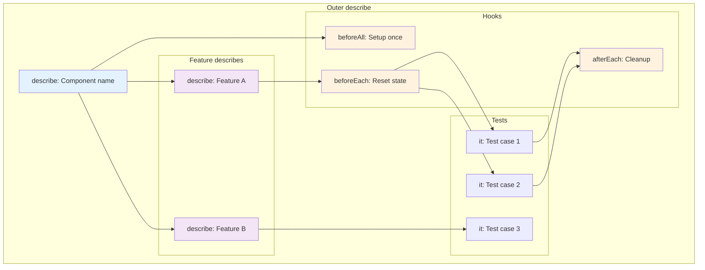
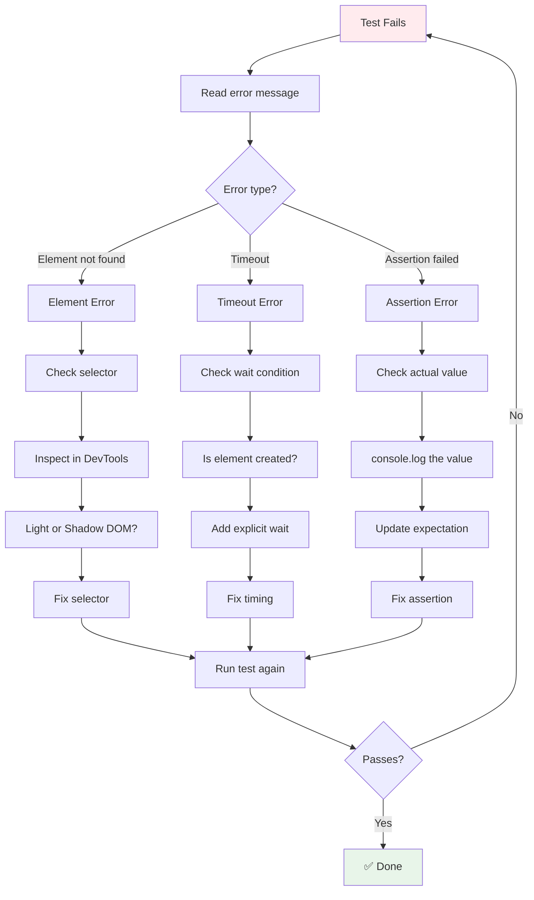

# E2E Testing Quick Reference

Visual cheat sheets and quick patterns for WebdriverIO + Lit component testing.

---

## Selector Patterns

### Light DOM vs Shadow DOM



### Common Selector Patterns

```javascript
// =====================================
// LIGHT DOM SELECTORS
// =====================================

// By ID (fastest, most reliable)
browser.$('#element-id')

// By class
browser.$('.class-name')

// By tag
browser.$('dialog')
browser.$('bannoweb-confirmation-dialog')

// By attribute
browser.$('[data-testid="my-element"]')
browser.$('button[type="submit"]')

// Chaining (within same DOM context)
browser.$('dialog').$('bannoweb-confirmation-dialog')

// =====================================
// SHADOW DOM SELECTORS
// =====================================

// Cross shadow boundary
element.shadow$('footer')
element.shadow$('#header-right')

// Common pattern: Light → Shadow → Light
const dialog = await browser.$('dialog').$('bannoweb-confirmation-dialog');
const footer = await dialog.shadow$('footer');
const button = await footer.$('jha-button[confirm-button]');

// =====================================
// MULTIPLE ELEMENTS
// =====================================

// Get all matching elements
const items = await browser.$$('.icon-item');

// Within shadow DOM
const buttons = await element.shadow$$('jha-button');

// Iterate over elements
for (const item of items) {
  await item.click();
}
```

---

## Wait Patterns

### Wait Decision Tree



### Wait Code Patterns

```javascript
// =====================================
// WAIT FOR ELEMENT TO EXIST
// =====================================
await element.waitForExist({
  timeout: 5000,
  timeoutMsg: 'Element did not exist'
});

// =====================================
// WAIT FOR ELEMENT TO BE VISIBLE
// =====================================
await element.waitForDisplayed({
  timeout: 5000,
  timeoutMsg: 'Element not displayed'
});

// =====================================
// WAIT FOR ELEMENT TO DISAPPEAR
// =====================================
await element.waitForDisplayed({
  reverse: true,
  timeout: 5000,
  timeoutMsg: 'Element did not disappear'
});

// =====================================
// WAIT FOR CUSTOM CONDITION
// =====================================
await browser.waitUntil(
  async () => {
    const dialog = await browser.$('dialog');
    return (await dialog.isExisting()) && (await dialog.isDisplayed());
  },
  {
    timeout: 5000,
    timeoutMsg: 'Dialog did not open',
    interval: 500 // Check every 500ms
  }
);

// =====================================
// WAIT FOR TEXT CONTENT
// =====================================
await browser.waitUntil(
  async () => {
    const element = await browser.$('#status');
    const text = await element.getText();
    return text === 'Complete';
  },
  { timeout: 5000 }
);

// =====================================
// WAIT FOR PROPERTY VALUE
// =====================================
await browser.waitUntil(
  async () => {
    const component = await browser.$('my-component');
    const loading = await component.getProperty('isLoading');
    return loading === false;
  },
  { timeout: 5000 }
);
```

---

## Page Object Patterns

### Page Object Structure



### Page Object Template

```javascript
import Page from './page.js';

class MyComponentPage extends Page {
  // =====================================
  // NAVIGATION
  // =====================================
  async open() {
    await browser.maximizeWindow();
    await browser.url('https://localhost:8443/test/my-component.html');
    await browser.$('#main-section').waitForDisplayed();
  }

  // =====================================
  // ELEMENT GETTERS
  // =====================================
  // Use getters for elements that need to be found each time
  get btnSubmit() {
    return browser.$('#btn-submit');
  }

  get inputEmail() {
    return browser.$('#email-input');
  }

  get errorMessage() {
    return browser.$('#error-message');
  }

  // =====================================
  // HELPER METHODS - ACTIONS
  // =====================================
  async clickSubmit() {
    await this.btnSubmit.click();
  }

  async fillEmail(email) {
    await this.inputEmail.setValue(email);
  }

  async submitForm(formData) {
    await this.fillEmail(formData.email);
    await this.clickSubmit();
  }

  // =====================================
  // HELPER METHODS - QUERIES
  // =====================================
  async getErrorText() {
    return this.errorMessage.getText();
  }

  async isSubmitButtonEnabled() {
    return !(await this.btnSubmit.getAttribute('disabled'));
  }

  // =====================================
  // HELPER METHODS - COMPLEX NAVIGATION
  // =====================================
  async openDialog() {
    await this.btnOpenDialog.click();
    await this.waitForDialog();
  }

  async getDialogComponent() {
    return browser.$('dialog').$('my-dialog-component');
  }

  async getDialogHeader() {
    const dialog = await this.getDialogComponent();
    const header = await dialog.shadow$('h1');
    return header.getText();
  }
}

export default new MyComponentPage();
export const Klass = MyComponentPage;
```

---

## Test Structure Patterns

### Test File Structure



### Test Template

```javascript
import myComponentPage from '../page-objects/my-component.js';

describe('my-component test page', () => {
  // =====================================
  // SUITE SETUP (once)
  // =====================================
  beforeAll(async () => {
    await myComponentPage.open();
  });

  // =====================================
  // FEATURE: Basic Functionality
  // =====================================
  describe('Basic functionality', () => {
    it('should display the component', async () => {
      const component = await browser.$('my-component');
      expect(await component.isDisplayed()).toBe(true);
    });

    it('should show correct default text', async () => {
      const text = await myComponentPage.getHeaderText();
      expect(text).toBe('Welcome');
    });
  });

  // =====================================
  // FEATURE: Form Submission
  // =====================================
  describe('Form submission', () => {
    beforeEach(async () => {
      // Reset form before each test
      await myComponentPage.open();
    });

    it('should submit valid form', async () => {
      await myComponentPage.fillForm({
        email: 'test@example.com',
        name: 'Test User'
      });

      await myComponentPage.submitForm();

      const successMsg = await myComponentPage.getSuccessMessage();
      expect(successMsg).toBe('Form submitted successfully');
    });

    it('should show error for invalid email', async () => {
      await myComponentPage.fillEmail('invalid-email');
      await myComponentPage.submitForm();

      const errorMsg = await myComponentPage.getErrorText();
      expect(errorMsg).toContain('Invalid email');
    });
  });

  // =====================================
  // FEATURE: Dialog Interactions
  // =====================================
  describe('Dialog interactions', () => {
    beforeEach(async () => {
      // Open dialog before each test
      await myComponentPage.openDialog();
    });

    afterEach(async () => {
      // Cleanup: close and remove dialog
      await browser.execute(() => {
        const dialog = document.querySelector('dialog');
        if (dialog) {
          dialog.close();
          dialog.remove();
        }
      });
      await browser.pause(100);
    });

    it('should display dialog header', async () => {
      const header = await myComponentPage.getDialogHeader();
      expect(header).toBe('Confirm Action');
    });

    it('should close on confirm', async () => {
      await myComponentPage.clickDialogConfirm();
      await myComponentPage.waitForDialogToClose();

      const dialog = await browser.$('dialog');
      expect(await dialog.isExisting()).toBe(false);
    });
  });
});
```

---

## Assertion Patterns

### Common Assertions

```javascript
// =====================================
// ELEMENT STATE
// =====================================

// Element exists in DOM
expect(await element.isExisting()).toBe(true);

// Element is visible
expect(await element.isDisplayed()).toBe(true);

// Element is enabled
expect(await element.isEnabled()).toBe(true);

// Element is selected/checked
expect(await element.isSelected()).toBe(true);

// =====================================
// TEXT CONTENT
// =====================================

// Exact text match
expect(await element.getText()).toBe('Expected text');

// Contains text
expect(await element.getText()).toContain('partial');

// Starts with
expect(await element.getText()).toMatch(/^Expected/);

// Empty text
expect(await element.getText()).toBe('');

// =====================================
// ATTRIBUTES
// =====================================

// Attribute value
expect(await element.getAttribute('icon')).toBe('circle-checkmark');

// Attribute exists
expect(await element.getAttribute('disabled')).not.toBeNull();

// Attribute doesn't exist
expect(await element.getAttribute('hidden')).toBeNull();

// =====================================
// PROPERTIES
// =====================================

// Property value
expect(await element.getProperty('isLoading')).toBe(false);

// Property type
expect(typeof await element.getProperty('value')).toBe('string');

// =====================================
// COLLECTIONS
// =====================================

// Number of elements
const items = await browser.$$('.item');
expect(items.length).toBe(5);

// At least one element
expect(items.length).toBeGreaterThan(0);

// =====================================
// VALUES & INPUTS
// =====================================

// Input value
expect(await input.getValue()).toBe('test@example.com');

// Select value
expect(await select.getValue()).toBe('option-2');

// Checkbox checked
expect(await checkbox.isSelected()).toBe(true);

// =====================================
// NUMERICAL COMPARISONS
// =====================================

// Exact match
expect(counter).toBe(5);

// Greater/less than
expect(counter).toBeGreaterThan(0);
expect(counter).toBeLessThan(10);

// Range
expect(counter).toBeGreaterThanOrEqual(1);
expect(counter).toBeLessThanOrEqual(10);

// =====================================
// NEGATIONS
// =====================================

// Not equal
expect(value).not.toBe('wrong');

// Not displayed
expect(await element.isDisplayed()).toBe(false);

// Not existing
expect(await element.isExisting()).toBe(false);
```

---

## Debugging Patterns

### Debug Flow



### Debug Commands

```javascript
// =====================================
// PAUSE EXECUTION
// =====================================

// Interactive debugging (opens REPL)
await browser.debug();

// Use in REPL:
// - browser.$('#element') - Query elements
// - .click() - Interact with elements
// - .getText() - Get values
// - Press Ctrl+C to continue

// =====================================
// LOGGING
// =====================================

// Log element state
console.log('Element exists:', await element.isExisting());
console.log('Element displayed:', await element.isDisplayed());
console.log('Element text:', await element.getText());
console.log('Element attribute:', await element.getAttribute('class'));

// Log all properties
const props = await element.getProperty(''); // Get all properties
console.log('All properties:', props);

// =====================================
// SCREENSHOTS
// =====================================

// Take screenshot
await browser.saveScreenshot('./debug-screenshot.png');

// Element screenshot
await element.saveScreenshot('./element-screenshot.png');

// =====================================
// EXECUTE JAVASCRIPT
// =====================================

// Check element state via JavaScript
const result = await browser.execute(() => {
  const dialog = document.querySelector('dialog');
  return {
    exists: !!dialog,
    open: dialog?.open,
    className: dialog?.className
  };
});
console.log('Dialog state:', result);

// Get computed styles
const styles = await browser.execute((selector) => {
  const el = document.querySelector(selector);
  const computed = window.getComputedStyle(el);
  return {
    display: computed.display,
    opacity: computed.opacity,
    visibility: computed.visibility
  };
}, '#my-element');
console.log('Computed styles:', styles);

// =====================================
// SLOW DOWN TEST
// =====================================

// Add small pauses to see what's happening
await browser.pause(1000); // 1 second pause
// Note: Use sparingly, prefer explicit waits

// =====================================
// VERBOSE LOGGING
// =====================================

// In wdio.conf.js:
// logLevel: 'debug' // Shows all WebDriver commands
```

---

## Common Patterns Cheat Sheet

### Dialog Pattern

```javascript
// Open dialog
await page.btnOpenDialog.click();
await page.waitForDialog();

// Interact with dialog
const header = await page.getDialogHeader();
expect(header).toBe('Expected');

// Close dialog
await page.clickDialogConfirm();
await page.waitForDialogToClose();

// Cleanup
await browser.execute(() => {
  const dialog = document.querySelector('dialog');
  if (dialog) {
    dialog.close();
    dialog.remove();
  }
});
```

### Form Pattern

```javascript
// Fill form
await page.inputName.setValue('John Doe');
await page.inputEmail.setValue('john@example.com');
await page.selectCountry.selectByAttribute('value', 'US');

// Submit
await page.btnSubmit.click();

// Verify
await page.successMessage.waitForDisplayed();
expect(await page.successMessage.getText()).toContain('Success');
```

### Counter Pattern

```javascript
// Get initial count
const initialCount = parseInt(await page.counter.getText());

// Perform action
await page.btnIncrement.click();

// Verify count increased
const finalCount = parseInt(await page.counter.getText());
expect(finalCount).toBe(initialCount + 1);
```

### Modal Pattern

```javascript
// Open modal
await page.showModalButton.click();
await page.modal.waitForDisplayed();

// Verify modal content
expect(await page.modal.isDisplayed()).toBe(true);
expect(await page.modalTitle.getText()).toBe('Modal Title');

// Close modal
await page.closeModalButton.click();
await page.modal.waitForDisplayed({ reverse: true });
```

---

## Anti-Patterns (Avoid These!)

```javascript
// ❌ DON'T: Use arbitrary waits
await browser.pause(5000); // Why 5 seconds?

// ✅ DO: Use conditional waits
await element.waitForDisplayed({ timeout: 5000 });

// ======================================

// ❌ DON'T: Mix concerns in tests
it('should do everything', async () => {
  // Opens dialog
  // Fills form
  // Submits
  // Verifies email
  // Checks database
  // Tests too much!
});

// ✅ DO: One concept per test
it('should open dialog', async () => {
  await page.openDialog();
  expect(await page.dialog.isDisplayed()).toBe(true);
});

// ======================================

// ❌ DON'T: Use complex selectors
browser.$('body > div:nth-child(3) > div > span.class')

// ✅ DO: Use simple, semantic selectors
browser.$('#element-id')
browser.$('[data-testid="element"]')

// ======================================

// ❌ DON'T: Test implementation details
expect(await element.getAttribute('class')).toContain('is-open');

// ✅ DO: Test behavior
expect(await element.isDisplayed()).toBe(true);

// ======================================

// ❌ DON'T: Share state between tests
let sharedData;

it('test 1', async () => {
  sharedData = await page.getData();
});

it('test 2', async () => {
  expect(sharedData).toBe('something'); // Depends on test 1!
});

// ✅ DO: Keep tests independent
it('test 1', async () => {
  const data = await page.getData();
  expect(data).toBe('something');
});

it('test 2', async () => {
  const data = await page.getData();
  expect(data).toBe('something');
});

// ======================================

// ❌ DON'T: Forget to await
const element = browser.$('#element'); // Returns promise!
element.click(); // Doesn't work!

// ✅ DO: Always await
const element = await browser.$('#element');
await element.click();
```

---

## Performance Tips

```javascript
// =====================================
// PARALLEL QUERIES
// =====================================

// ❌ Sequential (slow)
const header = await page.getHeader();
const description = await page.getDescription();
const footer = await page.getFooter();

// ✅ Parallel (fast)
const [header, description, footer] = await Promise.all([
  page.getHeader(),
  page.getDescription(),
  page.getFooter()
]);

// =====================================
// REUSE ELEMENTS
// =====================================

// ❌ Query multiple times
await browser.$('#button').click();
expect(await browser.$('#button').getText()).toBe('Clicked');
expect(await browser.$('#button').isEnabled()).toBe(false);

// ✅ Query once
const button = await browser.$('#button');
await button.click();
expect(await button.getText()).toBe('Clicked');
expect(await button.isEnabled()).toBe(false);

// =====================================
// OPTIMIZE WAITS
// =====================================

// ❌ Long default timeout
await element.waitForDisplayed({ timeout: 30000 });

// ✅ Reasonable timeout
await element.waitForDisplayed({ timeout: 5000 });

// =====================================
// BATCH ASSERTIONS
// =====================================

// ❌ Multiple round-trips
expect(await element.isDisplayed()).toBe(true);
expect(await element.getText()).toBe('Hello');
expect(await element.getAttribute('class')).toContain('active');

// ✅ Get data in parallel, then assert
const [isDisplayed, text, className] = await Promise.all([
  element.isDisplayed(),
  element.getText(),
  element.getAttribute('class')
]);

expect(isDisplayed).toBe(true);
expect(text).toBe('Hello');
expect(className).toContain('active');
```

---

## Quick Troubleshooting Guide

| Problem | Solution |
|---------|----------|
| Element not found | Check if it's in shadow DOM (use `shadow$()`) |
| Test times out | Add explicit wait (`waitForDisplayed()`) |
| Stale element reference | Re-query the element before using it |
| Click intercepted | Wait for overlaying element to disappear |
| Wrong text returned | Check if element is in correct scope (shadow/light DOM) |
| Assertion fails unpredictably | Missing `await` on async operation |
| Tests fail when run together | Tests sharing state, add proper cleanup |
| Can't find in shadow DOM | Use `shadow$()` to cross boundary |
| Dialog doesn't open | Check if dialog infrastructure is set up |
| Button not clickable | Element might be covered or disabled |

---

*Keep this handy while writing tests!*
