# E2E Testing Documentation

Comprehensive E2E testing documentation for the bannoweb-confirmation-components test suite.

## 📚 Documentation Index

This directory contains complete documentation for building and maintaining E2E tests for Lit components with Shadow DOM.

### 1. [Testing Guide](./TESTING_GUIDE.md) 📖
**Your learning foundation**

Comprehensive guide covering:
- Architecture overview with diagrams
- Component hierarchy visualization
- Shadow DOM navigation patterns
- Test patterns (Page Object Model, lifecycle management, wait strategies)
- Common issues and solutions
- Best practices

**Start here if you want to:**
- Understand the overall architecture
- Learn about Shadow DOM navigation
- Study test patterns and best practices
- See visual diagrams of the structure

### 2. [Problem-Solving Journey](./PROBLEM_SOLVING_JOURNEY.md) 🔍
**Learn from real debugging experiences**

Chronicles the 5 major problems encountered and solved:
1. CSS Property Testing
2. Shadow DOM Navigation
3. Dialog Opening Failure
4. Missing Element Container
5. Hidden Close Button Detection

**Start here if you want to:**
- See how to debug test failures systematically
- Learn problem-solving techniques
- Understand common pitfalls and how to avoid them
- Follow the journey from 0 to 51 passing tests

### 3. [Quick Reference](./E2E_QUICK_REFERENCE.md) ⚡
**Your everyday testing companion**

Quick reference with:
- Selector patterns cheat sheet
- Wait patterns decision tree
- Page Object templates
- Common assertions
- Debug commands
- Anti-patterns to avoid

**Start here if you want to:**
- Quick lookup while writing tests
- Code snippets to copy/paste
- Reminder of best practices
- Debug command reference

---

## 🎯 What Was Built

### Test Suite: `bannoweb-confirmation-components.spec.js`

A comprehensive E2E test suite with **51 passing tests** covering three component sections:


#### Section 1: bannoweb-shared-icons (14 tests)
- Icon rendering and display
- Icon size customization (24px, 72px, 120px)
- Icon color customization (multiple colors)
- Icon selection modal workflow
- Attribute reflection

#### Section 2: bannoweb-confirmation (7 tests)
- Success confirmation display
- Warning confirmation display
- Custom icon confirmation
- Header and description verification

#### Section 3: bannoweb-confirmation-dialog (30 tests)
- Basic dialog workflow
- Dialog with cancel button
- Warning dialog variant
- Custom icon dialog
- Loading state handling
- Dialog without close button
- Dialog with custom element insertion
- Icon color customization
- Async dialog integration
- Generic dialogs mixin
- Event tracking (confirm/cancel counters)

### Page Object: `bannoweb-confirmation-components.js`

Comprehensive page object with:
- **20+ element selectors** for test page interactions
- **15+ helper methods** for common operations
- **Shadow DOM navigation** utilities
- **Wait strategies** for dialog interactions
- **Extends base Page class** for shared functionality

### Test Page: `bannoweb-confirmation-components.html`

Rewritten test page featuring:
- **Direct dialog creation** using native `showModal()` API
- **Event handlers** for confirm/cancel actions
- **Counter tracking** for event verification
- **Dynamic dialog configuration** with multiple variants
- **Custom element insertion** support

---

## 📊 Project Metrics

### Success Metrics

| Metric | Value |
|--------|-------|
| Total Tests | 51 |
| Passing Tests | 51 (100%) |
| Test Sections | 3 |
| Components Tested | 3 |
| Page Objects Created | 1 |
| Documentation Pages | 4 |
| Test Execution Time | 45.8 seconds |

### Component Coverage

```mermaid
graph LR
    subgraph "Components Tested"
        C1[bannoweb-shared-icons<br/>✅ 14 tests]
        C2[bannoweb-confirmation<br/>✅ 7 tests]
        C3[bannoweb-confirmation-dialog<br/>✅ 30 tests]
    end

    subgraph "Test Infrastructure"
        PO[Page Object]
        TP[Test Page]
        TS[Test Spec]
    end

    PO --> C1
    PO --> C2
    PO --> C3

    TS --> PO
    TP --> C1
    TP --> C2
    TP --> C3

    style C1 fill:#e8f5e9
    style C2 fill:#e8f5e9
    style C3 fill:#e8f5e9
```



---

## 🔑 Key Patterns Demonstrated

### 1. Shadow DOM Navigation ✨

Understanding when to use `$()` vs `shadow$()`:

```javascript
// Light DOM → Shadow DOM → Light DOM navigation
const dialog = await browser.$('dialog').$('bannoweb-confirmation-dialog');
const footer = await dialog.shadow$('footer');  // Cross shadow boundary
const button = await footer.$('jha-button');    // Stay in shadow DOM
```

### 2. Page Object Model 📦

Encapsulating page structure and behavior:

```javascript
class MyPage extends Page {
  get btnSubmit() {
    return browser.$('#btn-submit');
  }

  async submitForm(data) {
    await this.fillForm(data);
    await this.btnSubmit.click();
  }
}
```

### 3. Test Independence 🔒

Each test is completely isolated:

```javascript
beforeEach(async () => {
  await page.openDialog();  // Fresh state
});

afterEach(async () => {
  await page.closeDialog();  // Cleanup
});
```

### 4. Explicit Wait Strategies ⏱️

Never guess timing, always wait for conditions:

```javascript
await browser.waitUntil(
  async () => await element.isDisplayed(),
  { timeout: 5000, timeoutMsg: 'Element not displayed' }
);
```

### 5. Event Counter Testing 🔢

Testing side effects through observable state:

```javascript
const initialCount = await page.getConfirmCount();
await page.confirmAction();
const finalCount = await page.getConfirmCount();
expect(finalCount).toBe(initialCount + 1);
```

---

## 🚀 Running the Tests

### Quick Start

```bash
# Run all component tests
yarn test:local:components

# Run only confirmation components tests
yarn test:local:component --spec=./test/components/bannoweb-confirmation-components.spec.js

# Debug mode (browser visible, with inspector)
yarn test:local:component --spec=./test/components/bannoweb-confirmation-components.spec.js --debug
```

### Test Output

```
✓ Icon rendering (3 tests)
✓ Icon size customization (3 tests)
✓ Icon color customization (3 tests)
✓ Icon selection modal (5 tests)
✓ Success confirmation (3 tests)
✓ Warning confirmation (2 tests)
✓ Custom icon confirmation (2 tests)
✓ Basic dialog workflow (5 tests)
✓ Dialog with cancel button (4 tests)
✓ Warning dialog (2 tests)
✓ Custom icon dialog (2 tests)
✓ Loading state dialog (3 tests)
✓ Dialog without close button (2 tests)
✓ Dialog with custom element (2 tests)
✓ Icon color customization (2 tests)
✓ Async dialog integration (3 tests)
✓ Generic dialogs mixin (2 tests)
✓ Event tracking (3 tests)

51 passing (45.8s)
```

---

## 🎓 Learning Path

### For Complete Beginners

```mermaid
graph TD
    START[Start Here] --> READ1[Read Testing Guide]
    READ1 --> UNDERSTAND[Understand architecture]
    UNDERSTAND --> PRACTICE[Try writing simple tests]
    PRACTICE --> READ2[Read Quick Reference]
    READ2 --> WRITE[Write more tests]
    WRITE --> READ3[Read Problem-Solving Journey]
    READ3 --> EXPERT[Confident E2E tester! 🎉]

    style START fill:#e3f2fd
    style EXPERT fill:#e8f5e9
```



**Recommended order:**
1. **Testing Guide** - Understand the foundations
2. **Quick Reference** - Practice with examples
3. **Problem-Solving Journey** - Learn debugging
4. Start writing your own tests!

### For Experienced Testers

```mermaid
graph LR
    EXP[Experienced Tester] --> QR[Quick Reference]
    QR --> PATTERNS[Review patterns]
    PATTERNS --> SHADOW[Shadow DOM section]
    SHADOW --> CODE[Start coding]

    CODE --> STUCK{Stuck?}
    STUCK -->|Yes| PSJ[Problem-Solving Journey]
    STUCK -->|No| SHIP[Ship it! 🚢]

    style EXP fill:#e3f2fd
    style SHIP fill:#e8f5e9
```



**Recommended order:**
1. **Quick Reference** - Get syntax and patterns
2. **Shadow DOM sections** - Understand the key difference
3. **Problem-Solving Journey** - When you hit issues

---

## 💡 Key Takeaways

### Technical Skills Demonstrated

1. **Shadow DOM Mastery** ✅
   - Understanding light vs shadow DOM
   - Correct selector usage
   - Component hierarchy navigation

2. **WebdriverIO Proficiency** ✅
   - Async/await patterns
   - Element queries
   - Wait strategies
   - Event handling

3. **Page Object Model** ✅
   - Separation of concerns
   - Reusable methods
   - Maintainable structure

4. **Test Design** ✅
   - Test independence
   - Proper lifecycle management
   - Meaningful assertions

5. **Debugging Skills** ✅
   - Systematic problem-solving
   - Root cause analysis
   - Solution implementation

### Problem-Solving Journey

From challenge to solution:


---

## 🔗 Related Resources

### Internal Documentation
- [Project README](./README.md) - Main project documentation
- [CLAUDE.md](./CLAUDE.md) - Project-wide guidance for Claude
- [Base Page Object](./test/page-objects/page.js) - Shared functionality
- [WebdriverIO Config](./wdio.conf.js) - Test configuration

### External Resources
- [WebdriverIO Documentation](https://webdriver.io/)
- [Lit Component Documentation](https://lit.dev/)
- [Shadow DOM Specification](https://developer.mozilla.org/en-US/docs/Web/Web_Components/Using_shadow_DOM)
- [Jasmine Documentation](https://jasmine.github.io/)
- [Page Object Pattern](https://martinfowler.com/bliki/PageObject.html)

---

## 🏆 Achievement Unlocked

You now have:

- ✅ **51 comprehensive E2E tests** covering all component variants
- ✅ **Complete documentation** with visual diagrams
- ✅ **Reusable patterns** for future test development
- ✅ **Problem-solving techniques** for debugging
- ✅ **Best practices** guide for maintainability

This test suite serves as a **reference implementation** for testing Lit components with Shadow DOM in the Banno Online application.

---

## 📝 Quick Reference Cards

### When Writing Tests

```
1. Understand component structure (Shadow DOM?)
2. Create/update page object
3. Write test with proper lifecycle hooks
4. Use explicit waits
5. Make tests independent
6. Verify with multiple runs
```

### When Tests Fail

```
1. Read error message carefully
2. Check selector (light vs shadow DOM?)
3. Add explicit wait if timeout
4. Inspect element in DevTools
5. Verify assumptions with console.log
6. Check component source code
```

### Code Review Checklist

```
✅ Page object methods are reusable
✅ Tests are independent
✅ Waits are explicit, not arbitrary
✅ Selectors are simple and semantic
✅ One assertion per test concept
✅ Cleanup in afterEach hooks
✅ Meaningful test descriptions
```

---

## 🤝 Contributing

When adding new tests to this suite:

1. Follow the established patterns in the test spec
2. Add selectors and helpers to the page object
3. Ensure tests are independent with proper cleanup
4. Use explicit waits, never arbitrary delays
5. Update this documentation if adding new patterns
6. Run the full suite to ensure no regressions

---

## 📫 Questions?

If you have questions about:
- **Test patterns** → See [Testing Guide](./TESTING_GUIDE.md)
- **Debugging** → See [Problem-Solving Journey](./PROBLEM_SOLVING_JOURNEY.md)
- **Quick syntax** → See [Quick Reference](./E2E_QUICK_REFERENCE.md)

---

**Happy Testing! 🎉**

*Built with ❤️ for the Banno Online team*

---

Last Updated: 2026-01-28
Test Suite Version: 1.0.0
All Tests Passing: ✅ 51/51
