# E2E Testing Guide: bannoweb-confirmation-components

This guide explains the patterns, architecture, and solutions used in building the E2E test suite for the confirmation components.

## Table of Contents
1. [Architecture Overview](#architecture-overview)
2. [Component Hierarchy](#component-hierarchy)
3. [Shadow DOM Navigation](#shadow-dom-navigation)
4. [Test Patterns](#test-patterns)
5. [Common Issues & Solutions](#common-issues--solutions)
6. [Best Practices](#best-practices)

---

## Architecture Overview

### High-Level Test Architecture

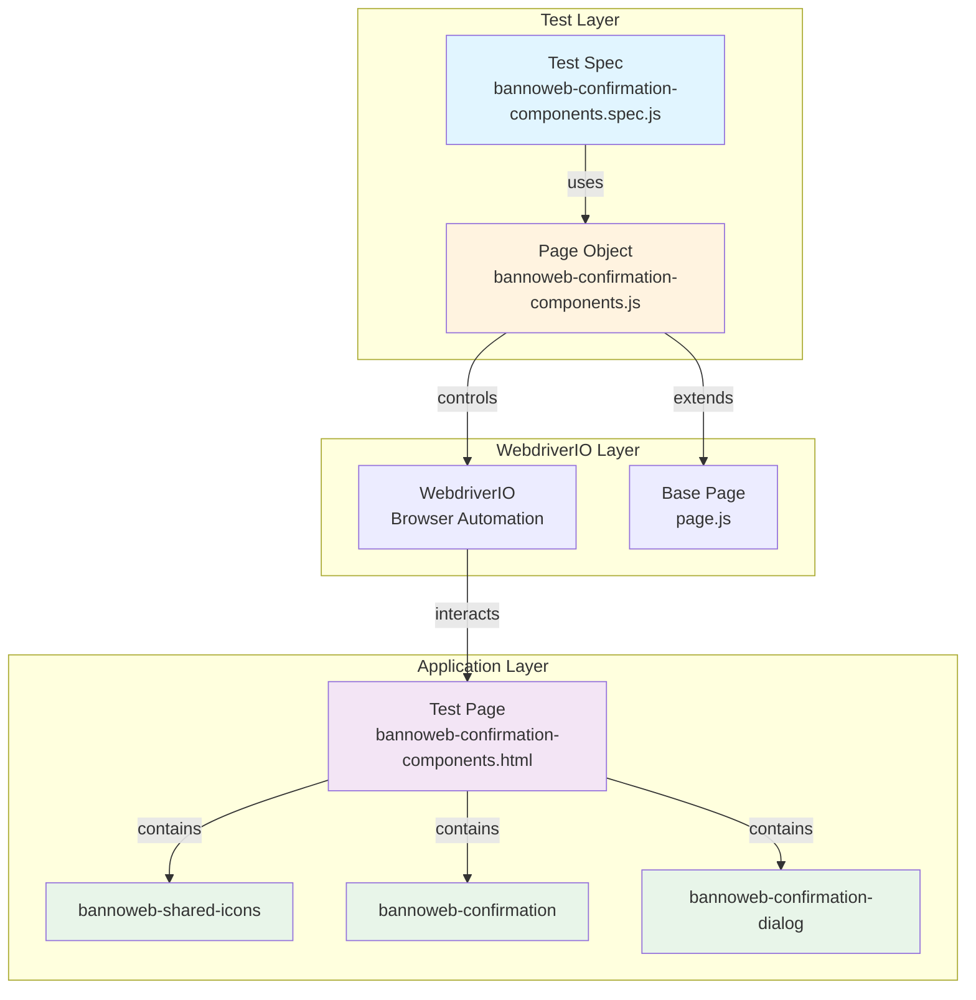

**Key Concepts:**

1. **Test Spec** - Contains test cases using Jasmine (describe/it blocks)
2. **Page Object** - Encapsulates selectors and helper methods
3. **WebdriverIO** - Browser automation framework
4. **Test Page** - HTML page that demonstrates component functionality
5. **Components** - Lit web components being tested

---

## Component Hierarchy

### DOM Structure

Understanding the DOM structure is critical for writing selectors and navigating shadow DOM.

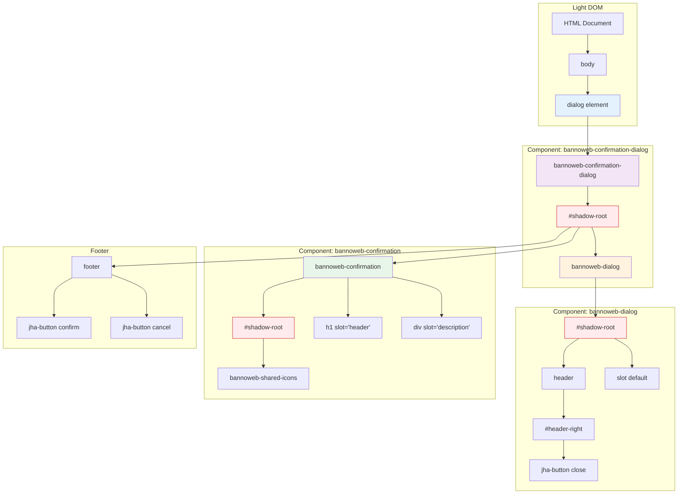

**Important Notes:**

- **Light DOM** - Regular DOM, accessible with `$()` selector
- **Shadow DOM** - Encapsulated DOM inside components, requires `shadow$()` selector
- **Red boxes** represent shadow roots (boundaries that require special navigation)

---

## Shadow DOM Navigation

### Navigation Pattern

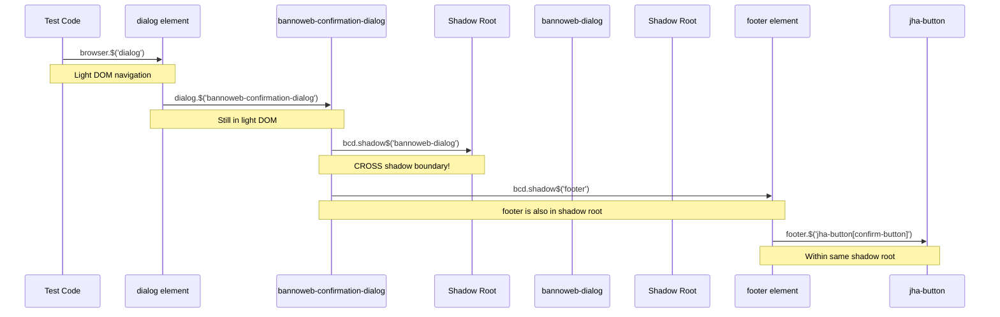

### Code Example

```javascript
// ❌ WRONG - Trying to access shadow content with light DOM selector
const dialog = await browser.$('dialog').$('bannoweb-confirmation-dialog');
const footer = await dialog.$('footer'); // FAILS - footer is in shadow DOM

// ✅ CORRECT - Using shadow$() to cross shadow boundary
const dialog = await browser.$('dialog').$('bannoweb-confirmation-dialog');
const footer = await dialog.shadow$('footer'); // SUCCESS
const button = await footer.$('jha-button[confirm-button]'); // Light DOM within shadow
```

**Rule of Thumb:**
- Use `shadow$()` when entering a component's shadow root
- Use `$()` for light DOM elements, even if they're inside shadow DOM

---

## Test Patterns

### Pattern 1: Page Object Model (POM)

The Page Object Model separates test logic from page structure.

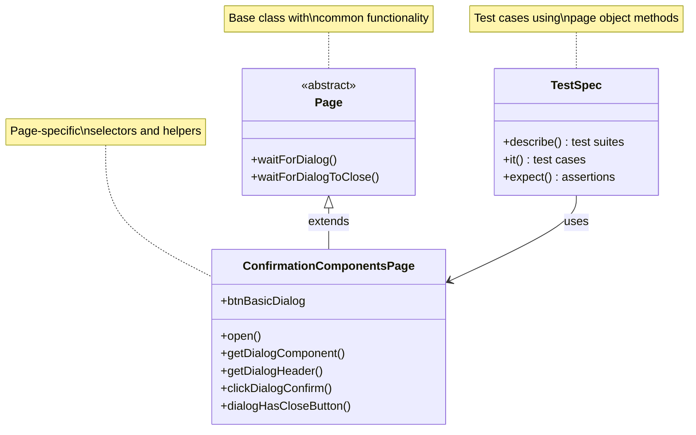

**Benefits:**
1. **Maintainability** - Change selectors in one place
2. **Reusability** - Share methods across tests
3. **Readability** - Test code reads like user actions

**Example:**

```javascript
// Page Object
class ConfirmationComponentsPage extends Page {
  get btnBasicDialog() {
    return browser.$('#btn-basic-dialog');
  }

  async clickDialogConfirm() {
    const dialog = await this.getDialogComponent();
    const footer = await dialog.shadow$('footer');
    const confirmBtn = await footer.$('jha-button[confirm-button]');
    await confirmBtn.click();
  }
}

// Test Spec
it('should open and confirm dialog', async () => {
  await confirmationComponentsPage.btnBasicDialog.click();
  await confirmationComponentsPage.waitForDialog();
  await confirmationComponentsPage.clickDialogConfirm();
  // Test remains readable, complexity hidden in page object
});
```

---

### Pattern 2: Test Lifecycle Management

Proper use of hooks prevents test pollution and ensures isolation.

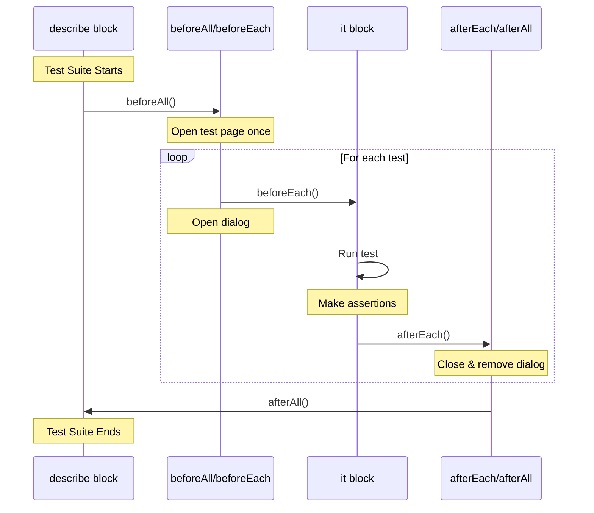

**Code Pattern:**

```javascript
describe('Dialog tests', () => {
  beforeAll(async () => {
    // Run once for entire suite
    await confirmationComponentsPage.open();
  });

  beforeEach(async () => {
    // Run before each test
    await confirmationComponentsPage.btnBasicDialog.click();
    await confirmationComponentsPage.waitForDialog();
  });

  afterEach(async () => {
    // Run after each test - cleanup
    await browser.execute(() => {
      const dialog = document.querySelector('dialog');
      if (dialog) {
        dialog.close();
        dialog.remove();
      }
    });
    await browser.pause(100); // Allow cleanup to complete
  });

  it('test 1', async () => {
    // Dialog is already open from beforeEach
    // Test runs in isolation
  });

  it('test 2', async () => {
    // Dialog is fresh, no pollution from test 1
  });
});
```

---

### Pattern 3: Wait Strategies

WebdriverIO requires explicit waits for asynchronous operations.

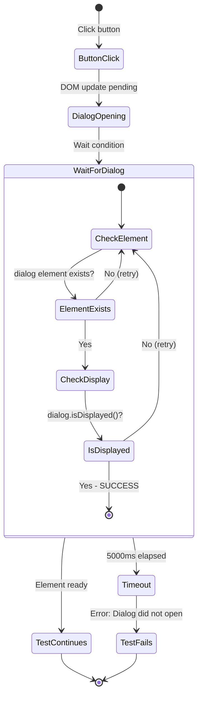

**Implementation:**

```javascript
// Page Object method
async waitForDialog() {
  await browser.waitUntil(
    async () => {
      const dialog = await browser.$('dialog');
      return (await dialog.isExisting()) && (await dialog.isDisplayed());
    },
    {
      timeout: 5000,
      timeoutMsg: 'Dialog did not open'
    }
  );
}

// Usage in test
await confirmationComponentsPage.btnBasicDialog.click();
await confirmationComponentsPage.waitForDialog(); // Explicit wait
// Now safe to interact with dialog
```

**Why This Matters:**
- DOM updates are asynchronous
- Race conditions cause flaky tests
- Explicit waits make tests reliable

---

### Pattern 4: Event Counter Testing

Testing side effects through observable state changes.

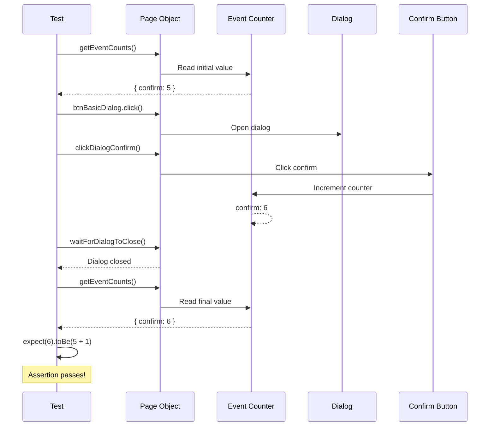

**Code Pattern:**

```javascript
it('should increment confirm counter', async () => {
  // Capture initial state
  const initialCounts = await confirmationComponentsPage.getEventCounts();
  // Returns: { confirm: 5, cancel: 3 }

  // Perform action
  await confirmationComponentsPage.btnBasicDialog.click();
  await confirmationComponentsPage.waitForDialog();
  await confirmationComponentsPage.clickDialogConfirm();
  await confirmationComponentsPage.waitForDialogToClose();

  // Verify state change
  const finalCounts = await confirmationComponentsPage.getEventCounts();
  // Returns: { confirm: 6, cancel: 3 }

  // Assert on the difference, not absolute values
  expect(finalCounts.confirm).toBe(initialCounts.confirm + 1);
});
```

**Why Test Differences:**
- Previous tests may have incremented counters
- Testing absolute values creates dependencies between tests
- Testing differences ensures isolation

---

## Common Issues & Solutions

### Issue 1: Dialog Opening Strategy

**Problem:** Dialogs weren't opening because the OpenModalEvent system wasn't working in tests.

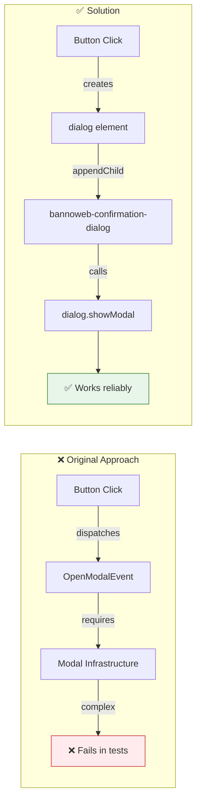

**Solution Code:**

```javascript
// ✅ Direct showModal() approach
function showDialog(config) {
  // Create dialog element
  const dialogElement = document.createElement('dialog');
  const confirmationDialog = document.createElement('bannoweb-confirmation-dialog');

  // Configure component
  Object.assign(confirmationDialog, config);

  // Set up event listeners
  confirmationDialog.addEventListener('confirm', () => {
    lastEvent.textContent = 'CONFIRM';
    dialogElement.close();
  });

  // Show dialog
  dialogElement.appendChild(confirmationDialog);
  document.body.appendChild(dialogElement);
  dialogElement.showModal(); // Native API, always works

  return { dialogElement, confirmationDialog };
}
```

---

### Issue 2: Missing Container for Custom Elements

**Problem:** The `appendElement()` method looked for `#insertedElement` container that didn't exist.

```mermaid
graph TB
    subgraph "❌ Before Fix"
        EL1[el property set] -->|triggers| UPD1[updated lifecycle]
        UPD1 -->|calls| APP1[appendElement]
        APP1 -->|queries| CONT1[#insertedElement]
        CONT1 -->|not found| FAIL1[❌ Element not inserted]
    end

    subgraph "✅ After Fix"
        EL2[el property set] -->|triggers| UPD2[updated lifecycle]
        UPD2 -->|calls| APP2[appendElement]
        APP2 -->|queries| CONT2[#insertedElement]
        CONT2 -->|exists in template| SUCC2[✅ Element appended]
    end

    style FAIL1 fill:#ffebee,stroke:#c62828
    style SUCC2 fill:#e8f5e9,stroke:#2e7d32
```

**Solution:**

```javascript
// Component render method
render() {
  return html`
    <bannoweb-dialog>
      <slot>
        <bannoweb-confirmation>...</bannoweb-confirmation>
      </slot>

      <!-- ✅ Added missing container -->
      <div id="insertedElement"></div>

      <footer>...</footer>
    </bannoweb-dialog>
  `;
}

// Lifecycle method (already existed)
updated(changedProperties) {
  if (changedProperties.has('el') && this.el) {
    this.appendElement(); // Now works!
  }
}

appendElement() {
  const container = this.shadowRoot.querySelector('#insertedElement');
  if (container && this.el) {
    container.appendChild(this.el); // ✅ Succeeds
  }
}
```

---

### Issue 3: Detecting Hidden Close Button

**Problem:** The test couldn't detect when the close button was hidden via `hideCloseButton` property.

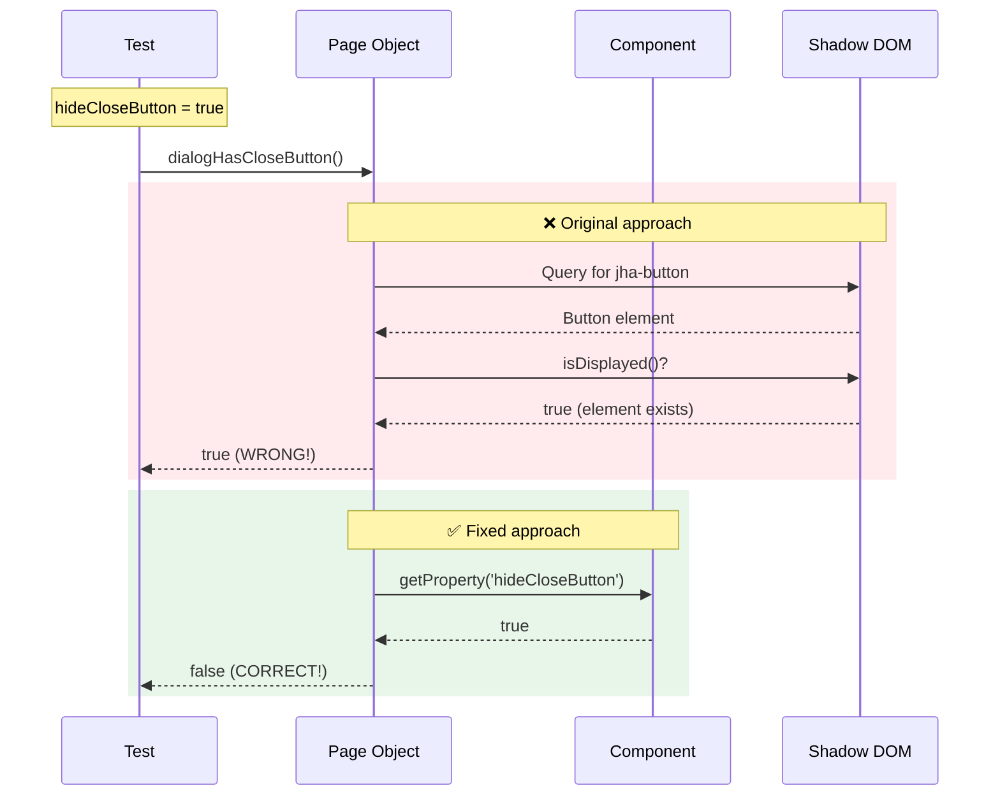

**Solution:**

```javascript
// ✅ Check property first, then DOM
async dialogHasCloseButton() {
  const dialog = await this.getDialogComponent();

  // Check the property directly
  const hideCloseButton = await dialog.getProperty('hideCloseButton');
  if (hideCloseButton) {
    return false; // Button is hidden by property
  }

  // If property is false, verify button exists in DOM
  const bannowebDialog = await dialog.shadow$('bannoweb-dialog');
  const headerRight = await bannowebDialog.shadow$('#header-right');
  const closeBtn = await headerRight.$('jha-button');
  return closeBtn.isDisplayed();
}
```

**Why This Works:**
- The `hideCloseButton` property controls rendering
- When true, component renders `<div slot="header-right"></div>` instead of button
- Checking property is more reliable than checking rendered output

---

## Best Practices

### 1. Selector Strategy

```mermaid
graph TD
    START[Choose Selector] --> Q1{Light or Shadow DOM?}

    Q1 -->|Light DOM| L1[Use $]
    Q1 -->|Shadow DOM| S1[Use shadow$]

    L1 --> Q2{What identifier?}
    S1 --> Q2

    Q2 -->|Has ID| ID[#element-id]
    Q2 -->|Has class| CLS[.class-name]
    Q2 -->|Has attribute| ATTR[element[attr='value']]
    Q2 -->|By tag| TAG[element-name]

    ID --> AVOID{Avoid complex selectors}
    CLS --> AVOID
    ATTR --> AVOID
    TAG --> AVOID

    AVOID -->|❌ Bad| BAD[div > span:nth-child3]
    AVOID -->|✅ Good| GOOD[Add ID or data-testid]

    style BAD fill:#ffebee,stroke:#c62828
    style GOOD fill:#e8f5e9,stroke:#2e7d32
```

**Guidelines:**
- Prefer IDs for test elements
- Use `data-testid` attributes for elements without IDs
- Avoid fragile selectors (nth-child, complex CSS)
- Keep selectors short and readable

---

### 2. Test Organization

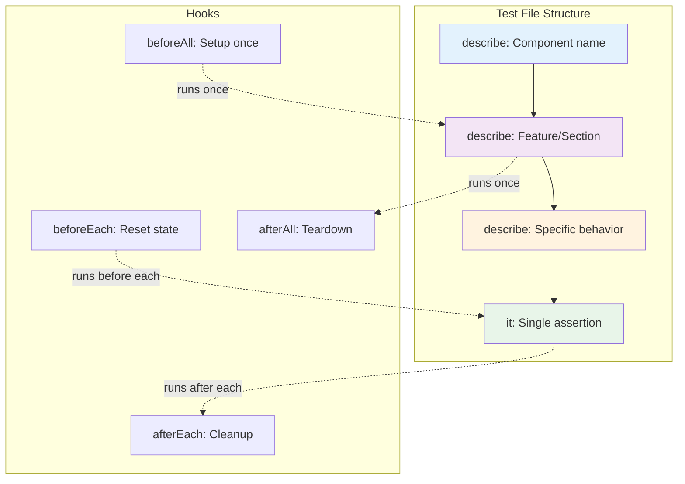

**Example Structure:**

```javascript
describe('bannoweb-confirmation-dialog', () => {
  beforeAll(async () => {
    await page.open(); // Once per suite
  });

  describe('Basic dialog workflow', () => {
    beforeEach(async () => {
      await page.openDialog(); // Before each test
    });

    afterEach(async () => {
      await page.closeDialog(); // After each test
    });

    it('should display header', async () => {
      // Single, focused assertion
      const header = await page.getDialogHeader();
      expect(header).toBe('Confirm Action');
    });

    it('should display description', async () => {
      // Each test is independent
      const desc = await page.getDialogDescription();
      expect(desc).toBe('Are you sure?');
    });
  });
});
```

---

### 3. Async/Await Patterns

All WebdriverIO methods are asynchronous and must be awaited.

```javascript
// ❌ WRONG - Missing await
it('test', async () => {
  const button = browser.$('#button'); // Returns promise
  button.click(); // Doesn't wait, test continues
  const header = page.getHeader(); // Runs immediately (race condition)
  expect(header).toBe('Expected'); // Fails unpredictably
});

// ✅ CORRECT - Proper await
it('test', async () => {
  const button = await browser.$('#button'); // Resolves promise
  await button.click(); // Waits for completion
  const header = await page.getHeader(); // Runs after click
  expect(header).toBe('Expected'); // Reliable assertion
});
```

---

### 4. Test Independence

Each test should be completely independent and runnable in any order.

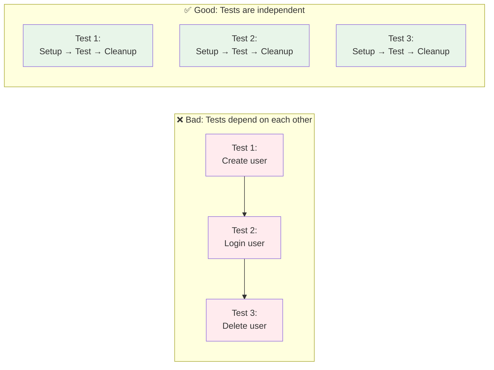

**Achieving Independence:**

```javascript
describe('Dialog tests', () => {
  beforeEach(async () => {
    // Each test starts fresh
    await page.open();
    await page.openDialog();
  });

  afterEach(async () => {
    // Each test cleans up after itself
    await page.closeDialog();
  });

  it('test 1', async () => {
    // Can run alone or in any order
  });

  it('test 2', async () => {
    // Doesn't depend on test 1
  });
});
```

---

## Key Learnings Summary

### 1. Shadow DOM Navigation

```
Light DOM → $()
Shadow DOM → shadow$()
```

### 2. Page Object Benefits

- Encapsulation of selectors
- Reusable helper methods
- Readable test code
- Easy maintenance

### 3. Test Lifecycle

```
beforeAll → beforeEach → test → afterEach → afterAll
```

### 4. Wait Strategies

- Always use explicit waits
- Never use arbitrary delays (browser.pause)
- Wait for conditions, not time

### 5. Test Independence

- No shared state between tests
- Each test sets up its own data
- Clean up after every test

---

## Testing Pyramid

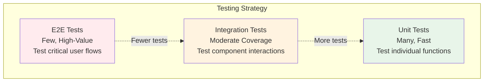

**Our E2E Tests:**
- Test complete user workflows
- Verify component integration
- Catch visual and behavioral issues
- Slower but high confidence

---

## Resources

- [WebdriverIO Documentation](https://webdriver.io/)
- [Shadow DOM Specification](https://developer.mozilla.org/en-US/docs/Web/Web_Components/Using_shadow_DOM)
- [Lit Component Documentation](https://lit.dev/)
- [Page Object Model Pattern](https://martinfowler.com/bliki/PageObject.html)

---

## Quick Reference

### Common Selectors

```javascript
// Light DOM
browser.$('#element-id')
browser.$('.class-name')
browser.$('element-name')
browser.$('[attribute="value"]')

// Shadow DOM
element.shadow$('#shadow-element')
element.shadow$('bannoweb-dialog')

// Chaining
browser.$('dialog').$('bannoweb-confirmation-dialog').shadow$('footer')
```

### Common Waits

```javascript
// Wait for element to exist
await element.waitForExist()

// Wait for element to be displayed
await element.waitForDisplayed()

// Custom wait condition
await browser.waitUntil(async () => {
  return condition;
}, { timeout: 5000, timeoutMsg: 'Custom message' })
```

### Common Assertions

```javascript
// Element state
expect(await element.isDisplayed()).toBe(true)
expect(await element.isExisting()).toBe(true)

// Text content
expect(await element.getText()).toBe('Expected text')
expect(await element.getText()).toContain('Partial text')

// Attributes
expect(await element.getAttribute('icon')).toBe('circle-checkmark')

// Properties
expect(await element.getProperty('hideCloseButton')).toBe(true)
```

---

*Generated for the bannoweb-confirmation-components E2E test suite*
