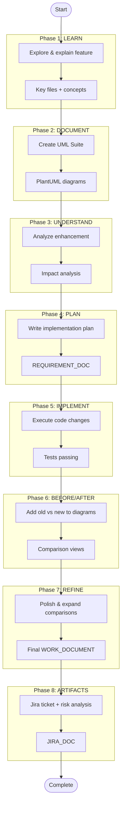

# Feature Documentation Workflow Template

This document describes the 8-phase workflow for documenting features and implementing enhancements, extracted from the Magic Links experience.

---

## Quick Start

Use the `/feature-docs` command:

```bash
/feature-docs <FEATURE_DOMAIN> "<NEW_ENHANCEMENT>" [TICKET_ID]
```

**Example:**
```bash
/feature-docs Conversations "Chat Termination Handling" WEB-5000
```

---

## The 8-Phase Workflow



---

## Constants Reference

| Constant | Description | How It's Used |
|----------|-------------|---------------|
| `FEATURE_DOMAIN` | The feature area being documented | Used in prompts and file names |
| `NEW_ENHANCEMENT` | The specific change being made | Describes what's changing |
| `TICKET_ID` | Jira ticket identifier | Folder name for outputs |
| `WORK_DOCUMENT` | Path to UML documentation | `{TICKET_ID}/{domain}-uml.md` |
| `REQUIREMENT_DOC` | Path to implementation plan | `{TICKET_ID}/{ENHANCEMENT}_PLAN.md` |
| `JIRA_DOC` | Path to Jira ticket draft | `{TICKET_ID}/JIRA-{enhancement}.md` |

---

## Phase Prompts (Generic Template)

### Phase 1: LEARN
```
Please teach me what {FEATURE_DOMAIN} is, how it is used by users of our product,
and how I can begin to understand it. Identify the key files and concepts.
```

### Phase 2: DOCUMENT
```
Create a UML Documentation Suite for {FEATURE_DOMAIN} at {WORK_DOCUMENT} using PlantUML with:
- Level 1: Use Case Diagram
- Level 2: Sequence Diagrams (main flows)
- Level 3: Activity Diagrams (process details)
- Level 4: Class Diagrams (static structure)
- Reference section (API endpoints, key files, events)
```

### Phase 3: UNDERSTAND
```
Study and review the changes being made for {NEW_ENHANCEMENT}.
Analyze what components/files are affected and create a plan.
```

### Phase 4: PLAN
```
Create an implementation plan document at {REQUIREMENT_DOC} that includes:
- Overview of changes
- API changes (if any)
- Implementation steps by phase
- Testing strategy
- Risks and mitigation
```

### Phase 5: IMPLEMENT
```
Implement the plan as specified in {REQUIREMENT_DOC}.
Mark todos as in_progress as you work. Don't stop until complete.
```

### Phase 6: BEFORE/AFTER
```
Update {WORK_DOCUMENT} to show before/after comparisons in the diagrams:
- Use color coding (pink=deprecated, green=current)
- Add migration notes
- Show new error scenarios
- Update class diagrams with new dependencies
```

### Phase 7: REFINE
```
Analyze all diagrams in {WORK_DOCUMENT} to determine which could benefit
from showing old vs new comparisons. Update those that are affected.
```

### Phase 8: ARTIFACTS
```
Create a Jira ticket document at {JIRA_DOC} with:
- Title and Description
- Scope (checklist)
- Acceptance Criteria
- Risk Assessment (use case impact, risk matrix)
- Testing Requirements
- Rollback Plan
```

---

# Example: Conversations + Chat Termination Handling

## Constants (Filled In)

| Constant | Value |
|----------|-------|
| `FEATURE_DOMAIN` | Conversations |
| `NEW_ENHANCEMENT` | Chat Termination Handling |
| `TICKET_ID` | WEB-5000 |
| `WORK_DOCUMENT` | `WEB-5000/conversations-uml.md` |
| `REQUIREMENT_DOC` | `WEB-5000/CHAT_TERMINATION_PLAN.md` |
| `JIRA_DOC` | `WEB-5000/JIRA-chat-termination.md` |

---

## Phase 1: LEARN (Conversations Example)

**Prompt:**
```
Please teach me what Conversations is, how it is used by users of our product,
and how I can begin to understand it. Identify the key files and concepts.
```

**Expected Output:**
- Explanation of the Conversations feature (what it is, how users use it)
- Key use cases (starting a chat, sending messages, chat termination)
- Key files:
  - Controllers (e.g., `conversations-controller.js`)
  - Components (e.g., `bannoweb-conversations.js`)
  - API endpoints
- Existing documentation references

---

## Phase 2: DOCUMENT (Conversations Example)

**Prompt:**
```
Create a UML Documentation Suite for Conversations at WEB-5000/conversations-uml.md using PlantUML with:
- Level 1: Use Case Diagram (User, Support Agent, System actors)
- Level 2: Sequence Diagrams (Start Chat, Send Message, Terminate Chat)
- Level 3: Activity Diagrams (Message routing, termination flow)
- Level 4: Class Diagrams (ConversationsController, ChatComponent)
- Reference section (API endpoints, key files, events)
```

**Expected Output:**
- `WEB-5000/conversations-uml.md` with PlantUML diagrams

---

## Phase 3: UNDERSTAND (Conversations Example)

**Prompt:**
```
Study and review the changes being made for Chat Termination Handling.
Analyze what components/files are affected and create a plan.
```

**Expected Output:**
- Analysis of current termination behavior
- What's changing and why
- Affected use cases
- Affected files and line numbers

---

## Phase 4: PLAN (Conversations Example)

**Prompt:**
```
Create an implementation plan document at WEB-5000/CHAT_TERMINATION_PLAN.md that includes:
- Overview: What is changing in chat termination
- API changes: Before/after endpoint comparison
- Implementation steps: Phased approach
- Testing strategy: Unit, integration, E2E
- Risks and mitigation: What could go wrong
```

**Expected Output:**
- `WEB-5000/CHAT_TERMINATION_PLAN.md` with detailed implementation plan

---

## Phase 5: IMPLEMENT (Conversations Example)

**Prompt:**
```
Implement the plan as specified in WEB-5000/CHAT_TERMINATION_PLAN.md.
Mark todos as in_progress as you work. Don't stop until complete.
```

**Expected Output:**
- Code changes to controllers, components, tests
- All tests passing
- Linting clean

---

## Phase 6: BEFORE/AFTER (Conversations Example)

**Prompt:**
```
Update WEB-5000/conversations-uml.md to show before/after comparisons:
- Use color coding (pink=old termination flow, green=new termination flow)
- Add migration notes explaining what changed
- Show new error scenarios for termination failures
- Update class diagrams with new dependencies
```

**Expected Output:**
- Updated diagrams with old vs new comparison groups
- Migration summary tables

---

## Phase 7: REFINE (Conversations Example)

**Prompt:**
```
Analyze all diagrams in WEB-5000/conversations-uml.md to determine which
could benefit from showing old vs new comparisons for Chat Termination Handling.
Update those that are affected.
```

**Expected Output:**
- All relevant diagrams updated
- Comprehensive before/after coverage

---

## Phase 8: ARTIFACTS (Conversations Example)

**Prompt:**
```
Create a Jira ticket document at WEB-5000/JIRA-chat-termination.md with:
- Title: Update chat termination handling for Conversations
- Description: Summary of changes
- Scope: Checklist of work items
- Acceptance Criteria: What "done" looks like
- Risk Assessment:
  - Use case impact map
  - Risk matrix (likelihood x impact)
- Testing Requirements: Unit, integration, manual
- Rollback Plan: How to revert
```

**Expected Output:**
- `WEB-5000/JIRA-chat-termination.md` ready to paste into Jira

---

## Comparison: Magic Links vs Conversations

| Aspect | Magic Links (WEB-4718) | Conversations (WEB-5000) |
|--------|------------------------|--------------------------|
| **FEATURE_DOMAIN** | Magic Links | Conversations |
| **NEW_ENHANCEMENT** | API Migration | Chat Termination Handling |
| **Key Change** | Endpoint format change | Termination flow change |
| **Affected Use Cases** | Token redemption, 2FA setup | Chat termination, session cleanup |
| **Risk Level** | Medium-High (onboarding path) | TBD (depends on analysis) |

---

## Files Produced

After completing all 8 phases, you'll have:

```
WEB-5000/
├── conversations-uml.md          # UML Documentation Suite
├── CHAT_TERMINATION_PLAN.md      # Implementation Plan
└── JIRA-chat-termination.md      # Jira Ticket Draft
```

Plus the actual code changes and test updates.
