# Magic Link UML Documentation Suite

This document provides a comprehensive UML documentation of the Magic Link feature in Banno Online, organized from high-level use cases down to detailed implementation diagrams.

**Note:** All diagrams use PlantUML syntax. To render them, use a PlantUML viewer, IDE plugin, or online tool like [PlantText](https://www.planttext.com/) or [PlantUML Server](http://www.plantuml.com/plantuml/).

---

## Table of Contents

### Level 1: Use Cases (What the system does)
- [Use Case Diagram](#use-case-diagram)

### Level 2: Sequence Diagrams (How objects interact)
- [Flow 1: Organization User Invitation](#flow-1-organization-user-invitation-with-api-migration)
- [Flow 2: 2FA Setup](#flow-2-organization-user-invitation-with-2fa-required)
- [Flow 3: Account Recovery](#flow-3-account-recovery-via-magic-link)
- [Flow 4: Error Handling](#flow-4-error-handling)

### Level 3: Activity Diagrams (Process details)
- [Activity: Token Decoding Process](#activity-token-decoding-process)
- [Activity: Credential Validation Flow](#activity-credential-validation-flow)
- [Activity: 2FA Verification Flow](#activity-2fa-verification-flow)

### Level 4: Class Diagrams (Static structure)
- [Class: MagicLinkController](#class-magiclinkcontroller)
- [Class: Controllers Overview](#class-controllers-overview)

### Reference
- [API Endpoints Summary](#api-endpoints-summary)
- [Key Files Reference](#key-files-reference)
- [Event Types Reference](#event-types-reference)

---

## Overview

Magic links are **single-use JWT tokens** embedded in URLs that authenticate users without passwords. They are used for:

1. **Organization User Invitations** - Inviting new users to join an organization
2. **First Admin 2FA Setup** - Setting up two-factor authentication for first admins
3. **Account Recovery** - Password reset via email/SMS

---

## Document Hierarchy

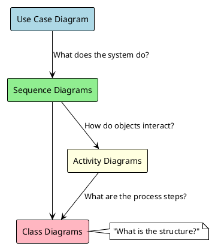

---

# Level 1: Use Case Diagram

## Use Case Diagram

This diagram shows the actors (users and external systems) and the use cases (system functionalities) for the Magic Link feature.

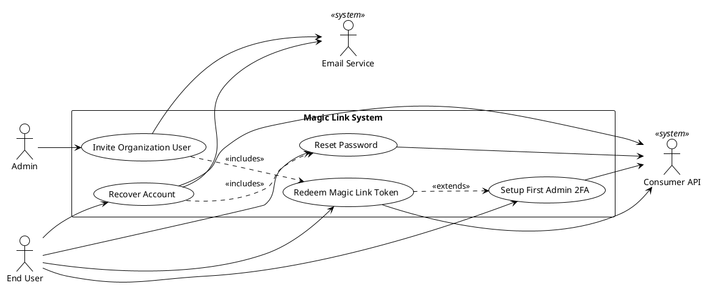

### Actors

| Actor | Description |
|-------|-------------|
| **Admin** | Organization administrator who invites new users |
| **End User** | Person receiving and using magic links |
| **Email Service** | External service that delivers magic link emails/SMS |
| **Consumer API** | Backend API that validates tokens and manages sessions |

### Use Cases

| Use Case | Description | Primary Actor |
|----------|-------------|---------------|
| **Invite Organization User** | Admin creates invitation, system sends magic link | Admin |
| **Redeem Magic Link Token** | User clicks link, system validates token and creates session | End User |
| **Setup First Admin 2FA** | First admin must complete 2FA before credential setup | End User |
| **Recover Account** | User requests password recovery via magic link | End User |
| **Reset Password** | User sets new password after magic link verification | End User |

---

# Level 2: Sequence Diagrams

---

## Flow 1: Organization User Invitation (with API Migration)

This is the primary magic link flow when a user is invited to join an organization.

**Note:** Step 3 shows both the deprecated and current API endpoints for token redemption. See [Activity: Token Decoding Process](#activity-token-decoding-process) for details on the new JWT decoding step.

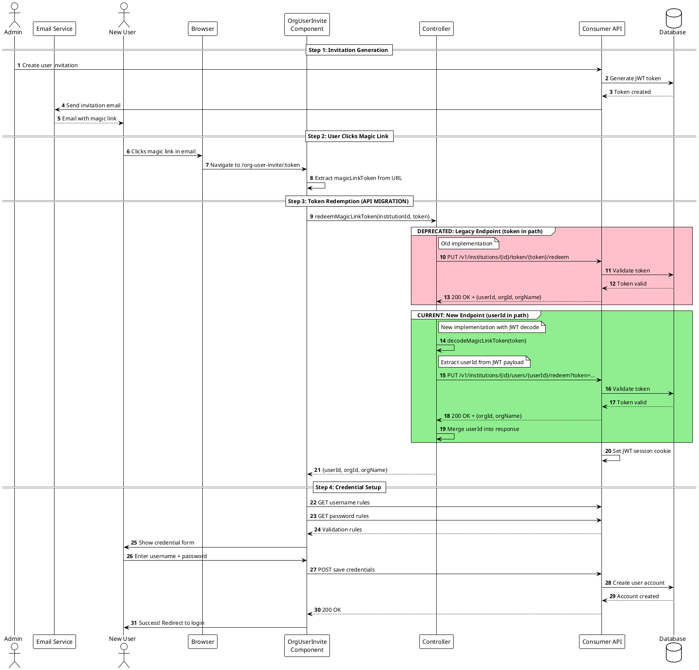

### API Migration Summary

| Aspect | Deprecated (Legacy) | Current (New) |
|--------|---------------------|---------------|
| **Endpoint** | `/v1/institutions/{id}/token/{token}/redeem` | `/v1/institutions/{id}/users/{userId}/redeem?token=...` |
| **Token location** | In URL path | In query parameter |
| **userId source** | Returned from API | Decoded from JWT client-side |
| **Client-side step** | None | Decode JWT to extract userId |

---

## Flow 2: Organization User Invitation with 2FA Required

When the first admin of an organization needs to set up 2FA before creating credentials.

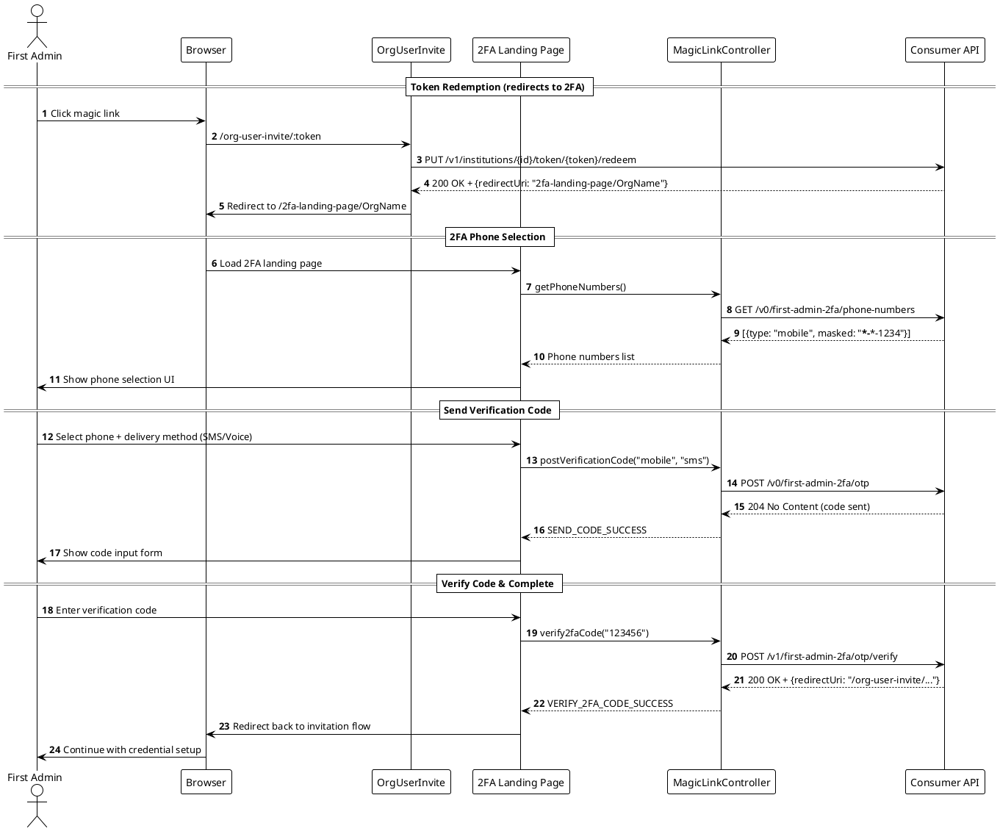

---

## Flow 3: Account Recovery via Magic Link

When a user forgets their password and uses a magic link for recovery.

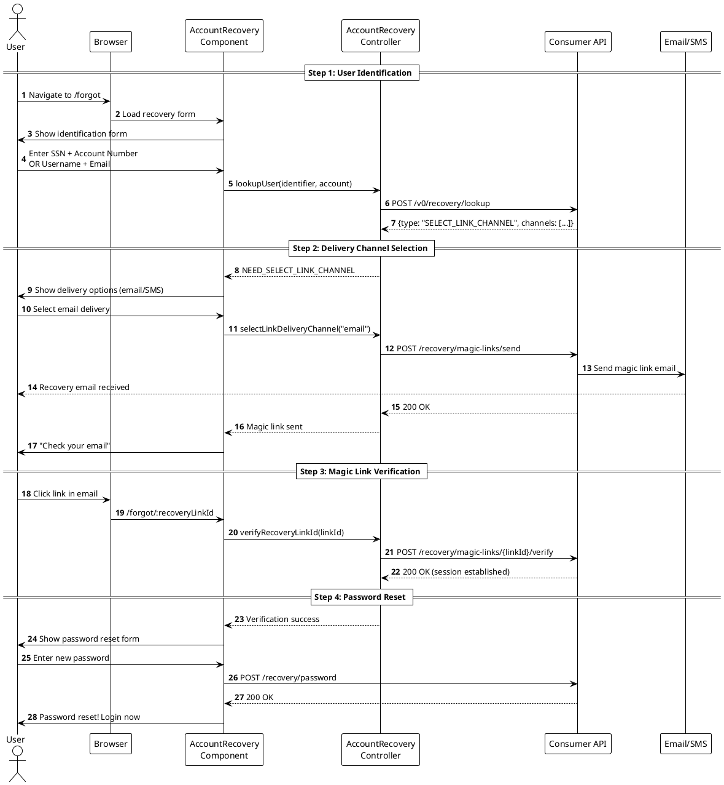

---

## Flow 4: Error Handling

Common error scenarios in magic link flows.

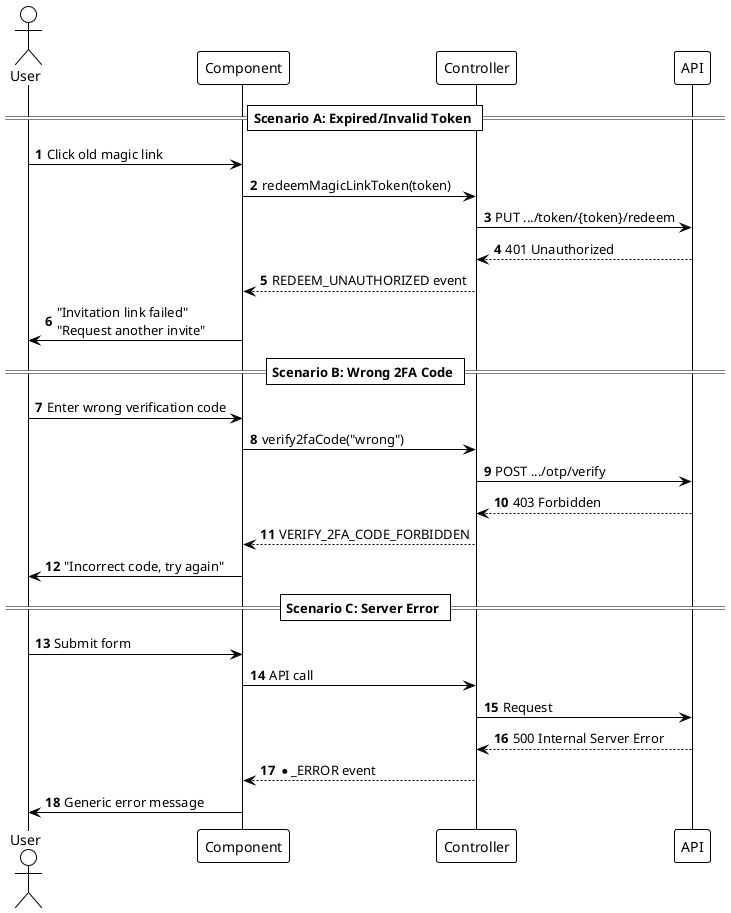

---

# Level 3: Activity Diagrams

Activity diagrams zoom into specific processes from the sequence diagrams, showing decision points and detailed workflow steps.

---

## Activity: Token Decoding Process

This diagram details the token decoding step introduced in the API migration. It shows how the controller extracts `userId` from the JWT token before making the API call.

**Referenced from:** [Flow 1: Step 3 - Token Redemption](#flow-1-organization-user-invitation-with-api-migration)

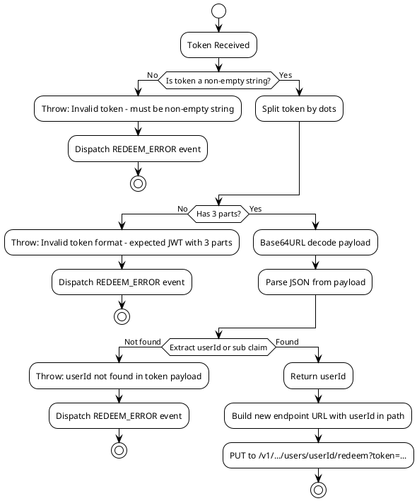

### Token Structure

```
header.payload.signature
   │      │        │
   │      │        └── Cryptographic signature (not decoded client-side)
   │      └── Base64URL encoded JSON with userId claim
   └── Base64URL encoded JSON with algorithm info
```

---

## Activity: Credential Validation Flow

This diagram shows the real-time validation process when users enter their username and password during enrollment.

**Referenced from:** [Flow 1: Step 4 - Credential Setup](#flow-1-organization-user-invitation-with-api-migration)

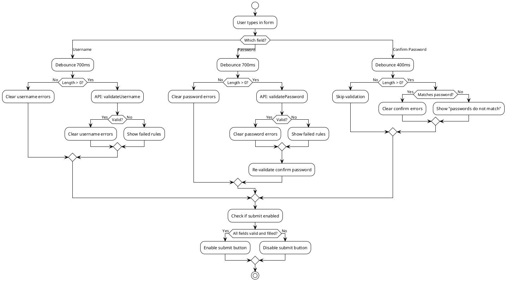

---

## Activity: 2FA Verification Flow

This diagram shows the two-factor authentication verification process for first admin users.

**Referenced from:** [Flow 2: 2FA Setup](#flow-2-organization-user-invitation-with-2fa-required)

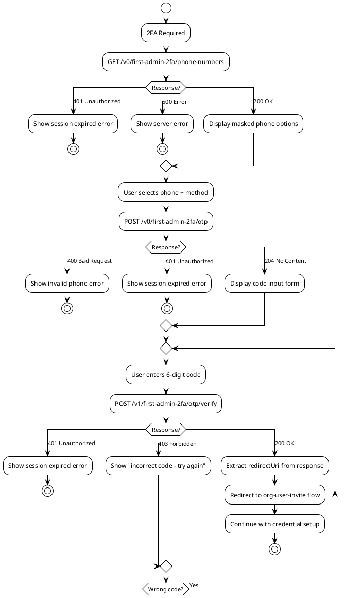

---

# Level 4: Class Diagrams

Class diagrams show the static structure of the system - the classes, their attributes, methods, and relationships.

---

## Class: MagicLinkController

This diagram shows the `MagicLinkController` class and its relationship to the new `decodeMagicLinkToken` utility.

**Referenced from:** All sequence diagrams using `MagicLinkController`

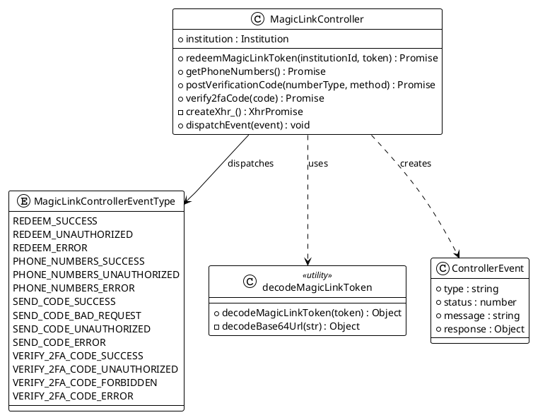

---

## Class: Controllers Overview

This diagram shows the relationship between the main controllers involved in magic link flows.

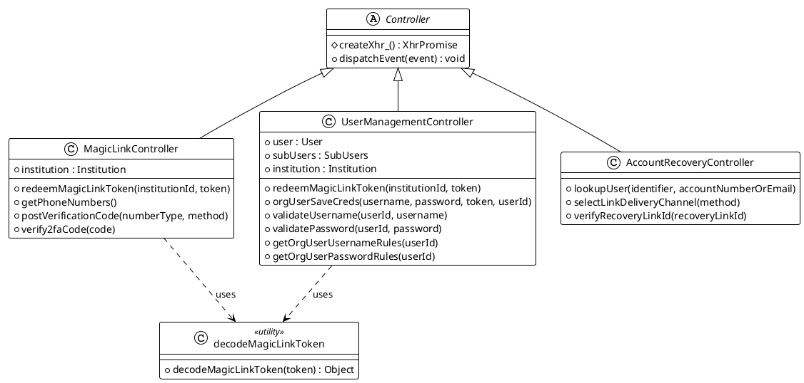

---

# Reference

---

## API Endpoints Summary

| Endpoint | Method | Purpose |
|----------|--------|---------|
| `/v1/institutions/{id}/users/{userId}/redeem?token=...` | PUT | Redeem invitation magic link (CURRENT) |
| `/v1/institutions/{id}/token/{token}/redeem` | PUT | Redeem invitation magic link (DEPRECATED) |
| `/v0/first-admin-2fa/phone-numbers` | GET | Get masked phone numbers for 2FA |
| `/v0/first-admin-2fa/otp` | POST | Send 2FA verification code |
| `/v1/first-admin-2fa/otp/verify` | POST | Verify 2FA code |
| `/v0/recovery/lookup` | POST | Initiate account recovery |
| `/recovery/magic-links/send` | POST | Send recovery magic link |
| `/recovery/magic-links/{id}/verify` | POST | Verify recovery link |

---

## Key Files Reference

| File | Description |
|------|-------------|
| `src/js/util/magic-link-token.js` | **NEW** - JWT token decoder utility for extracting userId |
| `src/js/api/controllers/magic-link-controller.js` | Core controller for magic link + 2FA APIs |
| `src/js/api/controllers/user-management-controller.js` | User management including token redemption |
| `src/js/api/controllers/account-recovery-controller.js` | Account recovery flows |
| `src/components/bannoweb/enrollment/bannoweb-org-user-invite.js` | UI for invitation flow |
| `src/components/bannoweb/two-factor-auth/bannoweb-two-factor-auth-landing-page.js` | 2FA setup UI |
| `src/components/bannoweb/account-recovery/bannoweb-account-recovery.js` | Recovery flow UI |

---

## Event Types Reference

The `MagicLinkController` dispatches these events:

```javascript
MagicLinkController.EventType = {
  // Token redemption
  REDEEM_SUCCESS: 'redeem-success',
  REDEEM_UNAUTHORIZED: 'redeem-unauthorized',      // 401 - invalid token
  REDEEM_ERROR: 'redeem-error',                    // 500 - server error

  // Phone numbers
  PHONE_NUMBERS_SUCCESS: 'phone-numbers-success',
  PHONE_NUMBERS_UNAUTHORIZED: 'phone-numbers-unauthorized',
  PHONE_NUMBERS_ERROR: 'phone-numbers-error',

  // Send verification code
  SEND_CODE_SUCCESS: 'send-code-success',
  SEND_CODE_BAD_REQUEST: 'send-code-bad-request',  // 400 - invalid phone
  SEND_CODE_UNAUTHORIZED: 'send-code-unauthorized',
  SEND_CODE_ERROR: 'send-code-error',

  // Verify 2FA code
  VERIFY_2FA_CODE_SUCCESS: 'verify-2fa-code-success',
  VERIFY_2FA_CODE_UNAUTHORIZED: 'verify-2fa-code-unauthorized',
  VERIFY_2FA_CODE_FORBIDDEN: 'forbidden',          // 403 - wrong code
  VERIFY_2FA_CODE_ERROR: 'verify-2fa-code-error',
};
```
