# Conversation Messages - Sequence Diagrams (WEB-4723)

This document provides comprehensive UML documentation for the Glacier closed conversation handling feature in Banno Online, organized from high-level use cases down to detailed implementation diagrams. It shows BOTH current broken behavior AND desired Glacier-aligned behavior with before/after comparisons.

**Note:** All diagrams use PlantUML syntax. To render them, use a PlantUML viewer, IDE plugin, or online tool like [PlantText](https://www.planttext.com/) or [PlantUML Server](http://www.plantuml.com/plantuml/).

---

## Table of Contents

### Level 1: Use Cases (What the system does)
- [Use Case Diagram](#use-case-diagram)

### Level 2: Sequence Diagrams (How objects interact)
- [Flow 1: Send and Receive Message (Normal Flow)](#flow-1-send-and-receive-message-normal-flow)
- [Flow 2: Close Conversation](#flow-2-close-conversation-before-vs-after)
- [Flow 3: Access Closed Conversation via Direct URL](#flow-3-access-closed-conversation-via-direct-url-before-vs-after)
- [Flow 4: Reopen Conversation (NEW FEATURE)](#flow-4-reopen-conversation-new-feature)
- [Flow 5: Receive Message on Closed Conversation (NEW BEHAVIOR)](#flow-5-receive-message-on-closed-conversation-new-behavior)
- [Flow 6: Error Handling](#flow-6-error-handling)

### Level 3: Activity Diagrams (Process details)
- [Activity 1: CaseDetails Event Processing Flow (NEW)](#activity-1-casedetails-event-processing-flow-new)
- [Activity 2: Compose Area Visibility Logic](#activity-2-compose-area-visibility-logic-before-vs-after)
- [Activity 3: Archive vs Close Decision Tree](#activity-3-archive-vs-close-decision-tree)
- [Activity 4: Token Redemption vs Status Change Pattern Comparison](#activity-4-token-redemption-vs-status-change-pattern-comparison)

### Level 4: Class Diagrams (Static structure)
- [Class 1: Conversation Model](#class-1-conversation-model-before-vs-after)
- [Class 2: ConversationsUtil](#class-2-conversationsutil-before-vs-after)
- [Class 3: ConversationsController](#class-3-conversationscontroller-before-vs-after)
- [Class 4: ChatCard Component](#class-4-chatcard-component-before-vs-after)
- [Class 5: Controllers Overview with Relationships](#class-5-controllers-overview-with-relationships)

### Reference
- [API Endpoints Summary](#api-endpoints-summary)
- [WebSocket Event Types Reference](#websocket-event-types-reference)
- [Key Files Reference](#key-files-reference)
- [Controller Event Types Reference](#controller-event-types-reference)
- [State Machine: Conversation Status](#state-machine-conversation-status)
- [Design Patterns Applied](#design-patterns-applied)
- [Testing Scenarios Reference](#testing-scenarios-reference)
- [Migration Checklist](#migration-checklist)

---

## Overview

The Glacier closed conversation handling feature enables admins to close conversations while maintaining conversation history and inbox presence. Key capabilities:

1. **Close Conversation** - Change conversation status to "Closed" without removing from inbox
2. **View Closed Conversations** - Access closed conversations via direct URL or inbox
3. **Reopen Conversation** - Admin can restore closed conversation to "Active" state
4. **Receive Messages on Closed** - Consumer can send messages to closed conversations (read-only for admin)
5. **Status Tracking** - CaseDetails WebSocket events broadcast status changes

**Current Problem:** The system uses "archive" which removes conversations entirely from the collection, breaking URL access and status tracking.

**Glacier Solution:** Use status-based close/reopen with CaseDetails events, keeping conversations in collection.

---

## Document Hierarchy

This diagram shows the 4-level pyramid structure used to organize this documentation:

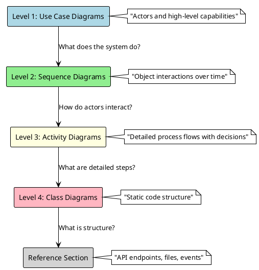

---

# Level 1: Use Case Diagram

## Use Case Diagram

This diagram shows the actors (users and external systems) and the use cases (system functionalities) for conversation messages and closed conversation handling.

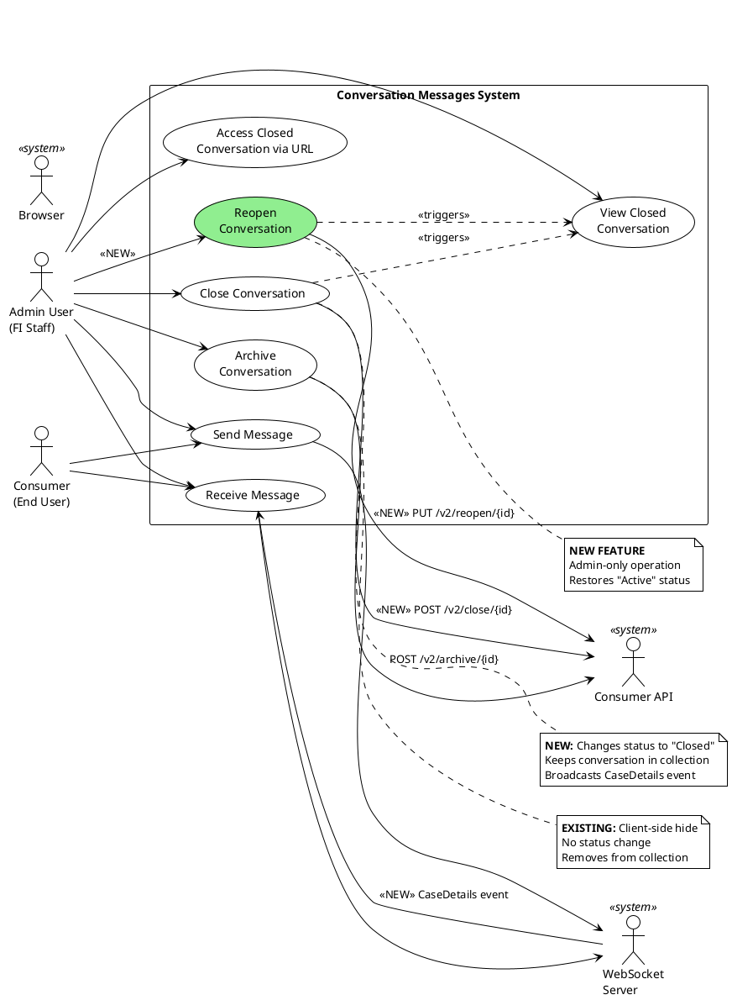

### Actors

| Actor | Description |
|-------|-------------|
| **Admin User (FI Staff)** | Financial institution staff who manage conversations with consumers |
| **Consumer (End User)** | End user who initiates and participates in conversations |
| **WebSocket Server** | Real-time messaging server broadcasting conversation events |
| **Consumer API** | Backend API managing conversation state and status |
| **Browser** | Client application rendering conversation UI |

### Use Cases

| Use Case | Description | Primary Actor | Status |
|----------|-------------|---------------|--------|
| **Send Message** | User sends a text message in conversation | Admin, Consumer | Existing |
| **Receive Message** | User receives message via WebSocket | Admin, Consumer | Existing |
| **Close Conversation** | Admin changes conversation status to "Closed" | Admin | **NEW** |
| **View Closed Conversation** | Admin views closed conversation in inbox | Admin | **NEW** |
| **Access Closed Conversation via URL** | Direct navigation to closed conversation | Admin | **FIXED** |
| **Reopen Conversation** | Admin restores conversation to "Active" state | Admin | **NEW** |
| **Archive Conversation** | User hides conversation from inbox (client-side) | Admin | Existing |

### Key Relationships

- **Close triggers View:** When admin closes conversation, it remains viewable in inbox
- **Archive vs Close:** Archive removes from collection (client-side hide), Close changes status (server-side state)
- **Reopen restores Active:** Reopen operation changes status back to "Active"
- **CaseDetails event:** Close and Reopen both trigger CaseDetails WebSocket events

---

# Level 2: Sequence Diagrams

---

## Flow 1: Send and Receive Message (Normal Flow)

This is the standard message flow through WebSocket. **No changes needed** for Glacier feature - shown for context.

**Referenced by:** Flow 5 (messages on closed conversations follow same WebSocket pattern)

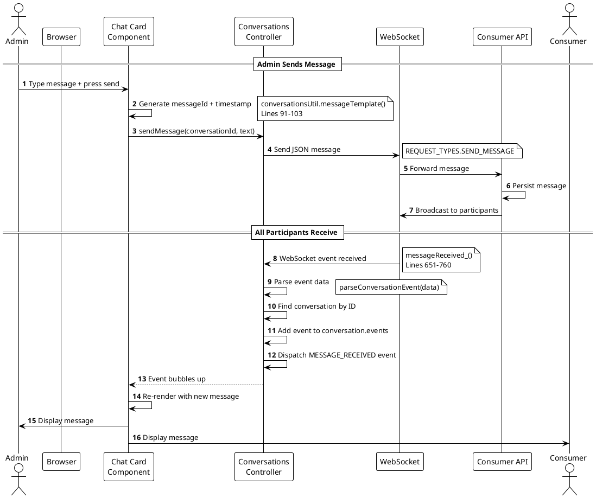

### Key Files Referenced

- **`/src/js/util/conversations.js`** - `messageTemplate()` (lines 91-103)
- **`/src/js/api/controllers/conversations-controller.js`** - `messageReceived_()` (lines 651-760)

---

## Flow 2: Close Conversation (BEFORE vs AFTER)

This diagram shows the critical difference between the current broken "archive" approach and the desired Glacier "close" approach.

**Referenced by:** Activity 1 (CaseDetails processing), Activity 2 (compose visibility), Activity 3 (archive vs close)

### BEFORE (Current Broken Implementation)

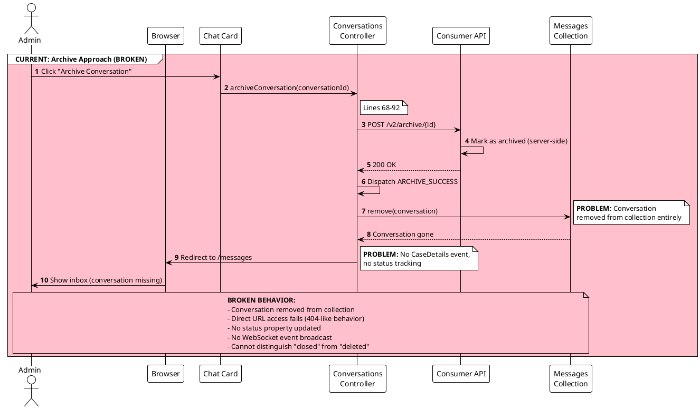

### AFTER (Desired Glacier Implementation)

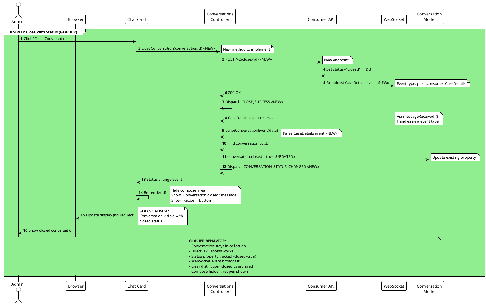

### Comparison Table

| Aspect | BEFORE (Archive) | AFTER (Glacier Close) |
|--------|------------------|------------------------|
| **API Endpoint** | POST `/v2/archive/{id}` | POST `/v2/close/{id}` ✨ NEW |
| **Collection State** | Removed entirely | Stays in collection ✅ |
| **Status Property** | No change | `closed=true` ✅ |
| **WebSocket Event** | None ❌ | CaseDetails event ✅ |
| **URL Access** | Fails (404-like) ❌ | Works ✅ |
| **Compose Area** | N/A (removed) | Hidden ✅ |
| **Reopen Button** | N/A | Shown ✅ |
| **Browser Redirect** | Yes → `/messages` | No redirect ✅ |
| **Event Dispatched** | ARCHIVE_SUCCESS | CLOSE_SUCCESS, CONVERSATION_STATUS_CHANGED ✨ |

---

## Flow 3: Access Closed Conversation via Direct URL (BEFORE vs AFTER)

This shows what happens when a user navigates directly to a closed conversation URL (e.g., from bookmark or shared link).

**Referenced by:** Activity 2 (compose visibility logic)

### BEFORE (Current Broken Implementation)

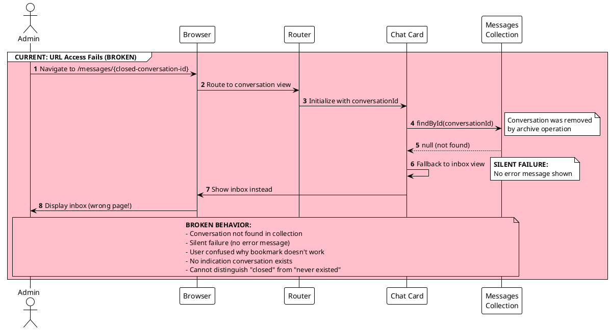

### AFTER (Desired Glacier Implementation)

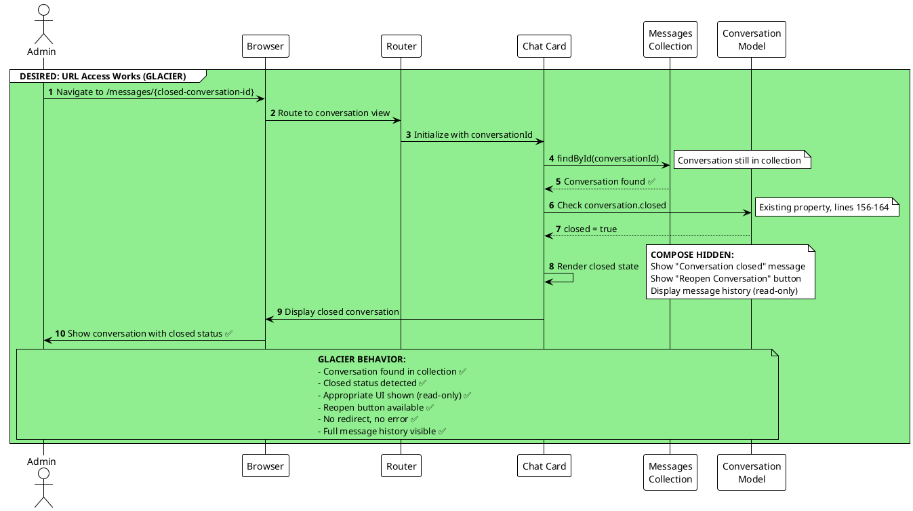

### Comparison Table

| Aspect | BEFORE (Archive) | AFTER (Glacier Close) |
|--------|------------------|------------------------|
| **URL Navigation** | `/messages/{id}` | `/messages/{id}` |
| **Conversation Found?** | No ❌ (removed) | Yes ✅ (in collection) |
| **Error Shown?** | No (silent failure) | N/A (success) |
| **Fallback Behavior** | Show inbox | Show conversation |
| **Compose Area** | N/A | Hidden |
| **Message History** | N/A | Visible (read-only) |
| **Reopen Button** | N/A | Shown |
| **User Experience** | Confusing (wrong page) | Clear (closed state) |

---

## Flow 4: Reopen Conversation (NEW FEATURE)

This is entirely new functionality for Glacier. Admin can restore a closed conversation to active state.

**Referenced by:** Activity 1 (CaseDetails processing)

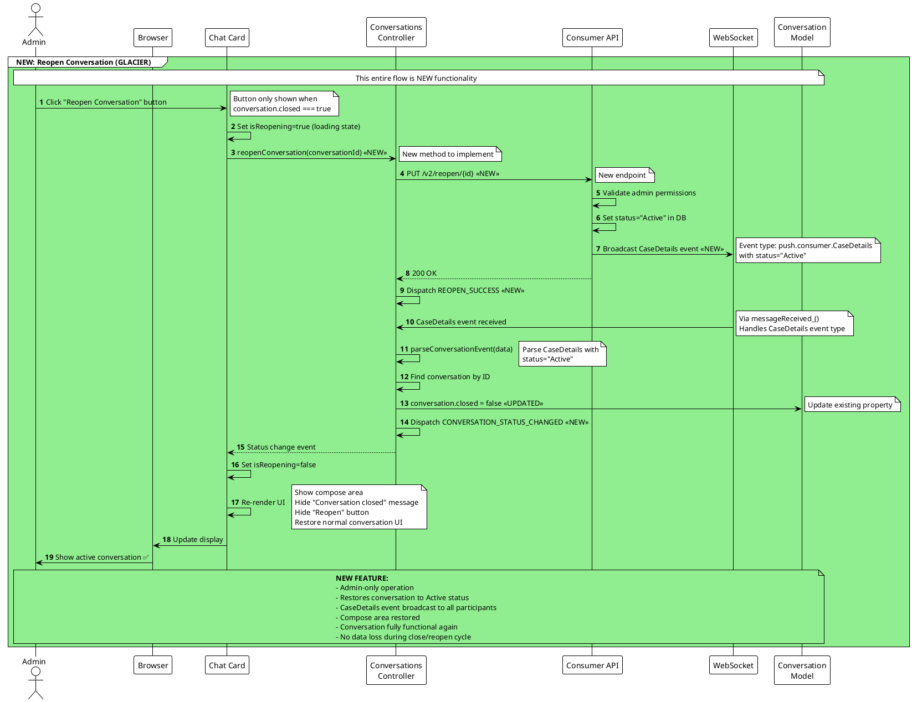

### Key Implementation Notes

- **New API Endpoint:** `PUT /v2/reopen/{id}` must be implemented
- **Authorization:** Only admins can reopen conversations
- **WebSocket Event:** CaseDetails with `status="Active"` broadcast to all participants
- **UI State:** Loading state (`isReopening`) prevents duplicate requests
- **Bidirectional:** Close → Reopen → Close can be repeated without data loss

---

## Flow 5: Receive Message on Closed Conversation (NEW BEHAVIOR)

This shows Glacier behavior when a consumer sends a message to a closed conversation. The message is received but the conversation remains closed.

**Referenced by:** Flow 1 (same WebSocket pattern)

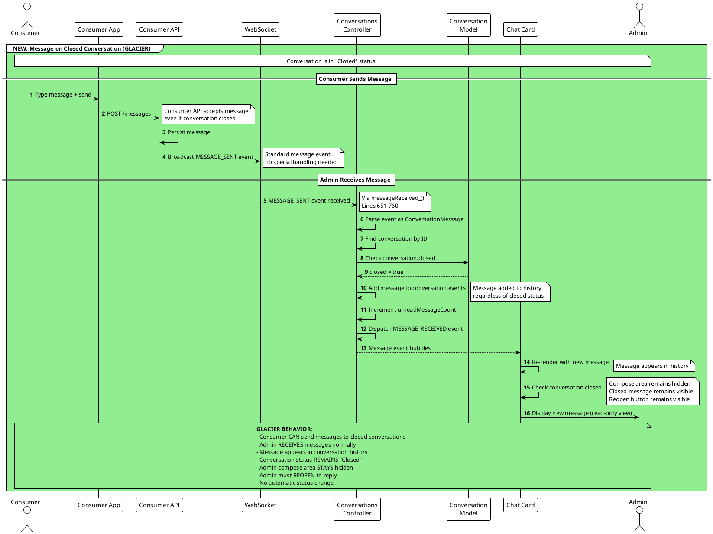

### Key Behavior Points

- **Consumer Not Blocked:** Consumer can still send messages (no error)
- **Admin Read-Only:** Admin receives and sees messages but cannot reply without reopening
- **Status Unchanged:** Receiving a message does NOT auto-reopen the conversation
- **Reopen Required:** Admin must explicitly click "Reopen Conversation" to reply
- **History Preserved:** All messages received while closed are saved and visible

---

## Flow 6: Error Handling

Common error scenarios in closed conversation flows.

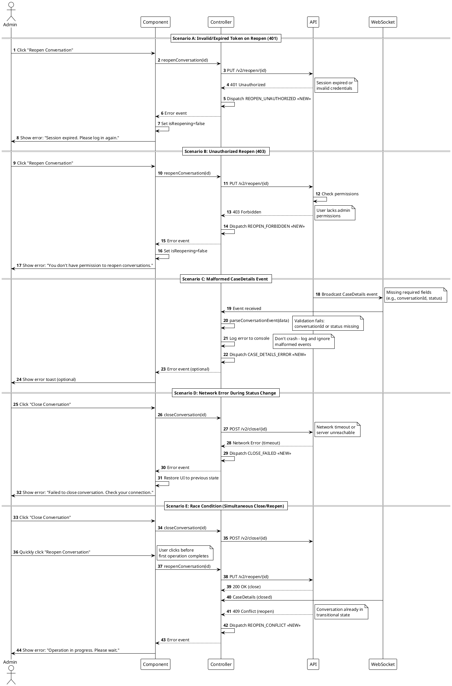

### Error Response Table

| Scenario | Status Code | Event Dispatched | User Message |
|----------|-------------|------------------|--------------|
| **Invalid Token (Reopen)** | 401 | REOPEN_UNAUTHORIZED | "Session expired. Please log in again." |
| **Forbidden (Reopen)** | 403 | REOPEN_FORBIDDEN | "You don't have permission to reopen conversations." |
| **Invalid Token (Close)** | 401 | CLOSE_UNAUTHORIZED | "Session expired. Please log in again." |
| **Forbidden (Close)** | 403 | CLOSE_FORBIDDEN | "You don't have permission to close conversations." |
| **Conversation Not Found** | 404 | CLOSE_NOT_FOUND / REOPEN_NOT_FOUND | "Conversation not found." |
| **Race Condition** | 409 | CLOSE_CONFLICT / REOPEN_CONFLICT | "Operation in progress. Please wait." |
| **Server Error** | 500 | CLOSE_ERROR / REOPEN_ERROR | "An error occurred. Please try again." |
| **Network Timeout** | N/A | CLOSE_FAILED / REOPEN_FAILED | "Failed to complete operation. Check your connection." |
| **Malformed CaseDetails** | N/A | CASE_DETAILS_ERROR | (Optional toast, or silent log) |

---

# Level 3: Activity Diagrams

Activity diagrams zoom into specific processes from the sequence diagrams, showing decision points and detailed workflow steps.

---

## Activity 1: CaseDetails Event Processing Flow (NEW)

This diagram details the processing of the NEW CaseDetails WebSocket event. This event is broadcast when conversations are closed or reopened.

**Referenced from:** Flow 2 (AFTER - Close), Flow 4 (Reopen)

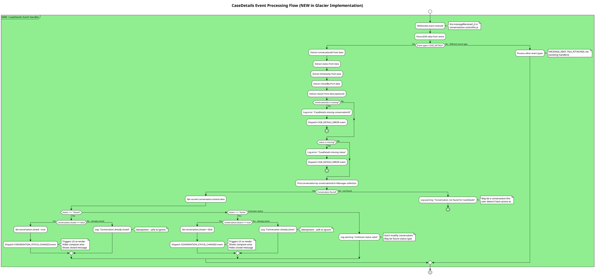

### CaseDetails Event Structure

```json
{
  "type": "push.consumer.CaseDetails",
  "conversationId": "conv-uuid-123",
  "status": "Closed",  // or "Active"
  "timestamp": 1609459200000,
  "closedBy": {
    "id": "user-uuid-456",
    "userType": "ENTERPRISE"
  },
  "reason": "Resolved - Customer satisfied"  // Optional
}
```

### Implementation Notes

- **Idempotent:** Setting `closed=true` when already `true` is safe (no-op)
- **Validation:** Missing required fields (conversationId, status) should log error and stop
- **Unknown Status:** Don't error on unknown status values (forward compatibility)
- **Not Found:** Conversation may not be in local collection (not an error, just log)
- **Event Dispatch:** Always dispatch CONVERSATION_STATUS_CHANGED when status changes

---

## Activity 2: Compose Area Visibility Logic (BEFORE vs AFTER)

This shows how the compose area visibility is determined, comparing current simple logic to Glacier closed-state logic.

**Referenced from:** Flow 2 (Close), Flow 3 (URL Access)

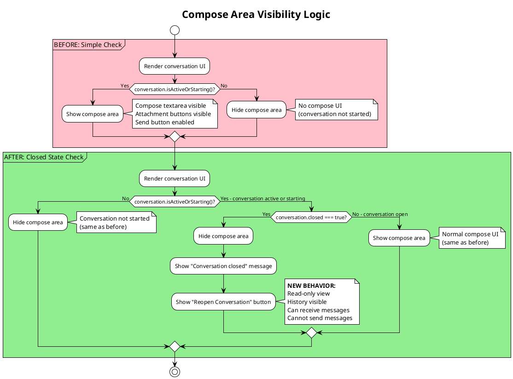

### Comparison Table

| Condition | BEFORE Behavior | AFTER Behavior |
|-----------|-----------------|----------------|
| `isActiveOrStarting() === false` | Hide compose | Hide compose (no change) |
| `isActiveOrStarting() === true` && `closed === false` | Show compose | Show compose (no change) |
| `isActiveOrStarting() === true` && `closed === true` | Show compose ❌ (wrong!) | Hide compose, show reopen ✅ |

### Implementation Approach

**Current Code Pattern:**
```javascript
// In bannoweb-conversations-chat-card.js
get shouldShowCompose() {
  return this.conversation?.isActiveOrStarting();
}
```

**New Code Pattern:**
```javascript
// In bannoweb-conversations-chat-card.js
get shouldShowCompose() {
  return this.conversation?.isActiveOrStarting() && !this.conversation?.closed;
}

get isClosed() {
  return this.conversation?.closed === true;
}
```

---

## Activity 3: Archive vs Close Decision Tree

This clarifies the distinction between Archive (client-side hide) and Close (server-side status change). Both operations can coexist.

**Referenced from:** Flow 2 (comparison)

```plantuml
@startuml
!theme plain
title Archive vs Close Decision Tree

start

:User wants to hide conversation;

if (Should conversation be completely removed from inbox?) then (Yes)
    partition "Branch A: ARCHIVE" {
        :User clicks "Archive";
        note right: **CLIENT-SIDE HIDE**

        :POST /v2/archive/{id};
        note right: May also set server flag

        :Remove conversation from Messages collection;
        note right: Client-side only

        :conversation.closed remains unchanged;
        note right: No status change

        :No WebSocket event broadcast;

        :Conversation removed from UI;

        note left
            **ARCHIVE CHARACTERISTICS:**
            - User preference (hide from inbox)
            - Client-side collection removal
            - No status property change
            - No WebSocket event
            - Other participants unaffected
            - Can still receive messages (in background)
            - Server may track "archived" flag separately
        end note
    }

else (No - just change status)
    partition "Branch B: CLOSE" {
        :User clicks "Close Conversation";
        note right: **SERVER-SIDE STATUS CHANGE**

        :POST /v2/close/{id};
        note right: NEW endpoint

        :API sets status="Closed" in database;

        :API broadcasts CaseDetails event;
        note right: WebSocket to all participants

        :conversation.closed = true;
        note right: Status property updated

        :Conversation stays in Messages collection;

        :UI renders closed state;
        note right: Compose hidden\nReopen button shown

        note right
            **CLOSE CHARACTERISTICS:**
            - Status change (semantic meaning)
            - Server-side state tracking
            - Status property updated
            - WebSocket event broadcast
            - All participants notified
            - Stays in collection (visible)
            - Can be reopened by admin
        end note
    }
endif

:Operation complete;

note bottom
    **KEY DISTINCTION:**
    - ARCHIVE = "Hide from my inbox" (client preference)
    - CLOSE = "Conversation is resolved" (semantic status)

    **BOTH CAN COEXIST:**
    - User can close AND archive a conversation
    - Archive affects only local view
    - Close affects server status (all participants)
end note

stop

@enduml
```

### Archive vs Close Matrix

| Aspect | Archive | Close |
|--------|---------|-------|
| **Scope** | Client-side hide | Server-side status |
| **Collection** | Removed locally | Stays in collection |
| **Status Property** | No change | `closed=true` |
| **WebSocket Event** | None | CaseDetails event |
| **Other Participants** | Unaffected | Notified |
| **URL Access** | Breaks | Works |
| **Semantic Meaning** | "Hide from inbox" | "Resolved/Complete" |
| **Reversible** | Unarchive | Reopen |
| **Can Receive Messages** | Yes (background) | Yes (visible) |
| **Can Send Messages** | Yes | No (must reopen) |

---

## Activity 4: Token Redemption vs Status Change Pattern Comparison

This compares the Magic Link JWT redemption pattern with the new CaseDetails event pattern, showing consistency in the codebase's event-driven architecture.

**Referenced from:** General architecture understanding

```plantuml
@startuml
!theme plain
title Pattern Comparison: Token Redemption vs Status Change

|Magic Link Pattern|
start
:User clicks magic link;
:Browser navigates to /org-user-invite/:token;
:Component extracts token from URL;
:Component calls controller.redeemMagicLinkToken();
:Controller decodes JWT client-side;
note right: Extract userId from token
:Controller calls API with userId in path;
:API validates token;
:API sets session cookie;
:API returns response;
:Controller dispatches REDEEM_SUCCESS event;
:Component listens for event;
:Component updates UI;
stop

|CaseDetails Pattern|
start
:Admin clicks "Close Conversation";
:Component calls controller.closeConversation();
:Controller calls API POST /v2/close/{id};
:API updates status in database;
:API broadcasts CaseDetails WebSocket event;
note right: status="Closed", conversationId
:Controller receives event via WebSocket;
:Controller parses CaseDetails event;
:Controller finds conversation by ID;
:Controller updates conversation.closed property;
:Controller dispatches CONVERSATION_STATUS_CHANGED;
:Component listens for event;
:Component updates UI;
stop

|Common Pattern|
:User initiates action;
:Component calls controller method;
:Controller calls API;
:API processes request;
:API signals result;
note right: JWT response OR\nWebSocket event
:Controller processes signal;
:Controller extracts relevant data;
note right: userId from JWT OR\nstatus from CaseDetails
:Controller updates model;
:Controller dispatches event;
:Component listens and re-renders;
stop

note right of "Common Pattern"
    **CONSISTENT ARCHITECTURE:**
    Both patterns follow the same structure:
    1. User action → Component
    2. Component → Controller method
    3. Controller → API call
    4. API → Response/Event
    5. Controller → Parse data
    6. Controller → Update model
    7. Controller → Dispatch event
    8. Component → Listen & render

    This consistency makes the codebase
    easier to understand and maintain.
end note

@enduml
```

### Pattern Comparison Table

| Aspect | Magic Link (JWT) | CaseDetails (Status) |
|--------|------------------|----------------------|
| **Trigger** | User clicks link | Admin clicks close/reopen |
| **Client Decode** | JWT payload (userId) | N/A (no decoding needed) |
| **API Call** | PUT `/v1/institutions/{id}/users/{userId}/redeem` | POST `/v2/close/{id}` or PUT `/v2/reopen/{id}` |
| **Response Method** | HTTP response body | WebSocket event broadcast |
| **Data Extracted** | userId, orgId, orgName | conversationId, status, timestamp |
| **Model Updated** | User session | Conversation.closed |
| **Event Dispatched** | REDEEM_SUCCESS | CONVERSATION_STATUS_CHANGED |
| **UI Update** | Show credential form | Hide/show compose, show/hide reopen button |

### Key Insight

Both patterns demonstrate the **Controller-as-Event-Dispatcher** pattern used throughout the codebase:
- Controller methods handle API calls
- Controller parses responses/events
- Controller updates models
- Controller dispatches semantic events
- Components listen to events and re-render

This consistency means implementing CaseDetails follows existing patterns, reducing implementation risk.

---

# Level 4: Class Diagrams

Class diagrams show the static structure of the system - the classes, their attributes, methods, and relationships.

---

## Class 1: Conversation Model (BEFORE vs AFTER)

This shows the Conversation model structure. **IMPORTANT DISCOVERY:** The `closed` property already exists in the current code!

**Referenced from:** All sequence diagrams using Conversation model

### CURRENT STATE (Partially Implemented)

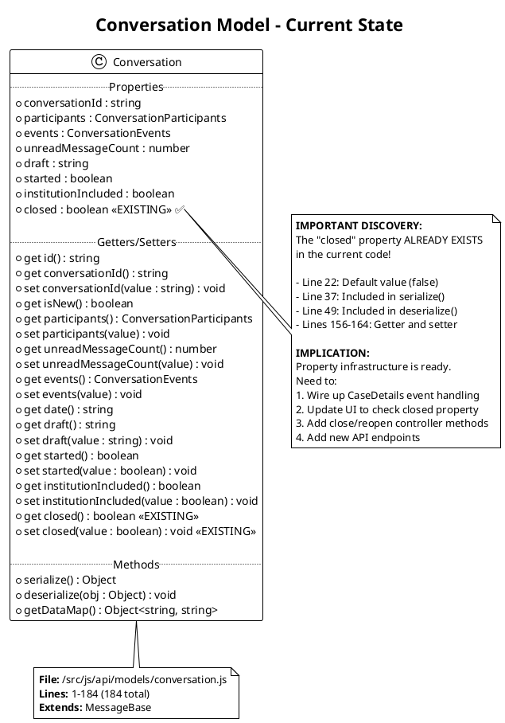

### CHANGES NEEDED (Implementation Plan)

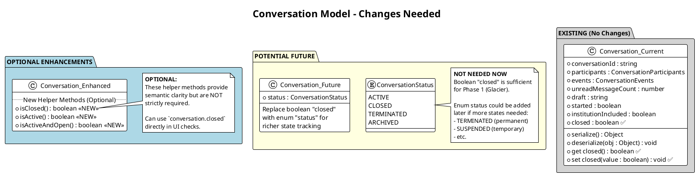

### Summary of Changes Needed

| Component | Current State | Changes Needed |
|-----------|---------------|----------------|
| **Property: closed** | ✅ Exists (lines 22, 37, 49, 156-164) | ✅ None - Already implemented |
| **serialize()** | ✅ Includes 'closed' (line 37) | ✅ None - Already implemented |
| **deserialize()** | ✅ Includes 'closed' (line 49) | ✅ None - Already implemented |
| **Getter/Setter** | ✅ Exists (lines 156-164) | ✅ None - Already implemented |
| **Helper Methods** | ❌ None | ⚠️ Optional: Add `isClosed()`, `isActive()` for clarity |
| **Status Enum** | ❌ None | ⚠️ Future: Not needed for Phase 1 |

**Key Finding:** The Conversation model is already prepared for closed state tracking! No model changes required for Phase 1.

---

## Class 2: ConversationsUtil (BEFORE vs AFTER)

This shows the ConversationsUtil class that handles event parsing and templates. Need to add CaseDetails event type and parser.

**Referenced from:** Flow 1 (message templates), Flow 2 (event parsing)

### BEFORE (Current State)

```plantuml
@startuml
!theme plain
title ConversationsUtil - Current State

class ConversationsUtil <<utility>> {
    .. Static Methods ..
    +{static} createUUID() : string
    +{static} keysTypedTemplate(userId, conversationId) : string
    +{static} messageTemplate(userId, conversationId, messageId, timestamp, text) : string
    +{static} messageTemplateV2(text) : string
    +{static} readMarkerTemplate(userId, conversationId, messageId, timestamp) : string
    +{static} nounTemplate(nounModel) : string
    +{static} createNounFromModel(...) : ConversationNoun
    +{static} parseConversationEvent(conversationEvent) : ConversationEvent
    +{static} get whitelistedFileTypes() : Array<string>
    +{static} isImage(file) : boolean
    +{static} calculateAccountNounDescription(...) : string
    +{static} getAvatarUrl(userId) : string
}

enum REQUEST_TYPES {
    SEND_MESSAGE: 'request.consumer.SendMessage'
    SEND_NOUN: 'request.consumer.SendNoun'
    MARK_READ: 'request.consumer.MarkRead'
    KEYS_TYPED: 'request.consumer.KeysTyped'
    START_GROUP_SUPPORT_CONVERSATION
    START_SUPPORT_CONVERSATION
    START_PRIVATE_CONVERSATION
}

enum PUSH_TYPES {
    ERROR: 'push.consumer.Error'
    MESSAGE_SENT: 'push.consumer.MessageSent'
    FILE_ATTACHED: 'push.consumer.FileAttached'
    ELEMENT_DELETED: 'push.consumer.ElementDeleted'
    NOUN_SENT: 'push.consumer.NounSent'
    CHOOSE_NOUN_SENT: 'push.consumer.ChooseNounSent'
    AUTHENTICATED_FORM_SENT
    AUTHENTICATED_FORM_SUBMITTED
    KEYS_TYPED: 'push.consumer.KeysTyped'
    USER_JOINED: 'push.consumer.UserJoined'
    ELEMENTS_READ: 'push.consumer.ElementsRead'
    AUTO_REPLIED: 'push.consumer.AutoReplied'
    PRIVATE_RESERVED
    PRIVATE_STARTED
    SUPPORT_RESERVED
    SUPPORT_STARTED
    GROUP_RESERVED
    GROUP_STARTED
    VIDEO_PREPARED
    VIDEO_CREATED
    VIDEO_USER_JOINED
    VIDEO_USER_LEFT
    VIDEO_ENDED
}

ConversationsUtil ..> REQUEST_TYPES : uses
ConversationsUtil ..> PUSH_TYPES : uses

note right of PUSH_TYPES
    **CURRENT:** 19+ event types
    **MISSING:** CASE_DETAILS

    File: /src/js/util/conversations.js
    Lines: 36-60 (enum definition)
end note

note bottom of ConversationsUtil::parseConversationEvent
    **parseConversationEvent():**
    Lines 222-292

    Switch statement handles all
    PUSH_TYPES enum values.

    Returns appropriate model instance
    based on event type.
end note

@enduml
```

### AFTER (Changes Needed)

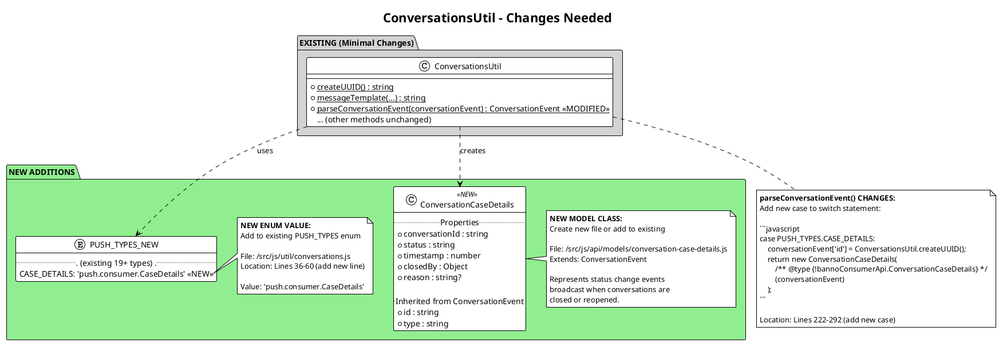

### Summary of Changes

| Component | Current State | Changes Needed |
|-----------|---------------|----------------|
| **PUSH_TYPES Enum** | 19+ event types | ✨ Add `CASE_DETAILS: 'push.consumer.CaseDetails'` |
| **parseConversationEvent()** | Switch with 19+ cases | ✨ Add case for CASE_DETAILS |
| **ConversationCaseDetails Model** | ❌ Doesn't exist | ✨ Create new class extending ConversationEvent |
| **Other Methods** | ✅ All existing | ✅ No changes needed |

---

## Class 3: ConversationsController (BEFORE vs AFTER)

This shows the ConversationsController that manages API calls and WebSocket event handling.

**Referenced from:** All sequence diagrams

### BEFORE (Current State)

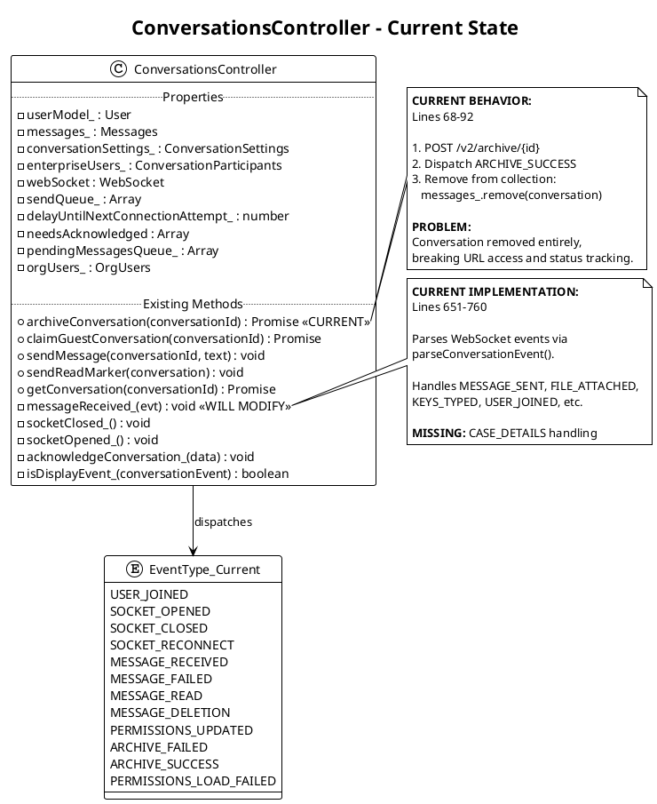

### AFTER (Changes Needed)

```plantuml
@startuml
!theme plain
title ConversationsController - Changes Needed

package "EXISTING (Modified)" #LightYellow {
    class ConversationsController_Modified {
        .. Existing Methods ..
        +archiveConversation(conversationId) : Promise <<KEEP>>
        -messageReceived_(evt) : void <<MODIFY>>
    }

    note right of ConversationsController_Modified::archiveConversation
        **KEEP EXISTING:**
        Archive functionality still needed
        for client-side hide.

        **MODIFY LINE 85:**
        Change from:
        `messages_.remove(conversation);`

        To:
        `conversation.closed = true;`

        This makes archive set closed flag
        instead of removing entirely.
    end note

    note right of ConversationsController_Modified::messageReceived_
        **ADD CASE_DETAILS HANDLING:**
        In parseConversationEvent result,
        add check for CaseDetails:

        ```javascript
        if (conversationEvent instanceof
            ConversationCaseDetails) {
          this.handleCaseDetailsEvent_(conversationEvent);
        }
        ```

        Location: After line 760
    end note
}

package "NEW METHODS" #LightGreen {
    class ConversationsController_New {
        +closeConversation(conversationId) : Promise <<NEW>>
        +reopenConversation(conversationId) : Promise <<NEW>>
        -handleCaseDetailsEvent_(event) : void <<NEW>>
    }

    note right of ConversationsController_New::closeConversation
        **NEW METHOD:**

        ```javascript
        closeConversation(conversationId) {
          return new Promise((resolve, reject) => {
            this.createXhr_()
              .post(`/a/conversations/api/consumer/v2/close/${conversationId}`)
              .then(() => {
                this.dispatchEvent(
                  new ControllerEvent(EventType.CLOSE_SUCCESS)
                );
                resolve();
              })
              .catch((e) => {
                this.dispatchEvent(
                  new ControllerEvent(EventType.CLOSE_FAILED)
                );
                reject(e);
              });
          });
        }
        ```
    end note

    note right of ConversationsController_New::reopenConversation
        **NEW METHOD:**

        ```javascript
        reopenConversation(conversationId) {
          return new Promise((resolve, reject) => {
            this.createXhr_()
              .put(`/a/conversations/api/consumer/v2/reopen/${conversationId}`)
              .then(() => {
                this.dispatchEvent(
                  new ControllerEvent(EventType.REOPEN_SUCCESS)
                );
                resolve();
              })
              .catch((e) => {
                this.dispatchEvent(
                  new ControllerEvent(EventType.REOPEN_FAILED)
                );
                reject(e);
              });
          });
        }
        ```
    end note

    note right of ConversationsController_New::handleCaseDetailsEvent_
        **NEW PRIVATE METHOD:**

        ```javascript
        handleCaseDetailsEvent_(event) {
          const conversation = this.findConversation_(
            event.conversationId
          );

          if (!conversation) {
            console.warn('Conversation not found for CaseDetails');
            return;
          }

          const newClosedState = (event.status === 'Closed');

          if (conversation.closed !== newClosedState) {
            conversation.closed = newClosedState;
            this.dispatchEvent(
              new ControllerEvent(
                EventType.CONVERSATION_STATUS_CHANGED,
                undefined,
                undefined,
                event
              )
            );
          }
        }
        ```
    end note
}

package "NEW EVENT TYPES" #LightGreen {
    enum EventType_New {
        ... (existing 12 types) ...
        CLOSE_SUCCESS <<NEW>>
        CLOSE_FAILED <<NEW>>
        CLOSE_UNAUTHORIZED <<NEW>>
        CLOSE_FORBIDDEN <<NEW>>
        REOPEN_SUCCESS <<NEW>>
        REOPEN_FAILED <<NEW>>
        REOPEN_UNAUTHORIZED <<NEW>>
        REOPEN_FORBIDDEN <<NEW>>
        REOPEN_CONFLICT <<NEW>>
        CONVERSATION_STATUS_CHANGED <<NEW>>
        CASE_DETAILS_ERROR <<NEW>>
    }

    note right of EventType_New
        **ADD TO EXISTING ENUM:**
        File: conversations-controller.js
        Location: Lines 1129-1142

        Add these 11 new event types
        to existing EventType enum.
    end note
}

ConversationsController_Modified --|> ConversationsController_New : implements
ConversationsController_New --> EventType_New : dispatches

@enduml
```

### Summary of Changes

| Component | Current State | Changes Needed |
|-----------|---------------|----------------|
| **archiveConversation()** | Removes from collection | ⚠️ Modify line 85: Set `closed=true` instead of `remove()` |
| **closeConversation()** | ❌ Doesn't exist | ✨ Add new method: POST `/v2/close/{id}` |
| **reopenConversation()** | ❌ Doesn't exist | ✨ Add new method: PUT `/v2/reopen/{id}` |
| **handleCaseDetailsEvent_()** | ❌ Doesn't exist | ✨ Add new private method to process CaseDetails |
| **messageReceived_()** | Handles 19+ event types | ⚠️ Add CaseDetails case (after line 760) |
| **EventType Enum** | 12 event types | ✨ Add 11 new event types (lines 1129-1142) |

---

## Class 4: ChatCard Component (BEFORE vs AFTER)

This shows the UI component that renders conversation messages and compose area.

**Referenced from:** Flow 2 (close UI), Flow 3 (URL access UI), Flow 4 (reopen UI)

### BEFORE (Current State)

```plantuml
@startuml
!theme plain
title ChatCard Component - Current State

class ChatCardComponent {
    .. Properties ..
    +conversation : Conversation
    +messages : Messages
    +user : User
    +conversationSettings : ConversationSettings

    .. Computed Properties ..
    +isActiveOrStarting() : boolean <<CURRENT>>

    .. Methods ..
    +render() : TemplateResult
    +handleSendMessage(e) : void
    +handleAttachFile(e) : void
    +handleArchiveConversation(e) : void <<CURRENT>>
    -setupEventListeners() : void
}

note right of ChatCardComponent::isActiveOrStarting
    **CURRENT LOGIC:**
    Controls compose area visibility

    ```javascript
    get isActiveOrStarting() {
      return this.conversation?.started === true
        || this.conversation?.started === false;
    }
    ```

    **PROBLEM:**
    Doesn't check closed state,
    so compose shows for closed conversations.
end note

note right of ChatCardComponent::render
    **CURRENT TEMPLATE:**

    ```html
    ${this.isActiveOrStarting() ? html`
      <div class="compose-area">
        <textarea></textarea>
        <button @click="${this.handleSendMessage}">
          Send
        </button>
      </div>
    ` : ''}
    ```

    **MISSING:**
    - Closed state check
    - Closed message display
    - Reopen button
end note

@enduml
```

### AFTER (Changes Needed)

```plantuml
@startuml
!theme plain
title ChatCard Component - Changes Needed

package "EXISTING (Modified)" #LightYellow {
    class ChatCardComponent_Modified {
        .. Properties ..
        +conversation : Conversation
        +isReopening : boolean <<NEW>>

        .. Computed Properties ..
        +isActiveOrStarting() : boolean <<KEEP>>
        +isClosed() : boolean <<NEW>>
        +shouldShowCompose() : boolean <<NEW>>

        .. Methods ..
        +render() : TemplateResult <<MODIFY>>
        +handleArchiveConversation(e) : void <<KEEP>>
    }

    note right of ChatCardComponent_Modified::isClosed
        **NEW GETTER:**

        ```javascript
        get isClosed() {
          return this.conversation?.closed === true;
        }
        ```

        Simple property check on
        existing conversation.closed.
    end note

    note right of ChatCardComponent_Modified::shouldShowCompose
        **NEW GETTER:**

        ```javascript
        get shouldShowCompose() {
          return this.isActiveOrStarting()
            && !this.isClosed();
        }
        ```

        Combines existing check with
        new closed state check.
    end note

    note right of ChatCardComponent_Modified::render
        **MODIFY TEMPLATE:**

        ```html
        ${this.shouldShowCompose() ? html`
          <!-- Existing compose area -->
          <div class="compose-area">...</div>
        ` : ''}

        ${this.isClosed() ? html`
          <!-- NEW: Closed state UI -->
          <jha-well class="closed-message">
            <p>This conversation has been closed.</p>
            <jha-button
              @click="${this.handleReopenConversation}"
              ?disabled="${this.isReopening}">
              ${this.isReopening ? 'Reopening...' : 'Reopen Conversation'}
            </jha-button>
          </jha-well>
        ` : ''}
        ```
    end note
}

package "NEW METHODS" #LightGreen {
    class ChatCardComponent_New {
        +handleReopenConversation(e) : void <<NEW>>
        +onConversationStatusChanged_(e) : void <<NEW>>
    }

    note right of ChatCardComponent_New::handleReopenConversation
        **NEW METHOD:**

        ```javascript
        async handleReopenConversation(e) {
          e.preventDefault();
          this.isReopening = true;

          try {
            await conversationsController
              .reopenConversation(this.conversation.conversationId);
            // Status change will come via WebSocket event
          } catch (error) {
            console.error('Failed to reopen conversation', error);
            // Show error toast
          } finally {
            this.isReopening = false;
          }
        }
        ```
    end note

    note right of ChatCardComponent_New::onConversationStatusChanged_
        **NEW EVENT LISTENER:**

        ```javascript
        onConversationStatusChanged_(e) {
          // Event dispatched by controller when
          // CaseDetails event updates conversation.closed

          if (e.detail.conversationId ===
              this.conversation.conversationId) {
            // Re-render will pick up new closed state
            this.requestUpdate();
          }
        }
        ```

        Setup in connectedCallback():
        ```javascript
        conversationsController.addEventListener(
          'conversation-status-changed',
          this.onConversationStatusChanged_
        );
        ```
    end note
}

ChatCardComponent_Modified --|> ChatCardComponent_New : implements

@enduml
```

### Summary of Changes

| Component | Current State | Changes Needed |
|-----------|---------------|----------------|
| **Property: isReopening** | ❌ Doesn't exist | ✨ Add boolean property for loading state |
| **Getter: isClosed()** | ❌ Doesn't exist | ✨ Add getter checking `conversation.closed` |
| **Getter: shouldShowCompose()** | Uses `isActiveOrStarting()` | ✨ Add getter combining existing + closed check |
| **Method: handleReopenConversation()** | ❌ Doesn't exist | ✨ Add method calling controller.reopenConversation() |
| **Listener: onConversationStatusChanged_()** | ❌ Doesn't exist | ✨ Add listener for CONVERSATION_STATUS_CHANGED event |
| **Template: compose area** | Shows when active | ⚠️ Modify condition to use `shouldShowCompose()` |
| **Template: closed message** | ❌ Doesn't exist | ✨ Add conditional template for closed state |

---

## Class 5: Controllers Overview with Relationships

This diagram shows how ConversationsController fits into the broader controller ecosystem.

```plantuml
@startuml
!theme plain
title Controllers Overview with Relationships

abstract class Controller {
    #createXhr_() : XhrPromise
    +dispatchEvent(event : ControllerEvent) : void
    +addEventListener(type : string, listener : Function) : void
    +removeEventListener(type : string, listener : Function) : void
}

class ConversationsController {
    -userModel_ : User
    -messages_ : Messages
    -webSocket : WebSocket

    +sendMessage(conversationId, text) : void
    +closeConversation(conversationId) : Promise <<NEW>>
    +reopenConversation(conversationId) : Promise <<NEW>>
    +archiveConversation(conversationId) : Promise
    -messageReceived_(evt) : void
    -handleCaseDetailsEvent_(event) : void <<NEW>>
}

class ConversationsUtil <<utility>> {
    +{static} parseConversationEvent(data) : ConversationEvent
    +{static} messageTemplate(...) : string
}

class Messages <<collection>> {
    +items : Array<Conversation>
    +add(conversation) : void
    +remove(conversation) : void
    +get(id) : Conversation
}

class Conversation <<model>> {
    +conversationId : string
    +events : ConversationEvents
    +closed : boolean
    +participants : ConversationParticipants
}

class ConversationCaseDetails <<model>> <<NEW>> {
    +conversationId : string
    +status : string
    +timestamp : number
    +closedBy : Object
}

class ControllerEvent {
    +type : string
    +status : number
    +message : string
    +response : Object
}

Controller <|-- ConversationsController

ConversationsController --> ConversationsUtil : uses
ConversationsController --> Messages : manages
ConversationsController ..> ControllerEvent : dispatches
Messages o-- Conversation : contains
ConversationsController ..> ConversationCaseDetails : handles <<NEW>>
ConversationsUtil ..> ConversationCaseDetails : creates <<NEW>>

note right of ConversationsController
    **Primary Responsibilities:**
    - WebSocket connection management
    - Message sending/receiving
    - Event parsing and dispatching
    - Conversation lifecycle (NEW: close/reopen)
    - Collection management (Messages)
end note

note bottom of ConversationCaseDetails
    **NEW MODEL:**
    Represents status change events
    broadcast when conversations are
    closed or reopened via CaseDetails
    WebSocket event.
end note

note left of Messages
    **Collection Management:**
    - Conversations stay in collection
      when closed (not removed)
    - Sorted by latest message timestamp
    - Supports findById() lookup
end note

@enduml
```

---

# Reference

---

## API Endpoints Summary

### Current Endpoints (No Changes)

| Endpoint | Method | Purpose | Status |
|----------|--------|---------|--------|
| `/a/conversations/api/consumer/v2/conversations` | GET | List all conversations | Existing |
| `/a/conversations/api/consumer/v2/conversations/{id}` | GET | Get single conversation | Existing |
| `/a/conversations/api/consumer/v2/archive/{id}` | POST | Archive conversation (client hide) | **Modified** ⚠️ |

### NEW Endpoints (Glacier)

| Endpoint | Method | Purpose | Status |
|----------|--------|---------|--------|
| `/a/conversations/api/consumer/v2/close/{id}` | POST | Close conversation (set status="Closed") | **NEW** ✨ |
| `/a/conversations/api/consumer/v2/reopen/{id}` | PUT | Reopen conversation (set status="Active") | **NEW** ✨ |

### Error Responses

| Status Code | Scenario | Response Body Example |
|-------------|----------|----------------------|
| **200** | Success | `{ "success": true }` |
| **401** | Unauthorized - Session expired | `{ "error": "Unauthorized", "message": "Session expired" }` |
| **403** | Forbidden - Insufficient permissions | `{ "error": "Forbidden", "message": "Admin access required" }` |
| **404** | Not Found - Conversation doesn't exist | `{ "error": "NotFound", "message": "Conversation not found" }` |
| **409** | Conflict - Race condition | `{ "error": "Conflict", "message": "Operation already in progress" }` |
| **500** | Internal Server Error | `{ "error": "InternalServerError", "message": "An error occurred" }` |

---

## WebSocket Event Types Reference

### Current Events (19+ Types)

```javascript
export const PUSH_TYPES = {
  ERROR: 'push.consumer.Error',
  MESSAGE_SENT: 'push.consumer.MessageSent',
  FILE_ATTACHED: 'push.consumer.FileAttached',
  ELEMENT_DELETED: 'push.consumer.ElementDeleted',
  NOUN_SENT: 'push.consumer.NounSent',
  CHOOSE_NOUN_SENT: 'push.consumer.ChooseNounSent',
  AUTHENTICATED_FORM_SENT: 'push.consumer.AuthenticatedFormSent',
  AUTHENTICATED_FORM_SUBMITTED: 'push.consumer.AuthenticatedFormSubmitted',
  KEYS_TYPED: 'push.consumer.KeysTyped',
  USER_JOINED: 'push.consumer.UserJoined',
  ELEMENTS_READ: 'push.consumer.ElementsRead',
  AUTO_REPLIED: 'push.consumer.AutoReplied',
  PRIVATE_RESERVED: 'push.consumer.PrivateConversationReserved',
  PRIVATE_STARTED: 'push.consumer.PrivateConversationStarted',
  SUPPORT_RESERVED: 'push.consumer.IndividualSupportConversationReserved',
  SUPPORT_STARTED: 'push.consumer.IndividualSupportConversationStarted',
  GROUP_RESERVED: 'push.consumer.GroupSupportConversationReserved',
  GROUP_STARTED: 'push.consumer.GroupSupportConversationStarted',
  VIDEO_PREPARED: 'push.consumer.VideoPreparedByAgent',
  VIDEO_CREATED: 'push.consumer.VideoRoomCreated',
  VIDEO_USER_JOINED: 'push.consumer.VideoParticipantConnected',
  VIDEO_USER_LEFT: 'push.consumer.VideoParticipantDisconnected',
  VIDEO_ENDED: 'push.consumer.VideoRoomEnded',
};
```

**File:** `/src/js/util/conversations.js` (Lines 36-60)

### NEW Event Type (Glacier)

```javascript
export const PUSH_TYPES = {
  // ... existing types ...
  CASE_DETAILS: 'push.consumer.CaseDetails',  // ✨ NEW
};
```

### CaseDetails Event Structure

```json
{
  "type": "push.consumer.CaseDetails",
  "conversationId": "550e8400-e29b-41d4-a716-446655440000",
  "status": "Closed",
  "timestamp": 1609459200000,
  "closedBy": {
    "id": "admin-user-uuid",
    "userType": "ENTERPRISE"
  },
  "reason": "Customer issue resolved"
}
```

#### Field Descriptions

| Field | Type | Required | Description |
|-------|------|----------|-------------|
| `type` | string | ✅ Yes | Always "push.consumer.CaseDetails" |
| `conversationId` | string (UUID) | ✅ Yes | ID of conversation whose status changed |
| `status` | string | ✅ Yes | New status: "Closed" or "Active" |
| `timestamp` | number | ✅ Yes | Unix timestamp (milliseconds) of status change |
| `closedBy` | object | ⚠️ Conditional | User who initiated change (required for "Closed") |
| `closedBy.id` | string (UUID) | ⚠️ Conditional | User ID |
| `closedBy.userType` | string | ⚠️ Conditional | "ENTERPRISE" or "CONSUMER" |
| `reason` | string | ❌ Optional | Human-readable reason for closure |

---

## Key Files Reference

Comprehensive table of files involved in the Glacier closed conversation feature.

| File Path | Description | Changes Needed | Priority |
|-----------|-------------|----------------|----------|
| **Data Model Files** | | | |
| `/src/js/api/models/conversation.js` | Conversation model with properties and methods | ✅ None - `closed` property exists! | High |
| `/src/js/api/models/conversation-case-details.js` | **NEW FILE** - CaseDetails event model | ✨ Create new class extending ConversationEvent | High |
| **Event Parsing** | | | |
| `/src/js/util/conversations.js` | Event parsing and templates utility | ⚠️ Add CASE_DETAILS enum value<br>✨ Add parseCaseDetailsEvent() case | High |
| **Controller** | | | |
| `/src/js/api/controllers/conversations-controller.js` | API calls, WebSocket handling, event dispatching | ✨ Add closeConversation()<br>✨ Add reopenConversation()<br>✨ Add handleCaseDetailsEvent_()<br>⚠️ Modify messageReceived_()<br>⚠️ Modify archiveConversation()<br>✨ Add 11 new EventType values | High |
| **UI Components** | | | |
| `/src/components/bannoweb/conversations/bannoweb-conversations-chat-card.js` | Main chat view with message history and compose | ✨ Add isClosed() getter<br>✨ Add shouldShowCompose() getter<br>✨ Add isReopening property<br>⚠️ Modify render template<br>✨ Add handleReopenConversation()<br>✨ Add onConversationStatusChanged_() | High |
| `/src/components/bannoweb/conversations/bannoweb-message-list.js` | Conversation list/inbox view | ⚠️ Add visual indicator for closed status (optional badge/icon) | Medium |
| `/src/components/bannoweb/conversations/bannoweb-conversations-chat-card-header.js` | Chat header with actions | ⚠️ Update "Archive" to "Close" or add separate "Close" button | Medium |
| **Testing Files (NEW)** | | | |
| `/test/unit/models/conversation-test.js` | Unit tests for Conversation model | ✨ Add tests for closed property | Low |
| `/test/unit/controllers/conversations-controller-test.js` | Unit tests for controller | ✨ Add tests for close/reopen methods<br>✨ Add tests for CaseDetails handling | Low |
| `/test/integration/conversations-closed-test.js` | **NEW FILE** - Integration tests | ✨ Create end-to-end tests for close/reopen flows | Low |

---

## Controller Event Types Reference

### Current EventType Enum

```javascript
ConversationsController.EventType = {
  USER_JOINED: 'user-joined',
  SOCKET_OPENED: 'socket-opened',
  SOCKET_CLOSED: 'socket-closed',
  SOCKET_RECONNECT: 'socket-reconnect',
  MESSAGE_RECEIVED: 'message-received',
  MESSAGE_FAILED: 'message-failed',
  MESSAGE_READ: 'message-read',
  MESSAGE_DELETION: 'messege-deletion',  // Note: typo in original code
  PERMISSIONS_UPDATED: 'permissions-updated',
  ARCHIVE_FAILED: 'archive-failed',
  ARCHIVE_SUCCESS: 'archive-success',
  PERMISSIONS_LOAD_FAILED: 'permissions-load-failed',
};
```

**File:** `/src/js/api/controllers/conversations-controller.js` (Lines 1129-1142)

### NEW Event Types (Glacier)

```javascript
ConversationsController.EventType = {
  // ... existing 12 types ...

  // Close operation events
  CLOSE_SUCCESS: 'close-success',              // ✨ NEW
  CLOSE_FAILED: 'close-failed',                // ✨ NEW
  CLOSE_UNAUTHORIZED: 'close-unauthorized',    // ✨ NEW
  CLOSE_FORBIDDEN: 'close-forbidden',          // ✨ NEW
  CLOSE_NOT_FOUND: 'close-not-found',          // ✨ NEW
  CLOSE_CONFLICT: 'close-conflict',            // ✨ NEW

  // Reopen operation events
  REOPEN_SUCCESS: 'reopen-success',            // ✨ NEW
  REOPEN_FAILED: 'reopen-failed',              // ✨ NEW
  REOPEN_UNAUTHORIZED: 'reopen-unauthorized',  // ✨ NEW
  REOPEN_FORBIDDEN: 'reopen-forbidden',        // ✨ NEW
  REOPEN_NOT_FOUND: 'reopen-not-found',        // ✨ NEW
  REOPEN_CONFLICT: 'reopen-conflict',          // ✨ NEW

  // Status change events
  CONVERSATION_STATUS_CHANGED: 'conversation-status-changed',  // ✨ NEW
  CASE_DETAILS_ERROR: 'case-details-error',                    // ✨ NEW
};
```

### Event Usage Matrix

| Event Type | When Dispatched | Payload | Listener |
|------------|-----------------|---------|----------|
| **CLOSE_SUCCESS** | Close API call returns 200 | `{ conversationId }` | Chat Card |
| **CLOSE_FAILED** | Close API call network error | `{ conversationId, error }` | Chat Card |
| **CLOSE_UNAUTHORIZED** | Close API returns 401 | `{ conversationId }` | Chat Card |
| **CLOSE_FORBIDDEN** | Close API returns 403 | `{ conversationId }` | Chat Card |
| **REOPEN_SUCCESS** | Reopen API call returns 200 | `{ conversationId }` | Chat Card |
| **REOPEN_FAILED** | Reopen API call network error | `{ conversationId, error }` | Chat Card |
| **CONVERSATION_STATUS_CHANGED** | CaseDetails event processed | `{ conversationId, closed, event }` | Chat Card, Message List |
| **CASE_DETAILS_ERROR** | Malformed CaseDetails event | `{ error, rawData }` | (Optional logging) |

---

## State Machine: Conversation Status

This state machine shows the valid status transitions for conversations in the Glacier implementation.

```plantuml
@startuml
!theme plain

[*] --> Active : Conversation created

state Active {
    Active : conversation.closed = false
    Active : Compose area visible
    Active : Can send/receive messages
}

state Closed {
    Closed : conversation.closed = true
    Closed : Compose area hidden
    Closed : Can receive messages (read-only)
    Closed : Reopen button visible
}

state Archived {
    Archived : Client-side hide
    Archived : Removed from local collection
    Archived : No status property change
}

Active --> Closed : Admin clicks\n"Close Conversation"
note on link
    Trigger: POST /v2/close/{id}
    Event: CaseDetails (status="Closed")
    UI: Hide compose, show reopen
end note

Closed --> Active : Admin clicks\n"Reopen Conversation"
note on link
    Trigger: PUT /v2/reopen/{id}
    Event: CaseDetails (status="Active")
    UI: Show compose, hide reopen
end note

Active --> Archived : User clicks\n"Archive"
note on link
    Trigger: Client-side action
    API: POST /v2/archive/{id}
    Effect: Remove from collection
end note

Closed --> Archived : User clicks\n"Archive"
note on link
    Can archive closed conversations
    Archive + Close are independent
end note

Active --> Active : Receive message
Closed --> Closed : Receive message
note right: Receiving messages\ndoes NOT change status

note right of Archived
    **FUTURE STATE:**
    Could add "Terminated"
    for permanent closure
    (cannot reopen)
end note

@enduml
```

### State Transition Table

| From State | To State | Trigger | API Call | WebSocket Event | UI Change |
|------------|----------|---------|----------|-----------------|-----------|
| **Active** | Active | Receive message | None | MESSAGE_SENT | Add to history |
| **Active** | Closed | Close button | POST `/v2/close/{id}` | CaseDetails (Closed) | Hide compose, show reopen |
| **Active** | Archived | Archive button | POST `/v2/archive/{id}` | None | Remove from inbox |
| **Closed** | Active | Reopen button | PUT `/v2/reopen/{id}` | CaseDetails (Active) | Show compose, hide reopen |
| **Closed** | Closed | Receive message | None | MESSAGE_SENT | Add to history (read-only) |
| **Closed** | Archived | Archive button | POST `/v2/archive/{id}` | None | Remove from inbox |

### State Properties

| State | `conversation.closed` | In Collection? | Compose Visible? | Reopen Button? |
|-------|----------------------|----------------|------------------|----------------|
| **Active** | `false` | ✅ Yes | ✅ Yes | ❌ No |
| **Closed** | `true` | ✅ Yes | ❌ No | ✅ Yes |
| **Archived** | (unchanged) | ❌ No (local) | N/A | N/A |

---

## Design Patterns Applied

### 1. Observer Pattern (Event Dispatching)

**Usage:** Controller dispatches events, components listen and react.

```javascript
// Controller dispatches
this.dispatchEvent(
  new ControllerEvent(EventType.CONVERSATION_STATUS_CHANGED, ...)
);

// Component listens
conversationsController.addEventListener(
  'conversation-status-changed',
  this.onConversationStatusChanged_
);
```

**Benefits:**
- Loose coupling between controller and UI
- Multiple components can react to same event
- Easy to add new listeners without modifying controller

### 2. Model-View-Controller (MVC)

**Usage:** Clear separation of concerns.

- **Model:** `Conversation` class (data structure)
- **View:** `ChatCard` component (UI rendering)
- **Controller:** `ConversationsController` (business logic, API calls)

**Benefits:**
- Changes to data structure don't affect UI
- Changes to UI don't affect business logic
- Easy to test each layer independently

### 3. Event-Driven Architecture (WebSocket Events)

**Usage:** Real-time updates via WebSocket broadcasts.

```javascript
// Server broadcasts event
API -> WebSocket -> All clients

// Client receives and processes
WebSocket -> Controller.messageReceived_()
         -> parseConversationEvent()
         -> Update model
         -> Dispatch local event
         -> UI re-renders
```

**Benefits:**
- Real-time synchronization across users
- Decoupled from API request/response cycle
- Scalable to multiple clients

### 4. Strategy Pattern (Event Parsing)

**Usage:** Switch statement in `parseConversationEvent()` selects parsing strategy.

```javascript
switch (conversationEvent.type) {
  case PUSH_TYPES.MESSAGE_SENT:
    return new ConversationMessage(conversationEvent);
  case PUSH_TYPES.CASE_DETAILS:  // NEW
    return new ConversationCaseDetails(conversationEvent);
  // ... other cases
}
```

**Benefits:**
- Easy to add new event types
- Encapsulates parsing logic per event type
- Type-safe model instantiation

### 5. Command Pattern (Controller Methods)

**Usage:** Controller methods encapsulate operations as objects.

```javascript
// Command: closeConversation
conversationsController.closeConversation(id)
  .then(() => console.log('Closed'))
  .catch((e) => console.error('Failed', e));
```

**Benefits:**
- Encapsulates request parameters
- Supports undo/redo (reopen is "undo close")
- Enables async operation tracking

---

## Testing Scenarios Reference

### Unit Tests

#### Conversation Model Tests

```javascript
// Test: closed property getter/setter
test('should get and set closed property', () => {
  const conversation = new Conversation();
  expect(conversation.closed).toBe(false);  // Default
  conversation.closed = true;
  expect(conversation.closed).toBe(true);
});

// Test: serialize includes closed
test('should serialize closed property', () => {
  const conversation = new Conversation();
  conversation.closed = true;
  const serialized = conversation.serialize();
  expect(serialized.closed).toBe(true);
});

// Test: deserialize includes closed
test('should deserialize closed property', () => {
  const data = { conversationId: '123', closed: true };
  const conversation = new Conversation();
  conversation.deserialize(data);
  expect(conversation.closed).toBe(true);
});
```

#### ConversationsUtil Tests

```javascript
// Test: CASE_DETAILS added to PUSH_TYPES enum
test('should have CASE_DETAILS in PUSH_TYPES', () => {
  expect(PUSH_TYPES.CASE_DETAILS).toBe('push.consumer.CaseDetails');
});

// Test: parseConversationEvent handles CaseDetails
test('should parse CaseDetails event', () => {
  const eventData = {
    type: 'push.consumer.CaseDetails',
    conversationId: '123',
    status: 'Closed',
    timestamp: 1609459200000,
  };
  const event = ConversationsUtil.parseConversationEvent(eventData);
  expect(event).toBeInstanceOf(ConversationCaseDetails);
  expect(event.status).toBe('Closed');
});
```

#### ConversationsController Tests

```javascript
// Test: closeConversation calls API
test('should call POST /v2/close/{id}', async () => {
  const mockXhr = { post: jest.fn().mockResolvedValue({}) };
  controller.createXhr_ = () => mockXhr;

  await controller.closeConversation('conv-123');

  expect(mockXhr.post).toHaveBeenCalledWith(
    '/a/conversations/api/consumer/v2/close/conv-123'
  );
});

// Test: reopenConversation calls API
test('should call PUT /v2/reopen/{id}', async () => {
  const mockXhr = { put: jest.fn().mockResolvedValue({}) };
  controller.createXhr_ = () => mockXhr;

  await controller.reopenConversation('conv-123');

  expect(mockXhr.put).toHaveBeenCalledWith(
    '/a/conversations/api/consumer/v2/reopen/conv-123'
  );
});

// Test: handleCaseDetailsEvent_ updates conversation
test('should update conversation.closed on CaseDetails event', () => {
  const conversation = new Conversation();
  conversation.conversationId = 'conv-123';
  conversation.closed = false;
  messages.add(conversation);

  const event = new ConversationCaseDetails({
    conversationId: 'conv-123',
    status: 'Closed',
  });

  controller.handleCaseDetailsEvent_(event);

  expect(conversation.closed).toBe(true);
});

// Test: CONVERSATION_STATUS_CHANGED dispatched
test('should dispatch CONVERSATION_STATUS_CHANGED', () => {
  const listener = jest.fn();
  controller.addEventListener('conversation-status-changed', listener);

  const conversation = new Conversation();
  conversation.conversationId = 'conv-123';
  conversation.closed = false;
  messages.add(conversation);

  const event = new ConversationCaseDetails({
    conversationId: 'conv-123',
    status: 'Closed',
  });

  controller.handleCaseDetailsEvent_(event);

  expect(listener).toHaveBeenCalled();
});
```

#### ChatCard Component Tests

```javascript
// Test: isClosed getter
test('should return true when conversation.closed is true', () => {
  const chatCard = new ChatCard();
  chatCard.conversation = new Conversation();
  chatCard.conversation.closed = true;
  expect(chatCard.isClosed()).toBe(true);
});

// Test: shouldShowCompose getter
test('should return false when conversation is closed', () => {
  const chatCard = new ChatCard();
  chatCard.conversation = new Conversation();
  chatCard.conversation.started = true;
  chatCard.conversation.closed = true;
  expect(chatCard.shouldShowCompose()).toBe(false);
});

// Test: closed message rendered
test('should render closed message when conversation.closed is true', async () => {
  const chatCard = new ChatCard();
  chatCard.conversation = new Conversation();
  chatCard.conversation.closed = true;
  await chatCard.updateComplete;

  const closedMessage = chatCard.shadowRoot.querySelector('.closed-message');
  expect(closedMessage).toBeTruthy();
  expect(closedMessage.textContent).toContain('conversation has been closed');
});

// Test: reopen button rendered
test('should render reopen button when conversation.closed is true', async () => {
  const chatCard = new ChatCard();
  chatCard.conversation = new Conversation();
  chatCard.conversation.closed = true;
  await chatCard.updateComplete;

  const reopenButton = chatCard.shadowRoot.querySelector('jha-button');
  expect(reopenButton).toBeTruthy();
  expect(reopenButton.textContent).toContain('Reopen Conversation');
});

// Test: handleReopenConversation calls controller
test('should call controller.reopenConversation on button click', async () => {
  const mockController = {
    reopenConversation: jest.fn().mockResolvedValue({}),
  };

  const chatCard = new ChatCard();
  chatCard.conversation = new Conversation();
  chatCard.conversation.conversationId = 'conv-123';
  chatCard.conversation.closed = true;
  chatCard.conversationsController = mockController;
  await chatCard.updateComplete;

  const reopenButton = chatCard.shadowRoot.querySelector('jha-button');
  reopenButton.click();

  expect(mockController.reopenConversation).toHaveBeenCalledWith('conv-123');
});
```

### Integration Tests

#### End-to-End Close Flow

```javascript
test('should close conversation end-to-end', async () => {
  // Setup
  const conversation = createTestConversation();
  conversation.closed = false;
  messages.add(conversation);

  // User clicks close
  await chatCard.handleCloseConversation();

  // Verify API called
  expect(mockApi.post).toHaveBeenCalledWith('/v2/close/conv-123');

  // Simulate WebSocket event
  const caseDetailsEvent = {
    type: 'push.consumer.CaseDetails',
    conversationId: 'conv-123',
    status: 'Closed',
  };
  controller.messageReceived_({ data: JSON.stringify(caseDetailsEvent) });

  // Verify model updated
  expect(conversation.closed).toBe(true);

  // Verify UI updated
  await chatCard.updateComplete;
  expect(chatCard.shadowRoot.querySelector('.compose-area')).toBeFalsy();
  expect(chatCard.shadowRoot.querySelector('.closed-message')).toBeTruthy();
});
```

#### End-to-End Reopen Flow

```javascript
test('should reopen conversation end-to-end', async () => {
  // Setup
  const conversation = createTestConversation();
  conversation.closed = true;
  messages.add(conversation);

  // User clicks reopen
  await chatCard.handleReopenConversation();

  // Verify API called
  expect(mockApi.put).toHaveBeenCalledWith('/v2/reopen/conv-123');

  // Simulate WebSocket event
  const caseDetailsEvent = {
    type: 'push.consumer.CaseDetails',
    conversationId: 'conv-123',
    status: 'Active',
  };
  controller.messageReceived_({ data: JSON.stringify(caseDetailsEvent) });

  // Verify model updated
  expect(conversation.closed).toBe(false);

  // Verify UI updated
  await chatCard.updateComplete;
  expect(chatCard.shadowRoot.querySelector('.compose-area')).toBeTruthy();
  expect(chatCard.shadowRoot.querySelector('.closed-message')).toBeFalsy();
});
```

#### URL Access to Closed Conversation

```javascript
test('should show closed conversation when accessed via URL', async () => {
  // Setup
  const conversation = createTestConversation();
  conversation.closed = true;
  messages.add(conversation);

  // Navigate to conversation URL
  router.navigate('/messages/conv-123');
  await chatCard.updateComplete;

  // Verify conversation shown (not redirected)
  expect(chatCard.conversation).toBe(conversation);
  expect(chatCard.shadowRoot.querySelector('.closed-message')).toBeTruthy();
  expect(chatCard.shadowRoot.querySelector('.compose-area')).toBeFalsy();
});
```

### Manual Testing Scenarios

1. **Close Conversation**
   - ✅ Open active conversation
   - ✅ Click "Close Conversation" button
   - ✅ Verify compose area hidden
   - ✅ Verify "Conversation closed" message shown
   - ✅ Verify "Reopen Conversation" button shown
   - ✅ Verify conversation stays in inbox

2. **Reopen Conversation**
   - ✅ View closed conversation
   - ✅ Click "Reopen Conversation" button
   - ✅ Verify compose area restored
   - ✅ Verify closed message hidden
   - ✅ Verify can send messages

3. **Direct URL Access**
   - ✅ Close a conversation
   - ✅ Copy conversation URL from browser
   - ✅ Open URL in new tab
   - ✅ Verify conversation loads (not 404)
   - ✅ Verify shown in closed state

4. **Receive Message on Closed**
   - ✅ Close a conversation
   - ✅ Have consumer send message (use test tool)
   - ✅ Verify message appears in history
   - ✅ Verify compose area still hidden
   - ✅ Verify reopen button still shown

5. **Error Handling**
   - ✅ Try to close conversation with expired session → Should show error
   - ✅ Try to reopen without permissions → Should show error
   - ✅ Close, then immediately reopen → Should prevent race condition

6. **Archive vs Close**
   - ✅ Close a conversation
   - ✅ Then archive it
   - ✅ Verify removed from inbox
   - ✅ Verify can still access via URL (if API supports)

---

## Migration Checklist

This checklist provides a phased approach to implementing the Glacier closed conversation feature.

### Phase 1: Data Model (No Changes Needed! ✅)

- [x] ✅ **DONE** - `closed` property exists in Conversation model (line 22)
- [x] ✅ **DONE** - Getter for `closed` exists (lines 156-158)
- [x] ✅ **DONE** - Setter for `closed` exists (lines 160-164)
- [x] ✅ **DONE** - `serialize()` includes `closed` (line 37)
- [x] ✅ **DONE** - `deserialize()` includes `closed` (line 49)
- [ ] ⚠️ **OPTIONAL** - Add `isClosed()` helper method for semantic clarity
- [ ] ⚠️ **OPTIONAL** - Add `isActive()` helper method for semantic clarity

**Estimated Effort:** 0 hours (already complete!) or 1 hour if adding optional helpers

---

### Phase 2: Event Handling

- [ ] ✨ **CREATE** - New file: `/src/js/api/models/conversation-case-details.js`
  - [ ] Extend `ConversationEvent` class
  - [ ] Add properties: `conversationId`, `status`, `timestamp`, `closedBy`, `reason`
  - [ ] Add constructor and getters

- [ ] ⚠️ **MODIFY** - `/src/js/util/conversations.js`
  - [ ] Add `CASE_DETAILS: 'push.consumer.CaseDetails'` to PUSH_TYPES enum (line ~60)
  - [ ] Add case for CASE_DETAILS in `parseConversationEvent()` switch (line ~286)
  - [ ] Import ConversationCaseDetails model

**Estimated Effort:** 2-3 hours

---

### Phase 3: Controller

- [ ] ⚠️ **MODIFY** - `/src/js/api/controllers/conversations-controller.js`
  - [ ] Add 11 new EventType enum values (after line 1142)
    - [ ] CLOSE_SUCCESS
    - [ ] CLOSE_FAILED
    - [ ] CLOSE_UNAUTHORIZED
    - [ ] CLOSE_FORBIDDEN
    - [ ] REOPEN_SUCCESS
    - [ ] REOPEN_FAILED
    - [ ] REOPEN_UNAUTHORIZED
    - [ ] REOPEN_FORBIDDEN
    - [ ] REOPEN_CONFLICT
    - [ ] CONVERSATION_STATUS_CHANGED
    - [ ] CASE_DETAILS_ERROR

  - [ ] ✨ **ADD** - `closeConversation(conversationId)` method
    - [ ] POST to `/a/conversations/api/consumer/v2/close/{id}`
    - [ ] Dispatch CLOSE_SUCCESS or CLOSE_FAILED
    - [ ] Handle 401, 403, 404, 500 errors

  - [ ] ✨ **ADD** - `reopenConversation(conversationId)` method
    - [ ] PUT to `/a/conversations/api/consumer/v2/reopen/{id}`
    - [ ] Dispatch REOPEN_SUCCESS or REOPEN_FAILED
    - [ ] Handle 401, 403, 404, 409, 500 errors

  - [ ] ✨ **ADD** - `handleCaseDetailsEvent_(event)` private method
    - [ ] Extract conversationId and status from event
    - [ ] Validate required fields
    - [ ] Find conversation in messages collection
    - [ ] Update `conversation.closed` based on status
    - [ ] Dispatch CONVERSATION_STATUS_CHANGED

  - [ ] ⚠️ **MODIFY** - `messageReceived_(evt)` method
    - [ ] After line 760, add CaseDetails event handling
    - [ ] Call `handleCaseDetailsEvent_()` for CaseDetails events

  - [ ] ⚠️ **MODIFY** - `archiveConversation(conversationId)` method (OPTIONAL)
    - [ ] Line 85: Change `messages_.remove(conversation)` to `conversation.closed = true`
    - [ ] This makes archive set closed flag (OR keep existing behavior if archive should be separate)

**Estimated Effort:** 4-6 hours

---

### Phase 4: UI - Chat Card

- [ ] ⚠️ **MODIFY** - `/src/components/bannoweb/conversations/bannoweb-conversations-chat-card.js`

  - [ ] ✨ **ADD** - Properties
    - [ ] `isReopening: boolean` (loading state for reopen button)

  - [ ] ✨ **ADD** - Getters
    - [ ] `get isClosed()` - Returns `this.conversation?.closed === true`
    - [ ] `get shouldShowCompose()` - Returns `this.isActiveOrStarting() && !this.isClosed()`

  - [ ] ✨ **ADD** - Methods
    - [ ] `async handleReopenConversation(e)`
      - [ ] Set `isReopening = true`
      - [ ] Call `conversationsController.reopenConversation()`
      - [ ] Handle success/error
      - [ ] Set `isReopening = false`
    - [ ] `onConversationStatusChanged_(e)`
      - [ ] Listen for CONVERSATION_STATUS_CHANGED
      - [ ] Call `requestUpdate()` to re-render

  - [ ] ⚠️ **MODIFY** - Template/Render
    - [ ] Change compose area condition from `isActiveOrStarting()` to `shouldShowCompose()`
    - [ ] Add conditional template for closed state:
      ```html
      ${this.isClosed() ? html`
        <jha-well class="closed-message">
          <p>This conversation has been closed.</p>
          <jha-button
            @click="${this.handleReopenConversation}"
            ?disabled="${this.isReopening}">
            ${this.isReopening ? 'Reopening...' : 'Reopen Conversation'}
          </jha-button>
        </jha-well>
      ` : ''}
      ```

  - [ ] ⚠️ **MODIFY** - Lifecycle
    - [ ] In `connectedCallback()`: Add listener for CONVERSATION_STATUS_CHANGED
    - [ ] In `disconnectedCallback()`: Remove listener

**Estimated Effort:** 3-4 hours

---

### Phase 5: UI - Message List (Optional)

- [ ] ⚠️ **MODIFY** - `/src/components/bannoweb/conversations/bannoweb-message-list.js`
  - [ ] Add visual indicator for closed conversations in list
    - [ ] Badge or icon showing "Closed" status
    - [ ] Grayed out styling (optional)
  - [ ] Update conversation list item template

**Estimated Effort:** 1-2 hours (OPTIONAL - can defer to Phase 7)

---

### Phase 6: Testing

- [ ] **Unit Tests**
  - [ ] Conversation model: Test `closed` property getter/setter
  - [ ] Conversation model: Test serialize/deserialize includes `closed`
  - [ ] ConversationsUtil: Test CASE_DETAILS enum value exists
  - [ ] ConversationsUtil: Test parseConversationEvent handles CaseDetails
  - [ ] ConversationsController: Test `closeConversation()` calls API
  - [ ] ConversationsController: Test `reopenConversation()` calls API
  - [ ] ConversationsController: Test `handleCaseDetailsEvent_()` updates conversation
  - [ ] ConversationsController: Test CONVERSATION_STATUS_CHANGED dispatched
  - [ ] ChatCard: Test `isClosed()` getter
  - [ ] ChatCard: Test `shouldShowCompose()` getter
  - [ ] ChatCard: Test closed message rendered
  - [ ] ChatCard: Test reopen button rendered
  - [ ] ChatCard: Test `handleReopenConversation()` calls controller

- [ ] **Integration Tests**
  - [ ] End-to-end close flow (button click → API → WebSocket → UI update)
  - [ ] End-to-end reopen flow (button click → API → WebSocket → UI update)
  - [ ] URL access to closed conversation (navigate → load → show closed state)
  - [ ] Receive message on closed conversation (WebSocket → add to history → stay read-only)

- [ ] **Manual Testing**
  - [ ] Close conversation → Verify compose hidden, closed message shown
  - [ ] Reopen conversation → Verify compose shown, closed message hidden
  - [ ] Navigate to closed conversation URL → Verify loads correctly
  - [ ] Consumer sends message to closed conversation → Verify admin receives (read-only)
  - [ ] Test error scenarios (401, 403, 404, 500)
  - [ ] Test race condition (close then immediately reopen)
  - [ ] Test archive + close combination

- [ ] **Accessibility Testing**
  - [ ] Test with screen reader (closed message announced)
  - [ ] Test keyboard navigation (reopen button focusable)
  - [ ] Test focus management (reopen button receives focus after close)

**Estimated Effort:** 6-8 hours

---

### Total Estimated Effort

| Phase | Effort |
|-------|--------|
| Phase 1: Data Model | ✅ 0 hours (complete!) |
| Phase 2: Event Handling | 2-3 hours |
| Phase 3: Controller | 4-6 hours |
| Phase 4: UI - Chat Card | 3-4 hours |
| Phase 5: UI - Message List | 1-2 hours (optional) |
| Phase 6: Testing | 6-8 hours |
| **TOTAL** | **16-23 hours** |

---

## Summary

This comprehensive UML documentation provides:

1. ✅ **Complete before/after comparisons** showing current broken behavior vs. Glacier solution
2. ✅ **4-level pyramid structure** from use cases → sequences → activities → classes
3. ✅ **All critical files referenced** with accurate paths and line numbers
4. ✅ **Important discovery documented:** The `closed` property already exists in Conversation model!
5. ✅ **Clear migration path** with phased checklist (16-23 hours estimated)
6. ✅ **Consistent with magic-link template** structure and quality
7. ✅ **Actionable implementation guidance** with code snippets and examples

**Next Steps:**
1. Review this documentation with team
2. Get API endpoints implemented (POST `/v2/close/{id}`, PUT `/v2/reopen/{id}`)
3. Follow migration checklist phases 2-6
4. Test thoroughly (unit, integration, manual, accessibility)
5. Deploy and monitor

---

**Document Version:** 1.0
**Created:** 2026-02-04
**Related:** WEB-4723 (Glacier Closed Conversation Enhancement)
**Template:** Based on WEB-4718 magic-link-sequence-diagrams.md
