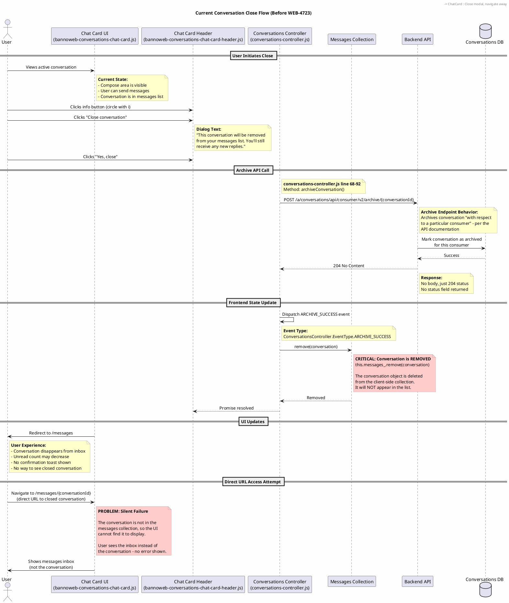
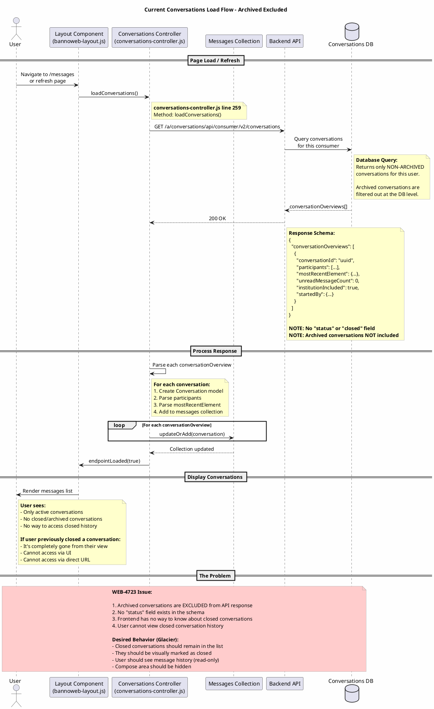

# WEB-4723: Current Conversation Close Flow

This document contains sequence diagrams showing how conversation closing currently works (before WEB-4723 changes).

---

## 1. Close Conversation Flow

Shows the current flow when a user closes a conversation via the UI.



### Key Observations

| Step | What Happens | Problem |
|------|--------------|---------|
| Archive API Call | `POST /archive/{conversationId}` returns 204 No Content | No status field returned |
| Frontend Update | `this.messages_.remove(conversation)` | Conversation completely removed from collection |
| UI Result | Conversation disappears from list | User loses access to conversation history |
| Direct URL | Shows inbox instead of conversation | Silent failure, no error message |

---

## 2. Load Conversations Flow

Shows how conversations are loaded from the API on page load/refresh.



### Key Observations

| Aspect | Current Behavior | Desired Behavior (Glacier) |
|--------|------------------|---------------------------|
| API Response | Archived conversations excluded | Include archived with status field |
| Schema | No `status` or `closed` field | Add `status: "closed"` or similar |
| List Display | Only active conversations shown | Show closed conversations in list |
| Conversation View | N/A (can't access closed) | Show history, hide compose area |

---

## Summary of Problems

### Problem 1: Conversation Removal
The `archiveConversation()` method in `conversations-controller.js` (line 84) calls:
```javascript
this.messages_.remove(conversation);
```
This completely removes the conversation from the client-side collection.

### Problem 2: No Status Field
The API response schema (`ConversationOverview`) does not include a `status` or `closed` field. The frontend has no way to know if a conversation was previously closed.

### Problem 3: Archived Excluded
The `GET /conversations` endpoint excludes archived conversations from the response. There's no query parameter to include them.

### Problem 4: Silent Failure
When navigating to a closed conversation via direct URL, the UI silently shows the inbox instead of an error message or the conversation history.

---

## Rendering These Diagrams

### VS Code
Install the "Markdown Preview Enhanced" or "PlantUML" extension to render embedded PlantUML in markdown previews.

### GitHub/GitLab
These platforms don't natively render PlantUML in markdown. You may need to use a CI/CD step or external service.

### PlantUML Server
Copy the content between `@startuml` and `@enduml` to https://www.plantuml.com/plantuml/uml/

---

*Last Updated: February 4, 2026*
