# WEB-4723 Ticket - Version 1: Full Discovery

## Ticket Description

### Goal
Enable users to view closed conversations in their message list (Glacier-style behavior) instead of having them disappear entirely.

### Current Behavior
When a user closes a conversation:
- It disappears from their messages list
- Navigating to the conversation via direct URL silently fails (shows inbox instead)
- Conversation history is inaccessible

### Desired Behavior (Glacier)
Closed conversations should:
- Remain visible in the messages list with visual indication they're closed
- Show message history when opened (read-only)
- Hide the compose area
- Have option to reopen

### Discovery Questions
Before implementing, we need to determine:
1. Does the Consumer API have (or can it provide) conversation status?
2. Is `CaseDetails` event Enterprise-only? What's the Consumer equivalent?
3. Does `GET /conversations` need a query param to include archived conversations?
4. Can the API schema be extended to include a `status` field?

### Work Breakdown
This ticket tracks the **discovery phase**. Implementation will be split into follow-up tickets based on findings.

📊 **Current State Analysis**: See Comment 1

---

## Comment 1: Current State Analysis

I've analyzed the existing conversation close flow to understand what needs to change. See diagrams below.

### Key Problems Identified:
1. **Conversation Removal**: `conversations-controller.js` line 84 calls `this.messages_.remove(conversation)` - completely removes from client collection
2. **No Status Field**: `ConversationOverview` schema lacks `status` or `closed` field
3. **Archived Excluded**: `GET /conversations` endpoint filters out archived conversations at DB level
4. **Silent Failure**: Direct URL access to closed conversations shows inbox with no error

### Current Flow Diagrams

#### 1. Close Conversation Flow

```mermaid
sequenceDiagram
    title Current Conversation Close Flow (Before WEB-4723)

    actor User
    participant ChatCard as Chat Card UI<br/>(bannoweb-conversations-chat-card.js)
    participant Header as Chat Card Header<br/>(bannoweb-conversations-chat-card-header.js)
    participant Controller as Conversations Controller<br/>(conversations-controller.js)
    participant Messages as Messages Collection
    participant API as Backend API
    participant DB as Conversations DB

    rect rgb(240, 248, 255)
        Note over User,DB: User Initiates Close
    end

    User->>ChatCard: Views active conversation
    Note right of ChatCard: Current State:<br/>- Compose area is visible<br/>- User can send messages<br/>- Conversation is in messages list

    User->>Header: Clicks info button (circle with i)
    Header->>Header: Opens "Conversation details" modal

    User->>Header: Clicks "Close conversation"
    Header->>Header: Shows confirmation dialog
    Note right of Header: Dialog Text:<br/>"This conversation will be removed<br/>from your messages list. You'll still<br/>receive any new replies."

    User->>Header: Clicks "Yes, close"

    rect rgb(240, 248, 255)
        Note over User,DB: Archive API Call
    end

    Header->>Controller: archiveConversation(conversationId)
    Note right of Controller: conversations-controller.js line 68-92<br/>Method: archiveConversation()

    Controller->>API: POST /a/conversations/api/consumer/v2/archive/{conversationId}
    Note right of API: Archive Endpoint Behavior:<br/>Archives conversation "with respect<br/>to a particular consumer" - per the<br/>API documentation

    API->>DB: Mark conversation as archived<br/>for this consumer
    DB-->>API: Success

    API-->>Controller: 204 No Content
    Note right of API: Response:<br/>No body, just 204 status<br/>No status field returned

    rect rgb(240, 248, 255)
        Note over User,DB: Frontend State Update
    end

    Controller->>Controller: Dispatch ARCHIVE_SUCCESS event
    Note right of Controller: Event Type:<br/>ConversationsController.EventType.ARCHIVE_SUCCESS

    Controller->>Messages: remove(conversation)
    Note right of Messages: ⚠️ CRITICAL: Conversation is REMOVED<br/>this.messages_.remove(conversation)<br/><br/>The conversation object is deleted<br/>from the client-side collection.<br/>It will NOT appear in the list.

    Messages-->>Controller: Removed

    Controller-->>Header: Promise resolved

    rect rgb(240, 248, 255)
        Note over User,DB: UI Updates
    end

    Header->>ChatCard: Close modal, navigate away
    ChatCard->>User: Redirect to /messages
    Note right of User: User Experience:<br/>- Conversation disappears from inbox<br/>- Unread count may decrease<br/>- No confirmation toast shown<br/>- No way to see closed conversation

    rect rgb(255, 230, 230)
        Note over User,DB: Direct URL Access Attempt
    end

    User->>ChatCard: Navigate to /messages/{conversationId}<br/>(direct URL to closed conversation)
    Note right of ChatCard: ⚠️ PROBLEM: Silent Failure<br/><br/>The conversation is not in the<br/>messages collection, so the UI<br/>cannot find it to display.<br/><br/>User sees the inbox instead of<br/>the conversation - no error shown.

    ChatCard->>User: Shows messages inbox<br/>(not the conversation)
```

#### 2. Load Conversations Flow

### API Documentation Review
I reviewed `consumer-api-docs/_conversations/conversations-v2.swagger.yaml` and found:
- ✅ `POST /archive/{conversation}` endpoint exists (returns 204 No Content)
- ❌ No `status` field in `ConversationOverview` schema
- ❌ No `CaseDetails` consumer event (mentioned in Slack as Enterprise event)
- ❌ No query parameter to include archived conversations
- ❓ Archive description says "with respect to a particular consumer" but unclear if archived conversations are queryable

### Next Steps
Posting questions in #glacier-working-group to clarify API capabilities before planning implementation.

---

## Comment 2: API Clarification (TO BE FILLED AFTER SLACK RESPONSES)

**Questions asked**: [link to Slack thread]

**Answers received**:
[Summarize the responses]

**Decisions**:
- [ ] Backend API changes needed: [Yes/No - details]
- [ ] Frontend-only solution possible: [Yes/No - details]
- [ ] Approach: [Brief description]

**Follow-up Tickets Needed**:
- [ ] [BACKEND-XXX] - Add status field to ConversationOverview schema
- [ ] [WEB-XXXX] - Implement closed conversation UI in Admin client
